Базы данных и схемы
###################

Кластер
*******

Каждый работающий экземпляр сервера обслуживает несколько баз данных. Этот набор называется кластером.
С точки зрения файловой системы кластер баз данных представляет собой один каталог, 
в котором будут храниться все данные. Он называется каталогом данных или областью данных. 
Администратор может сам выбирать место для хранения данных, но часто данные размещаются в 
**/usr/local/pgsql/data** или в **/var/lib/pgsql/data**. 
Прежде чем с каталогом данных можно будет работать, его нужно инициализировать, 
используя программу **initdb**, которая устанавливается в составе PostgreSQL.

https://postgrespro.ru/docs/postgresql/16/creating-cluster

При инициализации нового кластера всегда создаются три одинаковых базы данных **template0**, **template1**, **postgres**.

- **template0** используется, например, для восстановления из логической резервной копии или для создания базы в другой кодировке и **никогда не должна меняться**;

- **template1** служит шаблоном для всех остальных баз данных, которые может создать пользователь в этом кластере;

- **postgres** представляет собой обычную базу данных, которую можно использовать по своему усмотрению.

Первая база данных всегда создаётся командой **initdb** при инициализации пространства хранения данных. 
Эта база данных называется **postgres**. Далее для создания первой «обычной» базы данных можно подключиться к postgres.

При каждом создании новой базы данных командой **CREATE DATABASE** в рамках кластера производится клонирование шаблона **template1**. 
При этом любые изменения, сделанные в **template1**, распространяются на все созданные впоследствии базы данных.

::

	CREATE DATABASE my_db;
	
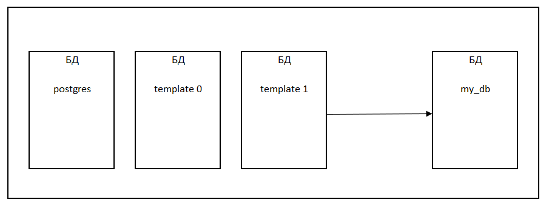

.. important:: CREATE DATABASE не копирует права GRANT уровня базы из исходной БД. 
				Новая база получает права уровня базы по умолчанию.

Вторая системная база template0. При инициализации она содержит те же самые объекты, что и template1, 
предопределённые в рамках устанавливаемой версии PostgreSQL. 
В template0 **не следует вносить никакие изменения** после инициализации кластера. 
Если в команде CREATE DATABASE указать в качестве шаблона template0 вместо template1, 
то можно получить «чистую» пользовательскую базу данных (в которой никаких пользовательских объектов нет, 
есть только системные объекты в первозданном виде), не содержащую ничего, что могло быть добавлено на месте в template1. 
Это особенно полезно при восстановлении дампа pg_dump: скрипт выгруженного дампа должен восстанавливаться в чистую базу, 
чтобы он мог воссоздать нужное содержимое базы, избежав конфликтов с объектами, которые могли быть добавлены в template1.

Другая причина, для копирования template0 вместо template1 заключается в том, 
что можно указать новые параметры локали и кодировку при копировании template0, 
в то время как для копий template1 они не должны меняться. Это связано с тем, что template1 
может содержать данные в специфических кодировках и локалях, в отличие от template0.

Практика:

1. Вывод списка баз данных кластера:

::

	\l

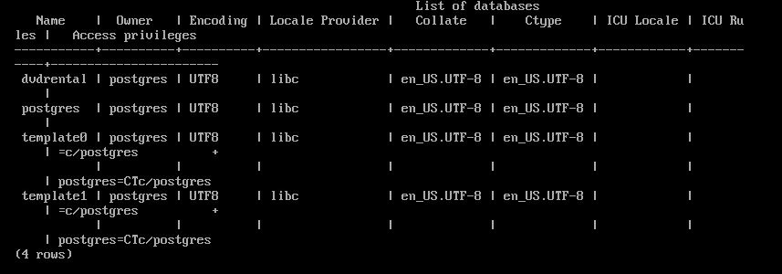

2. Просмотр списка баз данных с помощью SQL в таблице системного каталога

::

	SELECT datname, datistemplate, datallowconn, datconnlimit FROM pg_database;

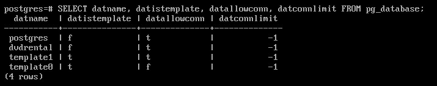

В таблице pg_database есть два полезных флага для каждой базы данных: 
столбцы **datistemplate** и **datallowconn**. 

- *datistemplate* указывает на факт того, что база данных может выступать в качестве шаблона в команде CREATE DATABASE. Если флаг установлен, то для пользователей с правом CREATEDB клонирование доступно; если флаг не установлен, 
то лишь суперпользователь и владелец базы данных могут её клонировать. 

- *datallowconn* если не установлен, то новые подключения к этой базе не допустимы (однако текущие сеансы не закрываются при сбросе этого флага). 

База template0 обычно помечена как *datallowconn = false* для избежания любых её модификаций.

.. important:: И template0, и template1 всегда должны быть помечены флагом datistemplate = true.

3. Проверить наличие функции **digest** в базе данных my_db:

.. note:: Функция **digest** вычисляет двоичный хэш входных данных с помощью алгоритма, указанного в типе. 
		  Эта функция поддерживает широкий спектр алгоритмов, включая md5, sha1 и семейство SHA-2 
		  (sha224, sha256, sha384, sha512), а также любой другой алгоритм вычисления дайджеста, поддерживаемый базовой библиотекой OpenSSL.

::

	\c my_db
	SELECT digest('Hello, world!', 'md5');

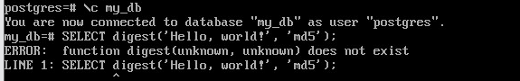

Данная функция доступна при установке пакета **pgcrypto**, который предоставляет функции для создания односторонних хэшей, 
необходимых для проверки целостности данных и безопасного сравнения данных без раскрытия исходного содержимого.

Данный пакет отсутствует по-умолчанию в шаблоне template1, а, следовательно, и во всех базах данных, созданных на его основе.

4. Установить пакет pgcrypto в template1:

4.1) Установить **Contrib** — это дополнительные модули для PostgreSQL, которые поставляются в составе исходного дистрибутива, 
но по умолчанию не активированы. Они предоставляются в виде модулей расширения или дополнительных клиентских или серверных приложений. 

::

	\q
	sudo apt-get install postgresql16-contrib
	
4.2) Установить пакет pgcrypto в template1:

::

	psql -U postgres
	\c template1
	CREATE EXTENSION pgcrypto;
	\c postgres

4.3) Удалить базу данных **my_db** и создать новую:

::

	DROP DATABASE my_db;
	CREATE DATABASE my_db;
	\c my_db
	SELECT digest('Hello, world!', 'md5');

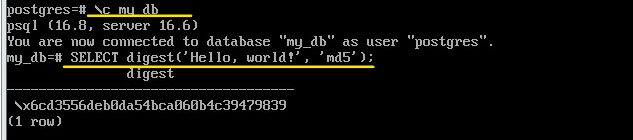

ALTER DATABASE
----------------

Для изменения атрубутов базы данных используется оператор ALTER DATABASE, который является расширением PostgreSQL.

https://postgrespro.ru/docs/postgresql/17/sql-alterdatabase

Переименование базы данных:

::
	
	\c postgres
	ALTER DATABASE my_db RENAME to appdb;

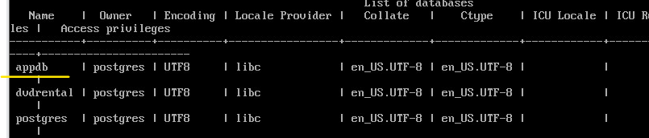
	   

Установить значение параметра work_mem для appdb 16 MB:

::

	ALTER DATABASE my_db SET work_mem='16MB';

Выйти из БД:

::

	\c postgres
	SHOW work_mem;
	
Подключиться к appdb и проверить work_mem:

::

	\c appdb;
	SELECT * FROM pg_settings WHERE name='work_mem' \gx

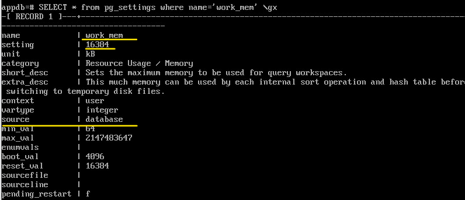

Размер базы данных

Размер базы данных можно узнать с помощью функции:

::

	SELECT pg_database_size('appdb');
 
 
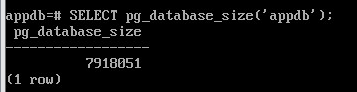
	   
	   
Вывод размера в читаемом виде:

::

	SELECT pg_size_pretty(pg_database_size('appdb'));
	
	
	
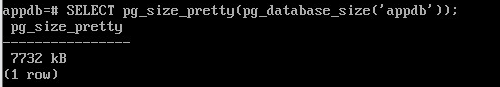

Схемы
*****

Кластер баз данных PostgreSQL содержит один или несколько именованных экземпляров баз. 
На уровне кластера создаются роли и некоторые другие объекты. 
При этом в рамках одного подключения к серверу можно обращаться к данным только одной базы — 
той, что была выбрана при установлении соединения.

**Схемы** предсставляют собой пространства имен для всех объектов, хранящихся в базе данных. 
Они содержат именованные объекты других видов, включая таблицы, типы данных, функции, операторы и прочее.

 figure:: img/do_01_schema00.png
       :scale: 100 %
       :align: center
       :alt: asda

Каждый объект, существующий в базе данных, принадлежит какой-либо схеме.

База данных содержит одну или несколько именованных схем, которые в свою очередь содержат таблицы. 

Одно и то же имя объекта можно свободно использовать в разных схемах, 

например и schema1, и schema2 могут содержать таблицы с именем mytable. 
В отличие от баз данных, схемы не ограничивают доступ к данным: 
пользователи могут обращаться к объектам в любой схеме текущей базы данных, если им назначены соответствующие права.

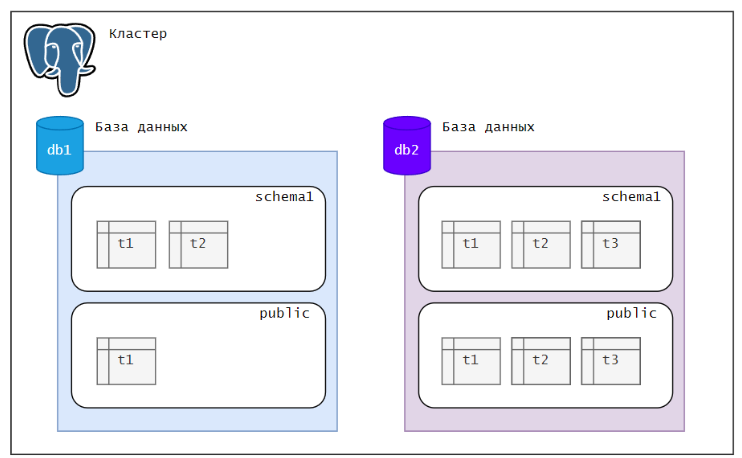

Преимущества использования схем:

- использование одной базы данных несколькими пользователями, независимо друг от друга.

- объединение объектов базы данных в логические группы для облегчения управления ими.

- исключение конфликтов.

Схемы в некотором смысле подобны каталогам в операционной системе, но они не могут быть вложенными.

Схема и пользователь - это разные сущности. 
Пользователи - это субъекты, которые выполняют какие-то действия по отношению к объектам, 
а схема — контейнер для этих объектов. Пользователю удобно работать с одноименными схемами.

Есть некоторое количество стандартных схем, которые существуютв любой базе данных. 
Кроме того, пользователь может создавать свои собственные схемы.

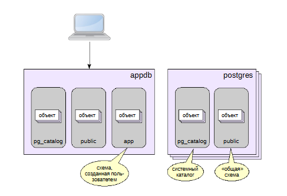
	   
В отличие от баз данных, схемы не ограничивают доступ к данным: 
пользователи могут обращаться к объектам в любой схеме текущей базы данных, если им назначены соответствующие права.

Для создания схемы используется команда **CREATE SCHEMA**. При этом вы определяете имя схемы по своему выбору, например так:

::

	CREATE SCHEMA myschema;
	
Чтобы создать объекты в схеме или обратиться к ним, указывается полное имя, состоящее из имён схемы и объекта, разделённых точкой:

**схема.таблица**

Этот синтаксис работает везде, где ожидается имя таблицы, включая команды модификации таблицы и команды обработки данных.

По умолчанию таблицы (и другие объекты) автоматически помещаются в схему «public».

Команда 

::

	CREATE TABLE my_table (...);
	
аналогична команде:

::

	CREATE TABLE public.my_table (...);

Практика:

1. Вывести список схем базы данных:

::

	\c appdb
	\dn

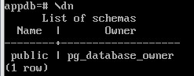

dn - describe namespace

2. Создание схемы:

::

	CREATE SCHEMA app;
	\dn
	
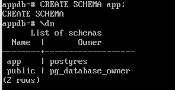

3. Создать таблицу:

::

	CREATE TABLE pr_lang(s text);
	INSERT INTO pr_lang VALUES ('PostgreSQL');

	\dt pr_lang
	
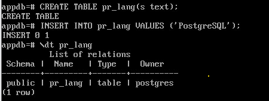

4. Перенести созданную таблицу в схему app:

::

	ALTER TABLE pr_lang SET SCHEMA app;
	SELECT * FROM pr_lang;

будет выдана ошибка, так как по-умолчанию осуществляется поиск в схеме public, а таблицы там нет.

::

	SELECT * FROM app.pr_lang;

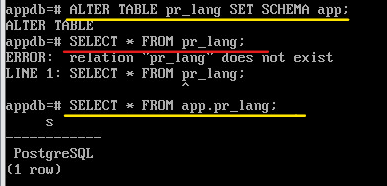

При перемещении между схемами физически данные остаются на месте. Переписываются только строки в системном каталоге.

Путь поиска
***********

Имя, записанное в нотации **схема.таблица** - это *квалифицированное* имя. При таком обращении однозначно указывается путь доступа к данным.
Но чаще всего к таблицам обращаются по неполному имени, состоящему просто из имени таблицы. 
Система определяет, какая именно таблица подразумевается, используя **путь поиска**, который представляет 
собой список просматриваемых схем. PostgreSQL пытается найти имя в одной из схем, 
перечисленных в пути поиска, который определяется конфигурационным параметром **search_path**.

Первая подходящая таблица, найденная в схемах, пути будет считаться результатом поиска. 
Если подходящая таблица не найдена, возникает ошибка, даже если таблица с таким именем есть в других схемах базы данных.

Чтобы узнать текущую последовательность схем для поиска, используется следующая команда:

::

	SHOW search_path;
	
По- умолчанию схема будет такая:

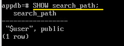

Если в параметре SEARCH PATH указаны схемы, которых на самом деле по каким-то причинам нет, или к этим схемам нет доступа, 
то Postgres такие схемы пропускает, 
и фактически реальное значение поискового пути формируется уже непосредственно в момент обращения к объектам. 

Кроме схемы **public**, в пути указана схема, совпадающая с именем пользователем **"$user"** (определяется автоматически для каждого пользователя).
Если такой схемы не создано, то из реального пути такое имя схемы будет исключено, но если ее создать, то это будет удобно, 
так как объекты соответствующего пользователя будут сразу попадать в одноименную схему. 

Реальный путь поиска, включая неявные схемы, возвращает вызов функции **current_schemas(true)**.
Аргумент **true** в вызове функций отвечает за отображение в выводе функции системные схемы. 
Схемы перебираются в указанномв пути поиска порядке, слева направо. 
Если в схеме нет объекта с нужным именем, поиск продолжается в следующей схеме.

::

	SELECT current_schemas(true);
	
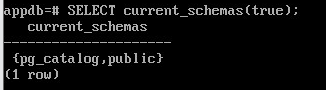

В дополнение к схеме **public** и схемам, создаваемым пользователями, любая база данных содержит схему **pg_catalog**, 
в которой находятся системные таблицы и все встроенные типы данных, функции и операторы. 
**pg_catalog** фактически всегда является частью пути поиска. 
Если даже эта схема не добавлена в путь явно, она неявно просматривается до всех схем, указанных в пути (ссылка на документацию).

*Системный каталог* — это метаинформация об объектах, принадлежащих кластеру, которая хранится в самом кластере в виде таблиц.
Альтернативное представление системного каталога (определенное в стандарте SQL) дает схема information_schema.

Для того чтобы обеспечить видимость системных объектов pg_catalog будет проверяться первым, даже если не будет указан в пути поиска.

Практика:

1. Проверить текущий путь поиска:

::

	\dconfig search_path
	
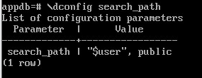
   

2. Установить путь поиска для сеанса:

::

	SET search_path = public, app;

Теперь таблица t будет найдена:

::

	SELECT * FROM pr_lang;
	
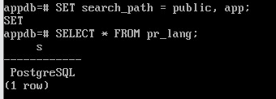

3. Установить параметр на уровне базы данных:

::

	ALTER DATABASE appdb SET search_path = public, app;

Теперь он будет устанавливаться для всех новых подключений к базе appdb. Проверим:

::

	\c appdb

::

	SHOW search_path;
	
	
 search_path 
-------------
 public, app
(1 row)

::

	SELECT current_schemas(true);
    

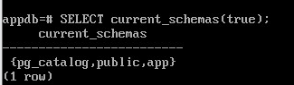

Еще одна функция — **current_schema** — возвращает первое имя схемы, не являющейся системной. 
Это имя той обычной схемы, в которой будут создаваться новые объекты.

::

	SELECT current_schema();
	

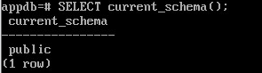

Схемы для временных таблиц
**************************

Временные таблицы в PostgreSQL — это таблицы, которые создаются и используются на время одной сессии с базой данных. 
Они обычно используются для:

- промежуточных вычислений;

- хранения временных или промежуточных данных, с которыми нужно работать в рамках конкретной сессии, например когда 
пользователь делает какие-то изменения, то в базу данных они записываются не сразу, а только при нажатии кнопки «Сохранить». 
До сохранения все изменения хранятся во временных таблицах;

- изоляции данных. Поскольку временные таблицы зависят от сеанса, разные сеансы или транзакции могут использовать одно и то же имя 
временной таблицы без конфликта. Это позволяет изолировать данные для определённой задачи или сеанса.

Временные таблицы не восстанавливаются после сбоев. Поэтому такие таблицы не журналируются. 
Также страницы временных таблиц не попадают в общий буферный кеш — работа с ними ведется во внутренней памяти обслуживающего процесса. 
Благодаря этому, работа с временной таблицей происходит несколько более эффективно, чем с обычной

Для создания временной таблицы используется команда **CREATE TEMPORARY TABLE**. 

::

	CREATE TEMPORARY TABLE temp_table (id INT, name VARCHAR(255));

Временные таблицы автоматически удаляются по завершении сеанса или при закрытии соединения. 
Однако если нужно явно удалить временную таблицу до конца сессии, можно использовать команду DROP TABLE.

PostgreSQL поддерживает локальные и глобальные временные таблицы. 
Локальные временные таблицы принадлежат созданной сессии и удаляются в её конце. 
Глобальные временные таблицы видны всем сессиям, но всё равно удаляются в конце созданной сессии

Для доступа к временным таблицам используются схемы **pg_temp**.
Для отдельного сеанса создается временная схема с именем **pg_temp_N** (pg_temp_1, pg_temp_2 и т. п.). Нумерация создается автоматически.
Обращаться к ней нужно по имени pg_temp (без номера) — для каждого сеанса это имя ссылается на конкретную временную схему.
Если pg_temp нет в пути, то эта схема просматривается перед всеми остальными. 
При желании можно указать схему pg_temp (как и pg_catalog) явно на нужном месте.

После окончания сеанса все объекты временной схемы удаляются,а сама схема остается для повторного использования.

В итоге получается следующая последовательность схем:

- Временная таблица (если не указана явно на другой позиции).

- Схема pg_catalog (если не указана явно на другой позиции).

- "$user" ссылается на схему с именем текущего пользователя 
(вместо него подставляется схема с именем, возвращаемым функцией CURRENT_USER, если такая схема существует и пользователь имеет право USAGE для неё). 
Если такой схемы не существует, ссылка на неё игнорируется.

- Схема public

Кроме указанных схем, имеется несколько специальных служебных:

- pg_toast — используется для объектов, относящихся к TOAST;

- information_schema — дает альтернативное представление системного каталога, регламентируемое стандартом SQL.

Практика:
=========

Временные таблицы и pg_temp
---------------------------

Создать временную таблицу:

::

	CREATE TEMP TABLE pr_lang(s text);
	INSERT INTO pr_lang VALUES ('Python');
	SELECT * FROM pr_lang;
	
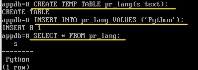

Извлечены данные из временной таблицы.

::

	SELECT current_schemas(true);
	
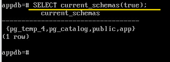

Схема **pg_temp_4** для временных таблиц стоит в начале списка, поэтому одноименные  таблицы будут в первую очередь 
браться из нее.

Для доступа к основной таблице необходимо указать название схемы:

::

	SELECT * FROM app.pr_lang;
	
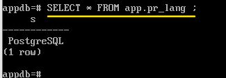

При передоключении объекты из временной схемы удаляются.

::

	\c appdb;
	SELECT current_schemas(true);
	
В пути поиска отсутствует схема для временных таблиц, хотя она в системе присутствует.

Удаление схемы
--------------

Удалить можно только пустую схему:

::

	DROP SCHEMA app;
	
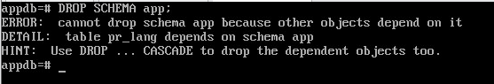
   
Удаление со всеми объектами

::

	DROP SCHEMA app CASCADE;
	\dn
	
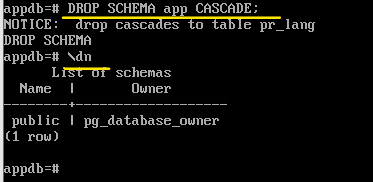
