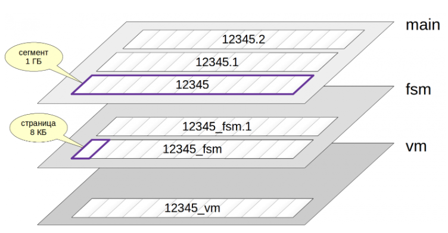
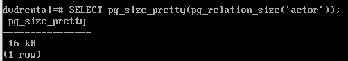
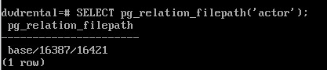
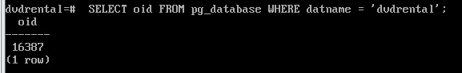
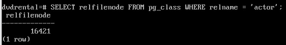
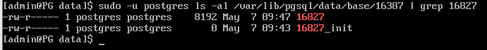
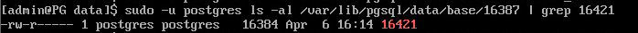
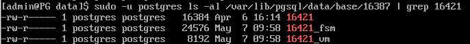
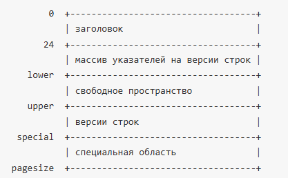
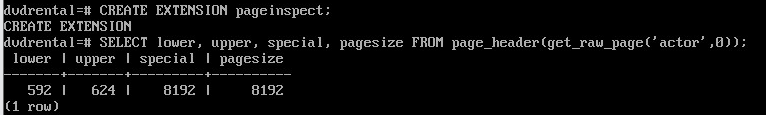

Табличные простраства, слои и длинные версии строк
##################################################

Табличные пространства
**********************

Табличные пространства (ТП) служат для организации физического хранения данных и 
определяют расположение данных в файловой системе.

Табличные пространства в PostgreSQL позволяют администраторам 
организовать логику размещения файлов объектов базы данных в файловой системе. 
К однажды созданному табличному пространству можно обращаться по имени на этапе создания объектов.

Табличные пространства позволяют администратору управлять дисковым пространством для инсталляции PostgreSQL:

1. При нехватке места в разделе, на котором был инициализирован кластер и невозможность его расширения
табличное пространство можно создать в другом разделе и использовать его до тех пор, 
пока не появится возможность переконфигурирования системы.

2. Табличные пространства позволяют администраторам оптимизировать производительность согласно бизнес-процессам, 
связанным с объектами базы данных. Например, часто используемый индекс можно разместить на очень быстром и надёжном, 
но дорогом SSD-диске. В то же время таблица с архивными данными, которые редко используются и скорость к 
доступа к ним не важна, может быть размещена в более дешёвом и медленном хранилище.

При инициализации кластера создаются два ТП: **pg_default** и **pg_global**.

Заметим, что у каждой базы данных есть табличное пространство по умолчанию, им является pg_default. 
Это то табличное пространство, в котором, если не указать иное явно, будут создаваться все объекты базы. 
В этом же табличном пространстве по умолчанию база данных хранит свой системный каталог. 
Табличное просторанство pg_global предназначено для хранения объектов системного каталога, 
содержащего информацию об объектах уровня всего всего кластера. 

.. figure:: img/do_02_tbspc_01.png
       :scale: 100 %
       :align: center
       :alt: asda

На картинке видно, что различные базы данных могут хранить свои объекты в разных табличных пространствах, 
а в одном табличном пространстве мы получаем объекты разных баз данных.

Таким образом, логическая и физическая организация данных являются независимыми между собой. 
По сути, табличное пространство это ссылка на некий каталог, где располагаются файлы с данными.
Для табличных пространств **pg_default** и **pg_global** местоположение фиксировано. 
**pg_global** располагается в каталоге **PGDATA/global**. 
Табличное пространство **pg_defaul** соответствует подкаталогу **PGDATA/base**

Внутри каталога PGDATA/base/ данные дополнительно разложены по подкаталогам баз данных, имеющих
цифровые названия, они совпадают с идентификаторами баз данных. 
Таким образом, объекты разных баз данных лежат в pg_defaul разложенные по соответствующим каталогам соответствующих баз данных.
(для PGDATA/global/ это не требуется, так как данные в нем относятся к кластеру в целом)

Для создания табличного пространства используется команда **CREATE TABLESPACE**, например::

::

	CREATE TABLESPACE fastspace LOCATION '/ssd1/postgresql/data';
	
.. important:: Каталог должен существовать, быть пустым и принадлежать пользователю ОС, под которым запущен PostgreSQL. 

Все созданные впоследствии объекты, принадлежащие целевому табличному пространству, 
будут храниться в файлах расположенных в этом каталоге. 

.. warning:: Каталог не должен размещаться на съёмных или устройствах временного хранения, 
			 так как кластер может перестать функционировать из-за потери этого пространства.

Создавать табличное пространство должен суперпользователь базы данных, 
но после этого можно разрешить обычным пользователям его использовать. 
Для этого необходимо предоставить привилегию **CREATE** на табличное пространство.

Таблицы, индексы и целые базы данных могут храниться в отдельных табличных пространствах. 
Для этого пользователь с правом CREATE на табличное пространство должен указать его имя в качестве параметра 
соответствующей команды. Например, далее создаётся таблица в табличном пространстве space1:

::

	CREATE TABLE foo(i int) TABLESPACE space1;
	
Для установки табличного пространства по-умолчанию :

::

	SET default_tablespace = space1;

или для базы данных:

::

	ALTER DATABASE <database> SET TABLESPACE ts;

При создании пользовательского ТП указывается произвольный каталог; 
для собственного удобства PostgreSQL создает на него символическую ссылку в каталоге **PGDATA/pg_tblspc/**.
Эта символьная ссылка получает имя по OID табличного пространства.

Внутри каталога пользовательского ТП появляется еще один уровень вложенности: версия сервера PostgreSQL, например PG_16_202307071 
Это сделано для удобства  обновления сервера на другую версию.
Внутри каталога конкретной версии находится подкаталог для каждой базы данных, 
которая имеет элементы в табличном пространстве, названный по OID базы данных. 
Таблицы и индексы хранятся внутри этого каталога, используя схему именования файловых узлов.

.. figure:: img/do_02_tbspc_02.png
       :scale: 100 %
       :align: center
       :alt: asda

Табличное пространство pg_default недоступно через pg_tblspc, но соответствует PGDATA/base. 
Табличное пространство pg_global недоступно через pg_tblspc, но соответствует PGDATA/global.

Практика:
---------

1. Получить список имеющихся табличных пространств:

::

	SELECT * FROM pg_tablespace;
	
.. figure:: img/do_02_tbspc_03.png
       :scale: 100 %
       :align: center
       :alt: asda
	   
2. Создать пользовательскоe табличное пространство:

::

	sudo -u postgres mkdir /var/lib/pgsql/data/my_ts

Подключиться к postgres и создать табличное пространство:

::

	CREATE TABLESPACE my_ts LOCATION '/var/lib/pgsql/data/my_ts';
	\db

.. figure:: img/do_02_tbspc_04.png
       :scale: 100 %
       :align: center
       :alt: asda

3. Вывести для имеющихся баз в кластере табличное пространство "по умолчанию":

.. figure:: img/do_02_tbspc_05.png
       :scale: 100 %
       :align: center
       :alt: asda

.. figure:: img/do_02_tbspc_06.png
       :scale: 100 %
       :align: center
       :alt: asda

4. Создадим базу **appdb** и назначим ей **my_ts** в качестве табличного пространства по-умолчанию:

::

	CREATE DATABASE appdb TABLESPACE my_ts;
	
5. Вывести для имеющихся баз в кластере табличное пространство "по умолчанию":

.. figure:: img/do_02_tbspc_07.png
       :scale: 100 %
       :align: center
       :alt: asda

Теперь все создаваемые таблицы и индексы будут попадать в my_ts, если явно не указать другое.

6. Подключиться к базе appdb:

::

	\c appdb

7. Создать таблицу:

::

	CREATE TABLE t1(
	id integer GENERATED ALWAYS AS IDENTITY,
	name text
	);   

8. Создать вторую таблицу в прострастве pg_default:

::	

	CREATE TABLE t2(
	n numeric
	) TABLESPACE pg_default;
	
.. figure:: img/do_02_tbspc_08.png
       :scale: 100 %
       :align: center
       :alt: asda
	   
Пустое поле **tablespace** указывает на табличное пространство по умолчанию, а у второй таблицы поле заполнено.

9. Создать индекс для t1 в pg_default

::

	CREATE INDEX ON t1(id) TABLESPACE pg_default;

::

	SELECT * FROM pg_indexes WHERE tablename='t1' \gx

.. figure:: img/do_02_tbspc_09.png
       :scale: 100 %
       :align: center
       :alt: asda

10. Создать новую базу данных и подключиться к ней:

::

	CREATE DATABASE configdb;

Табличным пространством по умолчанию для данной базы данных будет pg_default.

::

	\c configdb

11. Создать таблицу t в табличном пространстве my_ts:

::

	CREATE TABLE t(
    n integer
	) TABLESPACE my_ts;

::

	\d t
	
.. figure:: img/do_02_tbspc_10.png
       :scale: 100 %
       :align: center
       :alt: asda

Для временных таблиц и их индексов можно указать отдельное табличное пространство по умолчанию:

::

	SET temp_tablespaces = 'ts';

::

	CREATE TEMP TABLE temp(s text);

::
	
	\d temp
	
.. figure:: img/do_02_tbspc_11.png
       :scale: 100 %
       :align: center
       :alt: asda

В параметре temp_tablespaces можно указать несколько табличных пространств, 
в этом случае сервер выберет одно из них случайным образом.

Управление объектами в табличных пространствах
----------------------------------------------

Таблицы (и другие объекты, например, индексы), можно перемещать между табличными пространствами.
Это физическое перемещение файлов данных из одного каталога в другой.
На время ее выполнения доступ к перемещаемому объекту полностью блокируется.

::
	
	\c appdb

12. Переметить таблицк t1 в ТП pg_default:

::

	ALTER TABLE t1 SET TABLESPACE pg_default;
	
::

	SELECT tablename, tablespace FROM pg_tables WHERE schemaname = 'public';
	
.. figure:: img/do_02_tbspc_12.png
       :scale: 100 %
       :align: center
       :alt: asda
	   
Перенести индексы можно и при перестроении:

::

	REINDEX (TABLESPACE ts) TABLE t1;
	
13. Переместить все объекты из pg_default в my_ts:

::

	ALTER TABLE ALL IN TABLESPACE pg_default SET TABLESPACE my_ts;

.. figure:: img/do_02_tbspc_13.png
       :scale: 100 %
       :align: center
       :alt: asda
	   
Размер табличного пространства
-------------------------------

Вычисляется аналогично размеру базы данных:

::
	
	SELECT pg_size_pretty( pg_tablespace_size('my_ts') );

.. figure:: img/do_02_tbspc_14.png
       :scale: 100 %
       :align: center
       :alt: asda
	   
Размер табличного просторанства my_ts обусловлен наличием в нем таблиц системного каталога, по причине того, что оно установлено по умолчанию.

Удаление табличного пространства
----------------------------------

Удалить можно только пустое ТП.

Синтаксис:

::
	
	DROP TABLESPACE <name_tblspc>;

::

	DROP TABLESPACE my_ts;

Удаление не выполнено, так как ТП содержит объекты, причем принадлежаз-жие разным базам данных.

С помощью системного каталога получим перечень баз данных, использующих это ТП:

::

	SELECT oid FROM pg_tablespace WHERE spcname = 'my_ts'; 

.. figure:: img/do_02_tbspc_15.png
       :scale: 100 %
       :align: center
       :alt: asda
	
::

	SELECT datname
	FROM pg_database
	WHERE oid IN (SELECT pg_tablespace_databases(16772));

.. figure:: img/do_02_tbspc_16.png
       :scale: 100 %
       :align: center
       :alt: asda
	   
	 
::

	\c configdb

::

	SELECT relnamespace::regnamespace, relname, relkind
	FROM pg_class
	WHERE reltablespace = 16772;

.. figure:: img/do_02_tbspc_17.png
       :scale: 100 %
       :align: center
       :alt: asda

::

	DROP TABLE t;
	
В базе **appdb** my_ts установлено по умолчанию. ПО этой причине идентификатор ТП 
будет равен 0. И все таблицы системного каталога находятся в этом пространстве. 
Необходимо перенести все эти объекты в табличное пропростраство pg_default, а потом удалить my_ts.

::

	\c postgres
	ALTER DATABASE appdb SET TABLESPACE pg_default;
	DROP TABLESPACE my_ts;

Слои
****

Объекты базы данных физически хранятся в файлах каталогов, которые определены как табличные пространства.
Но представлены они не одним файлом, а целым набором. Обычно каждому объекту БД, хранящему данные (таблице, индексу, последовательности, материализованному представлению), 
соответствует несколько **слоев** (**forks**). Каждый слой содержит определенный вид данных

Если слой есть, то вначале он представлен одним-единственным файлом. 
Имя файла состоит из числового идентификатора, к которому может быть добавлено окончание, соответствующее имени слоя.
Общий размер любого слоя показывает функция **pg_relation_size**

Файл постепенно растет и, когда его размер доходит до 1 ГБ, 
создается следующий файл - сегмент, этого же слоя. Порядковый номер сегмента добавляется в конец имени файла.

Ограничение размера сегмента в 1 ГБ возникло исторически для поддержки различных файловых систем, 
некоторые из которых не умеют работать с файлами большого размера. Ограничение можно изменить при сборке PostgreSQL (./configure --with-segsize).
Каждый файл, в свою очередь, разделен на **страницы** (или блоки), обычно по 8 КБ.

Основной слой
=============

Основной слой - это непосредственно данные: версии строк таблиц или индексные записи. 
Имена файлов основного слоя совпадают с идентификатором. Основной слой существует для любых объектов.

::
	
	SELECT pg_relation_filepath('actor');

Каталог **base** соответствует табличному пространству pg_default, следующий подкаталог — базе данных, и уже в нем находится файл отношения:

Функция **pg_relation_filepath** удобна тем, что выдает готовый путь без необходимости выполнять несколько запросов к системному каталогу.

::

	 SELECT oid FROM pg_database WHERE datname = 'dvdrental';
	 

::

	SELECT relfilenode FROM pg_class WHERE relname = 'actor';
	

Практически все пути в PostgreSQL отсчитываются относительно PGDATA. По этой причине данный каталог можно переносить 
на другое место без влияние на то, как POstgres будет находить данные.

Имена файлов слоя инициализации оканчиваются на «_init». Этот слой существует только для нежурналируемых таблиц (созданныхс указанием UNLOGGED) и их индексов. Такие объекты ничем не отличаются от обычных, но действия с ними не записываются в журнал упреждающей записи. За счет этого работа с ними происходит быстрее, но в случае сбоя их содержимое невозможно восстановить. При восстановлении PostgreSQL 
просто удаляет все слои таких объектов и записывает слой инициализации на место основного слоя. В результате получается пустая таблица.

Слой инициализации
==================

Оканчивается на **_init**

Используется только для нежурналируемых таблиц (созданных с указанием UNLOGGED) и их индексов. 
Такие объекты ничем не отличаются от обычных, но действия с ними не записываются в журнал упреждающей записи. 
За счет этого работа с ними происходит быстрее, но в случае сбоя их содержимое невозможно восстановить. 
При восстановлении PostgreSQL просто удаляет все слои таких объектов и записывает слой инициализации на место основного слоя. 
Файл этого слоя представляет собой пустую таблицу или индекс соответствующего типа. 
Когда нежурналируемая таблица должна быть заново очищена по причине сбоя, 
файл инициализации копируется поверх главного файла, а все прочие файлы удаляются (при необходимости они будут автоматически созданы заново).

::

	CREATE UNLOGGED TABLE test (a text);
	INSERT INTO test VALUES ('TEST TABLE');

::
	
	SELECT relfilenode FROM pg_class WHERE relname = 'test';
	
	16827
	

Слой инициализации имеет такое же имя, как и основной слой, но с суффиксом "_init".

Карта свободного пространства (free space map) 
==============================================

https://postgrespro.ru/docs/postgresql/16/storage-fsm

Слой, в котором отмечено наличие пустого места внутри страниц. Существует и для таблиц, и для индексов.
Это место постоянно меняется: при добавлении новых версий строк уменьшается, при очистке — увеличивается. 
Карта свободного пространства используется при вставке новых версий строк, для поиска подходящей страницы, 
на которую запишутся добавляемые данные.

Карта свободного пространства имеет суффикс **"_fsm"**. 
Но файл появляется не сразу, а только при необходимости. 
Самый простой способ добиться этого — выполнить очистку таблицы:

::

	VACUUM actor;

Слой vm (visibility map)
=========================== 

Битовая карта видимости. Имена файлов этого слоя оканчиваются на «_vm». 
Слой существует только для таблиц; для индексов не поддерживается отдельная версионность.
Слой, в котором одним битом отмечены страницы, которые содержат только актуальные версии строк, что означает возможность показать строку без проверки
видимости когда транзакция пытается прочитать строку из такой страницы.

Страницы
========

Файлы логически поделены на страницы.

Обычно страница имеет размер 8 КБ. Размер в некоторых пределах можно поменять (16 КБ или 32 КБ), но только при сборке (./configure --with-blocksize). 
Собранный и запущенный экземпляр может работать со страницами только одного размера.

::

	SHOW block_size;
	
Независимо от того, к какому слою принадлежат файлы, они используются сервером примерно одинаково. 
Страницы сначала читаются в буферный кеш, где их могут читать и изменять процессы; затем при необходимости страницы вытесняются обратно на диск.

Каждая страница имеет внутреннюю разметку и в общем случае содержит следующие разделы:

	   
Для исследования страницы с цель отладки баз данных на низком уровне используется модуль **pageinspect**:

::

	CREATE EXTENSION pageinspect;
	SELECT lower, upper, special, pagesize FROM page_header(get_raw_page('actor',0));
	

	   
В данном примере рассматривается заголовок самой первой (нулевой) страницы таблицы. 
Кроме размеров остальных областей заголовок содержит и другую информацию о странице.

В старших адресах (внизу картинки) страницы расположена специальная область, в нашем случае пустая. Она используется только для индексов, и то не для всех.
Заполнение страницы данными осуществляется снизу-вверх.

Следом за специальной областью (выше по картинке) располагаются версии строк — те самые данные, которые хранятся в таблице, 
плюс некоторая служебная информация.

Вверху страницы, сразу за заголовком, находится оглавление: массив указателей на имеющиеся в странице версии строк.

Между версиями строк и указателями может оставаться свободное место (которое и отмечено в карте свободного пространства). 
Фрагментации внутри страницы не бывает, все свободное место всегда представлено одним фрагментом.

Указатели
=========

Индексные строки индексных файлов должны ссылаться на версии строк в таблице. 
Индекс ссылается на номер указателя, а указатель — на текущую позицию версии строки в странице. Получается косвенная адресация.

Каждый указатель занимает ровно 4 байта и содержит:

- ссылку на версию строки;

- длину этой версии строки;

- несколько бит, определяющих статус версии строки.

Версии строк и TOAST
====================

