Табличные простраства и низкий уровень
######################################

Табличные пространства
**********************

Табличные пространства (ТП) служат для организации физического хранения данных и 
определяют расположение данных в файловой системе.

Табличные пространства в PostgreSQL позволяют администраторам 
организовать логику размещения файлов объектов базы данных в файловой системе. 
К однажды созданному табличному пространству можно обращаться по имени на этапе создания объектов.

Табличные пространства позволяют администратору управлять дисковым пространством для инсталляции PostgreSQL:

1. При нехватке места в разделе, на котором был инициализирован кластер и невозможность его расширения
табличное пространство можно создать в другом разделе и использовать его до тех пор, 
пока не появится возможность переконфигурирования системы.

2. Табличные пространства позволяют администраторам оптимизировать производительность согласно бизнес-процессам, 
связанным с объектами базы данных. Например, часто используемый индекс можно разместить на очень быстром и надёжном, 
но дорогом SSD-диске. В то же время таблица с архивными данными, которые редко используются и скорость к 
доступа к ним не важна, может быть размещена в более дешёвом и медленном хранилище.

При инициализации кластера создаются два ТП: **pg_default** и **pg_global**.

Заметим, что у каждой базы данных есть табличное пространство по умолчанию, им является pg_default. 
Это то табличное пространство, в котором, если не указать иное явно, будут создаваться все объекты базы. 
В этом же табличном пространстве по умолчанию база данных хранит свой системный каталог. 
Табличное просторанство pg_global предназначено для хранения объектов системного каталога, 
содержащего информацию об объектах уровня всего всего кластера. 

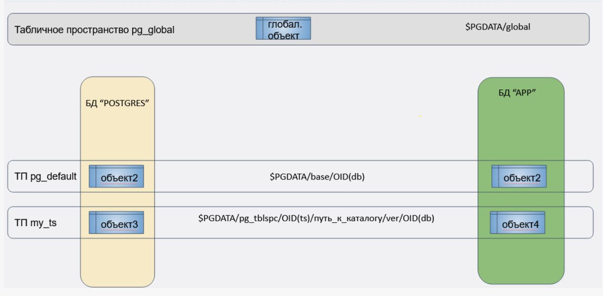

На картинке видно, что различные базы данных могут хранить свои объекты в разных табличных пространствах, 
а в одном табличном пространстве мы получаем объекты разных баз данных.

Таким образом, логическая и физическая организация данных являются независимыми между собой. 
По сути, табличное пространство это ссылка на некий каталог, где располагаются файлы с данными.
Для табличных пространств **pg_default** и **pg_global** местоположение фиксировано. 
**pg_global** располагается в каталоге **PGDATA/global**. 
Табличное пространство **pg_defaul** соответствует подкаталогу **PGDATA/base**

Внутри каталога PGDATA/base/ данные дополнительно разложены по подкаталогам баз данных, имеющих
цифровые названия, они совпадают с идентификаторами баз данных. 
Таким образом, объекты разных баз данных лежат в pg_defaul разложенные по соответствующим каталогам соответствующих баз данных.
(для PGDATA/global/ это не требуется, так как данные в нем относятся к кластеру в целом)

Для создания табличного пространства используется команда **CREATE TABLESPACE**, например::

::

	CREATE TABLESPACE fastspace LOCATION '/ssd1/postgresql/data';
	
.. important:: Каталог должен существовать, быть пустым и принадлежать пользователю ОС, под которым запущен PostgreSQL. 

Все созданные впоследствии объекты, принадлежащие целевому табличному пространству, 
будут храниться в файлах расположенных в этом каталоге. 

.. warning:: Каталог не должен размещаться на съёмных или устройствах временного хранения, 
			 так как кластер может перестать функционировать из-за потери этого пространства.

Создавать табличное пространство должен суперпользователь базы данных, 
но после этого можно разрешить обычным пользователям его использовать. 
Для этого необходимо предоставить привилегию **CREATE** на табличное пространство.

Таблицы, индексы и целые базы данных могут храниться в отдельных табличных пространствах. 
Для этого пользователь с правом CREATE на табличное пространство должен указать его имя в качестве параметра 
соответствующей команды. Например, далее создаётся таблица в табличном пространстве space1:

::

	CREATE TABLE foo(i int) TABLESPACE space1;
	
Для установки табличного пространства по-умолчанию :

::

	SET default_tablespace = space1;

или для базы данных:

::

	ALTER DATABASE <database> SET TABLESPACE ts;

При создании пользовательского ТП указывается произвольный каталог; 
для собственного удобства PostgreSQL создает на него символическую ссылку в каталоге **PGDATA/pg_tblspc/**.
Эта символьная ссылка получает имя по OID табличного пространства.

Внутри каталога пользовательского ТП появляется еще один уровень вложенности: версия сервера PostgreSQL, например PG_16_202307071 
Это сделано для удобства  обновления сервера на другую версию.
Внутри каталога конкретной версии находится подкаталог для каждой базы данных, 
которая имеет элементы в табличном пространстве, названный по OID базы данных. 
Таблицы и индексы хранятся внутри этого каталога, используя схему именования файловых узлов.

.. figure:: img/do_02_tbspc_02.png
       :scale: 100 %
       :align: center
       :alt: asda

Табличное пространство pg_default недоступно через pg_tblspc, но соответствует PGDATA/base. 
Табличное пространство pg_global недоступно через pg_tblspc, но соответствует PGDATA/global.

Практика:
---------

1. Получить список имеющихся табличных пространств:

::

	SELECT * FROM pg_tablespace;
	
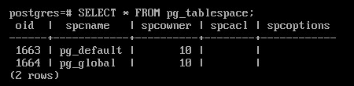
	   
2. Создать пользовательскоe табличное пространство:

::

	sudo -u postgres mkdir /var/lib/pgsql/data/my_ts

Подключиться к postgres и создать табличное пространство:

::

	CREATE TABLESPACE my_ts LOCATION '/var/lib/pgsql/data/my_ts';
	\db

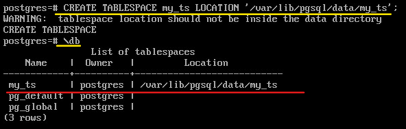

3. Вывести для имеющихся баз в кластере табличное пространство "по умолчанию":

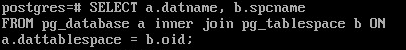

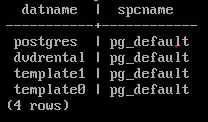

4. Создадим базу **appdb** и назначим ей **my_ts** в качестве табличного пространства по-умолчанию:

::

	CREATE DATABASE appdb TABLESPACE my_ts;
	
5. Вывести для имеющихся баз в кластере табличное пространство "по умолчанию":

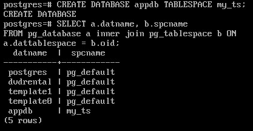

Теперь все создаваемые таблицы и индексы будут попадать в my_ts, если явно не указать другое.

6. Подключиться к базе appdb:

::

	\c appdb

7. Создать таблицу:

::

	CREATE TABLE t1(
	id integer GENERATED ALWAYS AS IDENTITY,
	name text
	);   

8. Создать вторую таблицу в прострастве pg_default:

::	

	CREATE TABLE t2(
	n numeric
	) TABLESPACE pg_default;
	
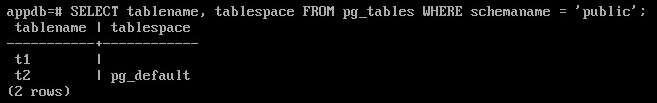
	   
Пустое поле **tablespace** указывает на табличное пространство по умолчанию, а у второй таблицы поле заполнено.

9. Создать индекс для t1 в pg_default

::

	CREATE INDEX ON t1(id) TABLESPACE pg_default;

::

	SELECT * FROM pg_indexes WHERE tablename='t1' \gx

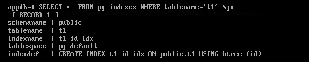

10. Создать новую базу данных и подключиться к ней:

::

	CREATE DATABASE configdb;

Табличным пространством по умолчанию для данной базы данных будет pg_default.

::

	\c configdb

11. Создать таблицу t в табличном пространстве my_ts:

::

	CREATE TABLE t(
    n integer
	) TABLESPACE my_ts;

::

	\d t
	
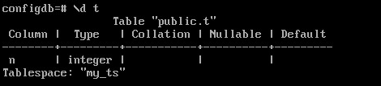

Для временных таблиц и их индексов можно указать отдельное табличное пространство по умолчанию:

::

	SET temp_tablespaces = 'ts';

::

	CREATE TEMP TABLE temp(s text);

::
	
	\d temp
	
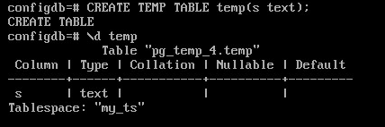

В параметре temp_tablespaces можно указать несколько табличных пространств, 
в этом случае сервер выберет одно из них случайным образом.

Управление объектами в табличных пространствах
----------------------------------------------

Таблицы (и другие объекты, например, индексы), можно перемещать между табличными пространствами.
Это физическое перемещение файлов данных из одного каталога в другой.
На время ее выполнения доступ к перемещаемому объекту полностью блокируется.

::
	
	\c appdb

12. Переметить таблицк t1 в ТП pg_default:

::

	ALTER TABLE t1 SET TABLESPACE pg_default;
	
::

	SELECT tablename, tablespace FROM pg_tables WHERE schemaname = 'public';
	
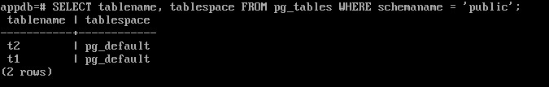
	   
Перенести индексы можно и при перестроении:

::

	REINDEX (TABLESPACE ts) TABLE t1;
	
13. Переместить все объекты из pg_default в my_ts:

::

	ALTER TABLE ALL IN TABLESPACE pg_default SET TABLESPACE my_ts;

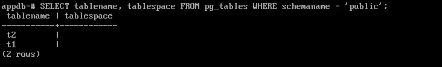
	   
Размер табличного пространства
-------------------------------

Вычисляется аналогично размеру базы данных:

::
	
	SELECT pg_size_pretty( pg_tablespace_size('my_ts') );

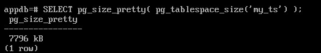
	   
Размер табличного просторанства my_ts обусловлен наличием в нем таблиц системного каталога, по причине того, что оно установлено по умолчанию.

Удаление табличного пространства
----------------------------------

Удалить можно только пустое ТП.

Синтаксис:

::
	
	DROP TABLESPACE <name_tblspc>;

::

	DROP TABLESPACE my_ts;

Удаление не выполнено, так как ТП содержит объекты, причем принадлежаз-жие разным базам данных.

С помощью системного каталога получим перечень баз данных, использующих это ТП:

::

	SELECT oid FROM pg_tablespace WHERE spcname = 'my_ts'; 

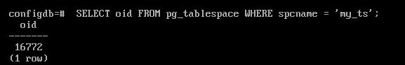
	
::
	SELECT datname
	FROM pg_database
	WHERE oid IN (SELECT pg_tablespace_databases(16772));

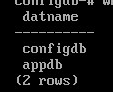
	   
	 
::
	\c configdb

::

	SELECT relnamespace::regnamespace, relname, relkind
	FROM pg_class
	WHERE reltablespace = 16772;

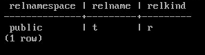

::

	DROP TABLE t;
	
В базе фззви my_ts установлено по умолчанию. ПО этой причине идентификатор ТП 
будет равен 0. И все таблицы системного каталога находятся в этом пространстве. 
Необходимо перенести все эти объекты в табличное пропростраство pg_default, а потом удалить my_ts.

::

	\c postgres
	ALTER DATABASE appdb SET TABLESPACE pg_default;
	DROP TABLESPACE my_ts;

