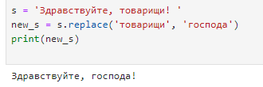

Методы строк
~~~~~~~~~~~~~

В работе многих специалистов, например, аналитиков, специалистов по Data Science, очень много времени уделяется обработке текстовых данных. Поэтому, владение таким инструментарием, как методы строк, сильно повышатет эффективность работы.

Сложение (конкатенация)
```````````````````````

Строки, как и числа, можно складывать или сцеплять между собой с помощью оператора **+**.

.. code-block:: python
   
        s1 = 'Jupyter'
        s2 = 'Notebook'
        s3 = s1 + s2
        print(s3)

Результат:

Jupiter Notebook

Метод replace
``````````````

Замена последовательности символов в строке на другую последовательность. Он создаёт новую строку путём замены частей исходной строки.

.. code-block:: python
   
        s = 'Здравствуйте, товарищи! '
        new_s = s.replace('товарищи','господа') 
        
        print(new_s)




Метод join
```````````

Метод join собирает список строк в одну строку с разделителем, который указан перед join:

.. code-block:: python

        fio = ['Иванов', 'Петров', 'Сидоров']
        ','.join(fio)

Результат:

'Иванов,Петров,Сидоров'


Умножение строк
````````````````

Многократное повторение строки

.. code-block:: python

        s = '+' * 10
        print(s)

Результат:

**++++++++++**

Методы upper, lower, swapcase, capitalize
``````````````````````````````````````````

Методы upper(), lower(), swapcase(), capitalize() выполняют преобразование регистра строки:


**upper**

.. code-block:: python

        s = 'силуянов саломон дормидонтович'
        print(s.upper())

Результат:

СИЛУЯНОВ САЛОМОН ДОРМИДОНТОВИЧ

**lower**

.. code-block:: python

        s = 'СИЛУЯНОВ САЛОМОН ДОРМИДОНТОВИЧ'
        print(s.lower())

Результат:

силуянов саломон дормидонтович

**swapcase**

.. code-block:: python

        s = 'cИЛУЯНОВ cАЛОМОН дОРМИДОНТОВИЧ'
        s.swapcase()

Результат:

Cилуянов Cаломон Дормидонтович


count
``````
Метод count() используется для подсчета того, сколько раз символ или подстрока встречаются в строке:

.. code-block:: python

        string1 = 'Hello, hello, hello, hello'

        print(string1.count('hello'))
        3

        print(string1.count('ello'))
        4

        print(string1.count('l'))
        8

Метод strip
`````````````
Часто при обработке строк в них встречаются лишние пробелы в начале и конце строки. 

Для того, чтобы избавиться от них, очень удобно использовать метод strip():

.. code-block:: python

        string1 = '  Подразделение     №  1   '
        string1 = string1.strip()
        print(string1)

Результат:

Подразделение № 1

Метод **strip()** убирает спецсимволы и в начале, и в конце строки. Если необходимо убрать символы только слева или только справа, можно использовать, соответственно, методы **lstrip()** и **rstrip()**.

Метод find
```````````

Метод find() используется для поиска индекса первого вхождения подстроки в строку. Возвращает индекс исходной строки, с которого начинается подстрока:

.. code-block:: python

        string1 = 'Jupyter Notebook'
        find_string = 'Notebook'
        pos = string1.find(find_string)
        print(pos)

Результат:

8

Если подстроки в строке нет, Python возвращает −1

Метод **rfind** выполняет поиск позиции в строке, начиная справа.

Метод split
````````````

Метод split() разбивает строку на части, используя в качестве разделителя указанный символ (или символы), возвращая при этом список строк. По-умолчанию, разделителем является **пробел**

.. code-block:: python

        string1 = 'Jupyter Notebook'
        parts = string1.split()
        print(parts)

Результат:

**['Jupyter', 'Notebook']**


