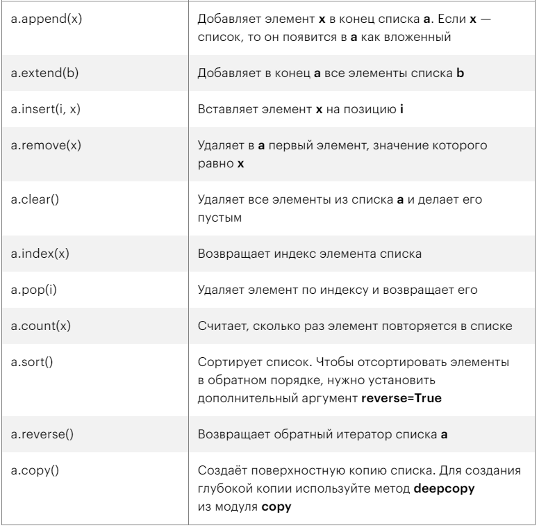

Методы списков
~~~~~~~~~~~~~~

append()
````````

Добавляет новый элемент в конец списка:

.. code:: python

        a = [1, 2, 3]
        a.append(4)
        print(a) 

[1, 2, 3, 4]

  
extend()
`````````
Добавляет набор элементов в конец списка.

В качестве аргумента методу необходимо передать итерируемый объект, например, список или строку:

.. note:: Итератор в python — это любой объект, реализующий метод __next__ без аргументов, который должен вернуть следующий элемент.

.. code:: python

        a = [1, 2, 3]
        a.extend([4, 5])
        print(a) 

[1, 2, 3, 4, 5]

Внутрь метода extend() нужно передать итерируемый объект — например, другой list или строку.

Добавление строки:

.. code:: python

        a = ['cat', 'dog', 'bat']
        a.extend('mouse')
        print(a)

['cat', 'dog', 'bat', 'm', 'o', 'u', 's', 'e']


insert()
``````````
Добавляет новый элемент по индексу:

.. code:: python

        a = [1, 2, 3]
        a.insert(0, 4)
        print(a)

[4, 1, 2, 3]

Первый параметр - индекс элемента, второй - значение элемента.

remove()
`````````

Удаление элемент из списка (первое вхождение). Если элемент отсутсвует, то будет возвращена ошибка.

.. code:: python

        a = [1, 2, 3, 1]
        a.remove(1)
        print(a) 

[2, 3, 1]

.. code:: python

        a = [1, 2, 3, 1]
        a.remove(5)

        Traceback (most recent call last):
        File "<stdin>", line 1, in <module>
        ValueError: list.remove(x): x not in list

clear()
``````````

Очистка списка (удаление всех элементов):

.. code:: python

        a = [1, 2, 3]
        a.clear()
        print(a) 

[]

index()
````````

Возвращает индекс элемента списка в Python:

.. code:: python

        a = [1, 2, 3]
        print(a.index(2)) 

1

Если элемента нет в списке, выведется ошибка:

.. code:: python

        a = [1, 2, 3]
        print(a.index(4))
        Traceback (most recent call last):
          File "<stdin>", line 1, in <module>
        ValueError: 4 is not in list

pop()
``````
Возвращает элемент с указанным индексом и удаляет его из списка. Если индекс не указан, то удаляется последний.

.. code:: python

        a = [1, 2, 3]
        print(a.pop())
        print(a)

        3
        [1, 2]

.. code:: python

        a = [1, 2, 3]
        print(a.pop(1)) 
        print(a) 

        2
        [1, 3]

count()
``````````
Возвращает число вхождений элемента в список:

.. code:: python

        a = [1, 1, 1, 2]
        print(a.count(1)) 

3

sort()
```````
Сортировка списка с его изменением:

.. code:: python

        a = [4, 1, 5, 2]
        a.sort() # [1, 2, 4, 5]

Параметр reverse - обратная сортировка:

.. code:: python

        a = [4, 1, 5, 2]
        a.sort(reverse=True) # [5, 4, 2, 1]

reverse()
``````````
Переставляет элементы в обратном порядке:

.. code:: python

        a = [1, 3, 2, 4]
        a.reverse() 

[4, 2, 3, 1]

copy()
`````````
Копирование списка(создание полной копии в новом объекте):

.. code:: python

        a = [1, 2, 3]
        b = a.copy()
        print(b)

[1, 2, 3]


Сводная таблица методов списков
```````````````````````````````````



