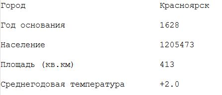

Задания для выполнения
#########################

Ограничение: Все задания надо выполнять используя только пройденные темы.

Строки
********

Задание 2.1
============

Напишите программу на Python, чтобы получить строку из заданной строки, 
в которой все вхождения ее первого символа были изменены на **'$'**, за исключением самого первого символа.

Вход: 'restart'

Выход: 'resta$t'

Задание 2.2
===========

Напишите программу на Python, чтобы получить одну строку из двух заданных строк, 
разделенных пробелом, и поменять местами первые два символа в каждой строке.

Вход: 'abc', 'xyz'

Выход: 'xyc abz'

Задание 2.3
===========

Написать скрипт на Python, который принимает входные данные от пользователя и отображает их обратно в верхнем и нижнем регистрах.

Вход: english

Выход: ENGLISH english

Списки
********

Задание 2.4
===========

Получить из строки travel:

.. code:: python

	travel = "Города посещения Москва, Красноярск, Новосибирск, Челябинск, Магадан, Петропавловск-Камчатский, Курск"

такой **список** городов:

.. code:: python

	['Москва', 'Красноярск', 'Новосибирск', 'Челябинск', 'Магадан', 'Петропавловск-Камчатский', 'Курск']

Итоговый список должен быть записан в переменную **result** и выведен на стандартный поток вывода (stdout) с помощью print. 

Ограничение: Все задания надо выполнять используя только пройденные темы.

Множества
*********

Задание 2.5
===========

Получить из строк **travel_1**, **travel_1** итоговый список **result**, в котором отсутствуют дубликаты наименований городов :

.. code:: python

	travel_1 = "Города посещения Москва, Красноярск, Новосибирск, Челябинск, Магадан, Петропавловск-Камчатский, Курск"
	travel_2 = "Города посещения Москва, Санкт-Петербург, Челябинск, Златоуст, Уфа, Самара, Курск, Новосибирск"

	['Москва', 'Красноярск', 'Новосибирск', 'Челябинск', 'Магадан', 'Петропавловск-Камчатский', 'Курск']

Задание 2.6
===========

Из строк **travel_1** и **travel_2**  получить список городов, которые присутствуют в обоих турах (пересечение).

.. code:: python
	
	travel_1 = "Города посещения Москва, Красноярск, Новосибирск, Челябинск, Магадан, Петропавловск-Камчатский, Курск"
	travel_2 = "Города посещения Москва, Санкт-Петербург, Челябинск, Златоуст, Уфа, Самара, Курск, Новосибирск"

	['Москва', 'Челябинск', 'Курск', 'Новосибирск']
	
Итоговый список должен быть записан в переменную **result** и выведен на стандартный поток вывода (stdout) с помощью print. 

Форматированный вывод 
**********************

Задание 2.7
===========

Обработать строку **info** 

.. code:: python

	info = 'Красноя́рск 1628 1205473 413 +2.0' 

и вывести информацию на стандартный поток вывода в виде:

	
