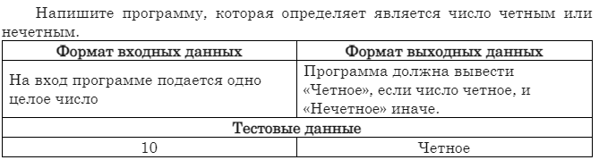
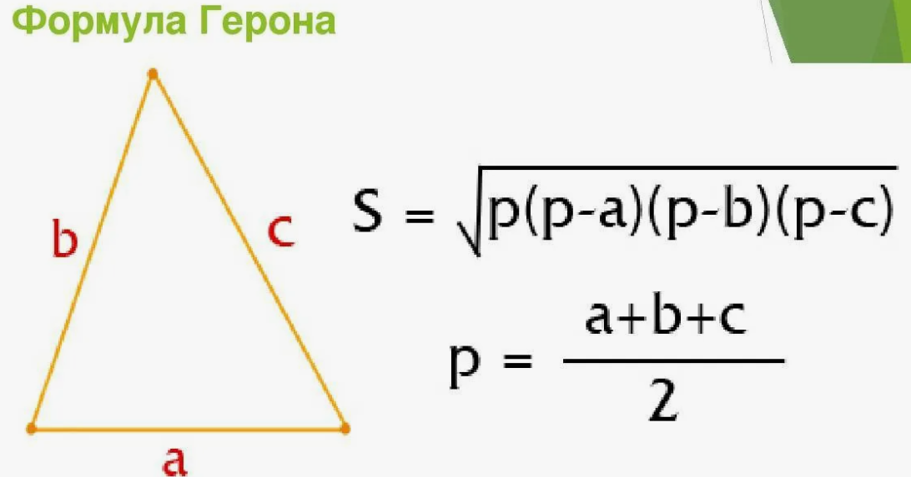

Примеры работы с условными операторами
~~~~~~~~~~~~~~~~~~~~~~~~~~~~~~~~~~~~~~~

Четность числа
""""""""""""""""""""""""

Площадь треугольника
"""""""""""""""""""""""""""""""

Даны стороны треугольника a,b,c. Составить программу вычисления площади труегольника по формуле Герона:

Проверка пароля
"""""""""""""""""""""""""

Создать скрипт проверки ввода пароля.

.. code:: python
	
	password = input('Введите пароль')
	if password == 'P@ssw0rd':
		print('Successful')
	else:
		print('Access denied!')
		
Проверка имени пользователят пароля
""""""""""""""""""""""""""""""""""""""""""""

Дополнить предыдущий скрипт проверки ввода имени пользователя и  пароля. Список пользователей и паролей представить в виде словаря.

.. code:: python
	
	list_users = {'admin': 'admin_password', 'manager': 'manager_password', 'anykey': 'anykey_password'}
	
	

Создание сложного пароля*
"""""""""""""""""""""""""""""""""""

Анатолию в последний месяц удача улыбалась очень плохо. У него 3 раза взломали пароль. 
Вот он и задумался над тем, что неправильно подходит к вопросу составления паролей. 
Чтобы не напрягаться больше и опять не попасть впросак, молодой человек решил написать скрипт на Python, который будет проверять его пароль на надежность. 
Требования к паролю у Анатолия следующие:

1. Длина – 8 символов (если меньше – то проще взломать, а если длиннее – то сложно запомнить).

2. В пароле должны быть:

1) заглавные буквы,

2) строчные символы,

3) числа

4) специальные знаки (из перечня *-#; другие спецсимволы недопустимы, так как Анатолий их не может запомнить).

Помогите парню составить скрипт, который проверит пароль на соответствие требованиям.
В случае верного пароля выведется на печать "Пароль соответствует требованиям", а в остальных случаях будут перечислены все ошибки, которые Анатолий допустил 
(для представления перечня ошибок заведите переменную err в виде словаря).

