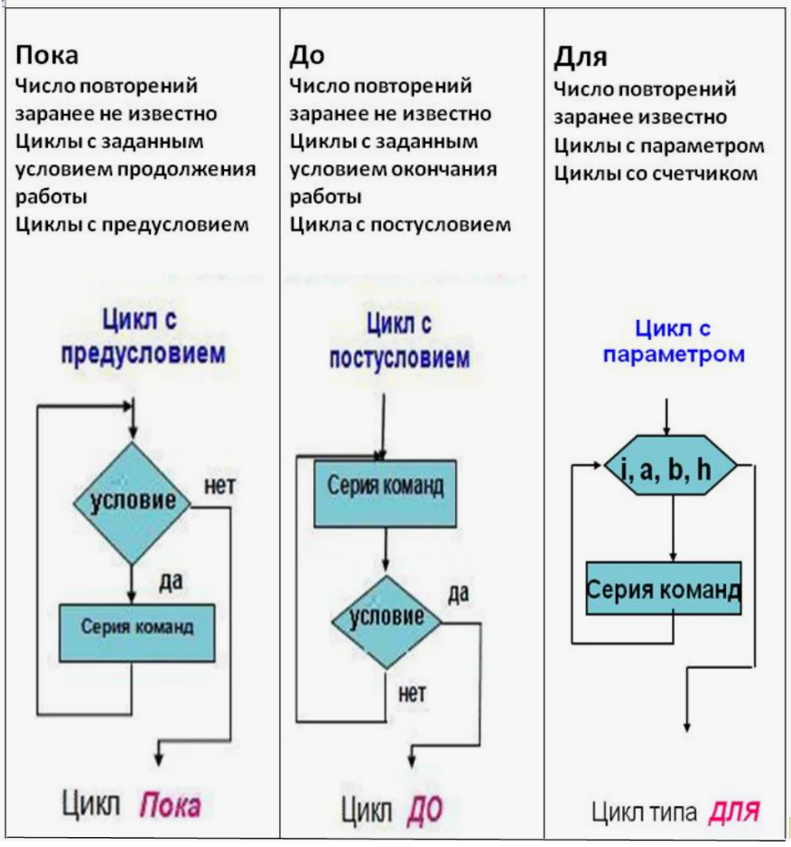

Циклы
~~~~~~

**Цикл** - это такая форма организации действий, при которой одна и таже последовательность действий выполняется до тех пор, пока выполняется условие.

Используются в случаях, когда требуется многократно повторить одно и тоже, например:

- проверить все элементы последовательности на соответствие условию; 
- посчитать сумму чисел;
- считать в память с клавиатуры или файла значения;

То есть применяются для работы с большими объемами данных. Обработка ни одного файла, ни одного массива данных не обходится без циклов. 

Являются одной из основных структур в программировании.

**Элементы цикла:**

- **условие** — параметр, проверяя который, программы принимает решение о продолжении цикла. 
- **тело** — серия команд (блок операторов), которая выполняется внутри цикла.

Циклы бывают:

- **с предусловием**, то есть условие проверяется до начала выполнения тела цикла. По данной причине в этом виде цикла тело может не выполниться ни разу.
- **с постусловием**, то есть условие проверяется после выполнени тела цикла. Тело выполняется, как минимум, один раз.

В Python используются циклы с предусловием **for** и **while**. Циклов с постусловием нет, но можно сконструировать его самостоятельно.

Цикл **for** называют **цикл с параметром**.

Несмотря на то, что и for и while необходимы для повторения некоего количества раз одной и той же операции, циклы отличаются друг от друга и имеют свою специфику. 

**While** используется тогда, когда заранее неизвестно количество повторений тела цикла.

**For** используется, когда количество повторений заранее может быть установлено. Например, с 0 и до последнего символа строки или элемента списка или для чисел из диапазона от 1 до 15. 
Применяется для последовательного манипулирования с элементами итератора, он проходит по очереди элементы объекта (например, множества) и заканчивается (в общем случае) после их полного перебора.

Таким образом, **for** удобен для перебора, а **while** – проверки истинности условия перед каждой итерацией.

Полное выполнение всех операций тела цикла за один проход называется **итерацией цикла**.

.. toctree::
   :maxdepth: 1
   :hidden:

   for
   while
   cicle_examples

