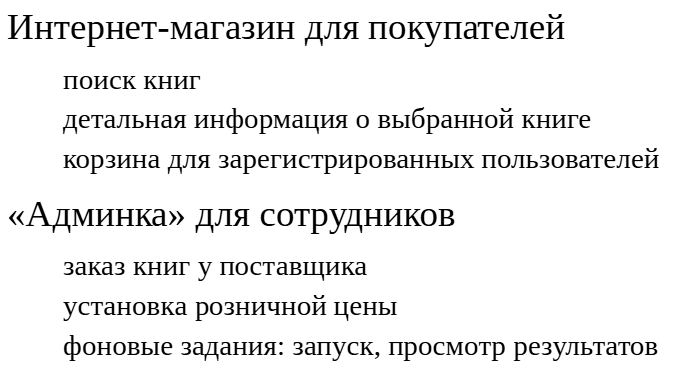
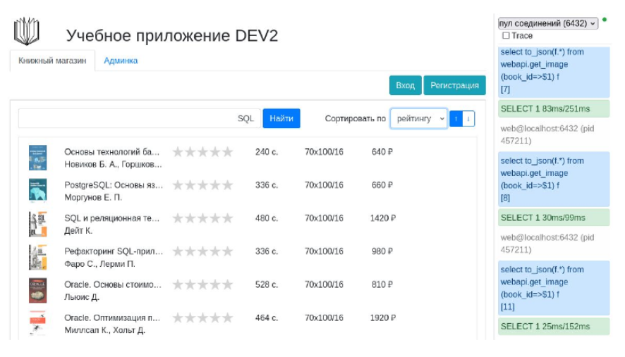
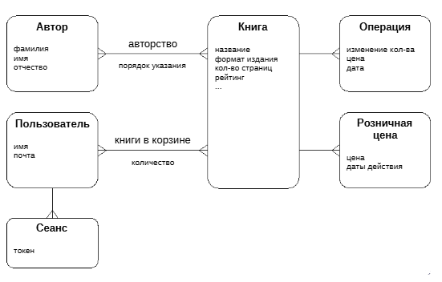
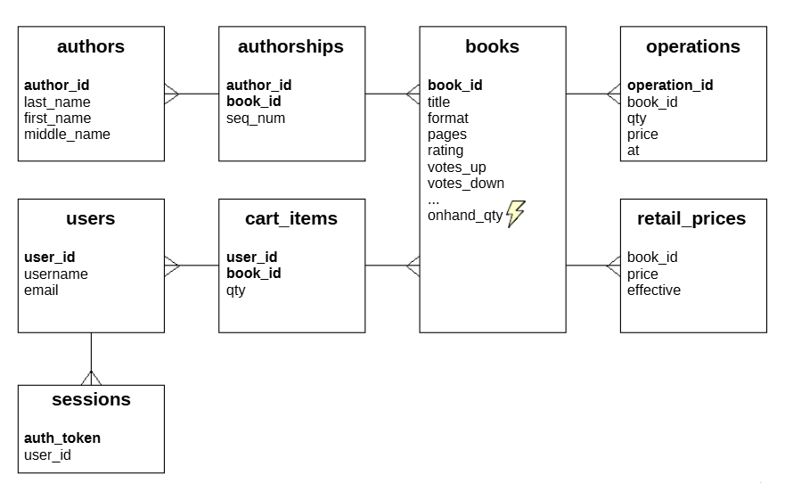
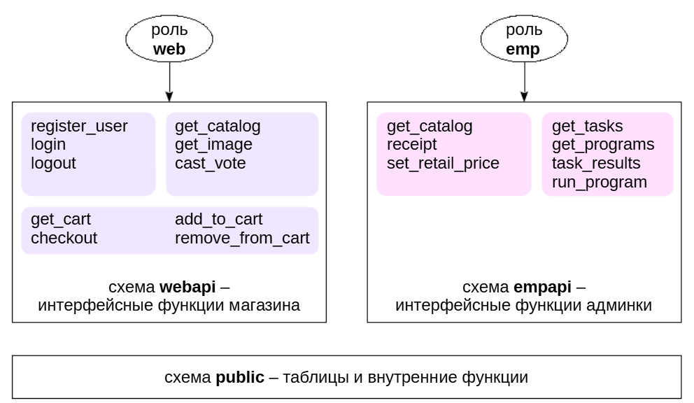
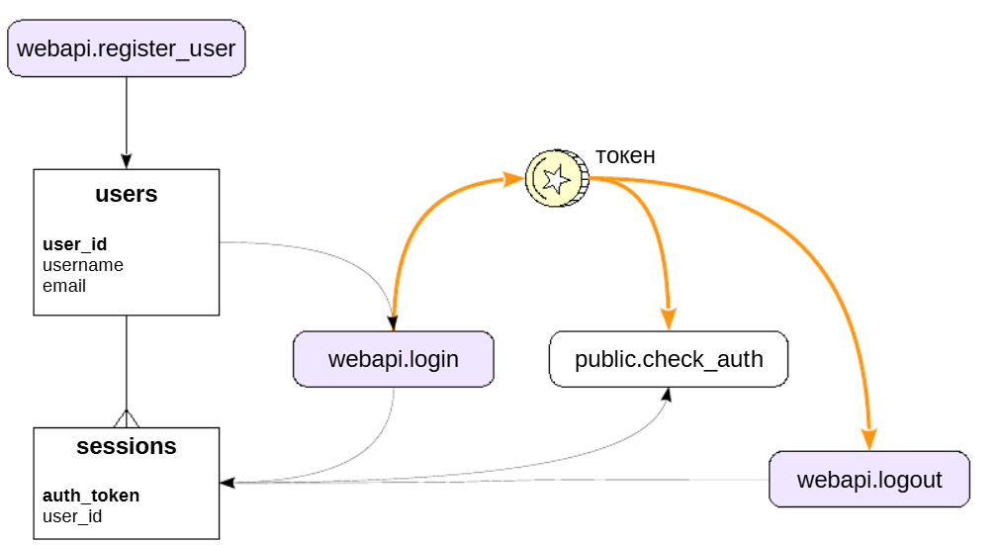
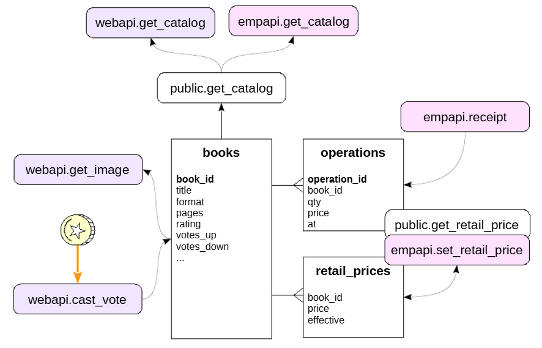
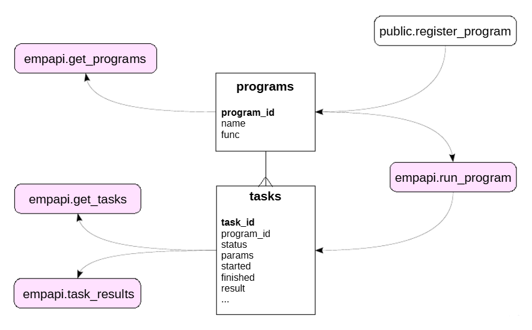

Приложение
##########

Клиент - процесс
****************

Клиентская часть полностью готова, а серверная будем улучшаться по мере прохождения курса.
Как и раньше, клиентская часть состоит из интернет-магазинаи «админки». 

Чтобы приобрести книги, покупатели должны регистрироваться на сайте и входить под своим именем. В магазине теперь есть корзина, а книги имеют цену.

Админка позволяет заказывать книги и устанавливать на них цену. Добавление книг и авторов из админки исключено из приложения 2.0.

Добавилась возможность запускать фоновые задания (например, отчеты) и просматривать их результаты после завершения.

Приложение состоит из двух частей, представленных вкладками.

- «Книжный магазин» — это интерфейс веб-пользователя, в котором он может просматривать и покупать книги.

- «Админка» — интерфейс сотрудников магазина, в котором они могут заказывать книги и устанавливать их цену, а также выполнять фоновые задания.

В учебных целях вся функциональность представлена на одной общей веб-странице. Если какая-то часть функциональности недоступна из-за того, что на сервере нет подходящего объекта, приложение сообщит об этом. 
Также приложение выводит текст запросов, которые оно посылает на сервер.

Приложение позволяет выбрать сервер для подключения. В основном будет использоваться значение по умолчанию.

Основные сущности
*****************

- Книга. К книгам добавились атрибуты.

- Автор. Книги и авторы связаны отношением многие-ко-многим (авторство).

- Операции с книгами: покупки в магазине и поступления на склад. К атрибутам добавилась цена книги.

Новые сущности:

- Розничная цена. Цена рассматривается как отдельнаю сущность, а не атрибут книги, поскольку она может меняться со временем,то есть имеет диапазон дат действия.

- Пользователь веб-магазина. Определяется именем (логином)и имеет почтовый адрес. Пользователь может класть книги в корзину, и поэтому связанс книгами отношением многие-ко-многим. (Отдельной сущностидля корзины мы не предусматриваем.)

- Сеанс работы пользователя с магазином. Сеанс связан с вопросами аутентификации и разграничения доступа.

Основные таблицы
****************

Основные таблицы базы данных представлены на слайде.

В качестве идентификаторов используются суррогатные ключи, генерируемые с помощью последовательностей.

Связи «многие ко многим» представлены дополнительными таблицами:

- authorships — авторство;

- cart_items — книги в корзине.

В таблице книг books имеется дополнительный столбец **onhand_qty**, содержащий текущее количество книг на складе магазина, и обновляемый *триггером* по таблице операций.

С расчетом рейтинга книг (**rating**) связаны еще два столбца: голоса пользователей «за» (**votes_up**) и «против» (**votes_down**).

Интерфейс клиента
*****************

Клиентский API серверной части полностью построен на *функциях*.

Интерфейсные функции *веб-магазина* доступны только пользователю web и размещены в схеме **webapi**: 

- аутентификация и разграничение доступа;

- работа с каталогом книг;

- операции с корзиной.

Интерфейсные функции *админки* доступны только пользователю empи размещены в схеме **empapi**:

- работа с каталогом книг;

- фоновые задания.

Аутентификация в админке не предусмотрена.

Все таблицы, а также внутренние функции, **не открытые напрямую** для клиента, размещены в схеме **public**.

Интерфейсные функции объявлены как **SECURITY DEFINER**, чтобы иметь доступ к объектам базы данных. С помощью механизма привилегий по умолчанию (**ALTER DEFAULT PRIVILEGES**) доступк функциям в схеме **webapi** автоматически выдается только 
пользователю **web**, в схеме **empapi** — пользователю **emp**, а доступк функциям в схеме **public** отбирается у роли **public**.

Информационная панель веб-клиента показывает, какие вызовы он отправляет на сервер.

Аутентификация
**************

	   
Аутентификация пользователей интернет-магазина происходит на клиенте. С точки зрения базы данных клиент всегда представлен одной ролью **web**.

Новый пользователь регистрируется вызовом **register_user**. Для простоты не используются пароли (но если бы использовали, то хеш пароля хранился бы в таблице users).

Чтобы иметь возможность совершать покупки, пользователь должен войти в систему. Это выполняет функция **login**. Она создает сеанс пользователя, который определяется *токеном* (**UUID**).

Токен возвращается клиенту и дальше клиент передает его как параметр во все функции, связанные с покупками. 

Каждая такая функция первым делом проверяет правильность токена с помощью вызова **check_auth**, который определяет по токену имя пользователя.

Наконец, вызов **logout** завершает сеанс.

Функционал истечения срока сеанса не реализован, но может быть легко добавлен.

ПРАКТИКА
========

**Аутентификация**

::

	\c bookstore2
	You are now connected to database "bookstore2" as user "student".

У нас уже есть два зарегистрированных пользователя:

::

	SELECT * FROM users;

	 user_id | username |      email      
	---------+----------+-----------------
		   1 | alice    | alice@localhost
		   2 | bob      | bob@localhost
	(2 rows)

Зарегистрируем еще одного. Почтовый адрес можно указывать любой — мы будем отправлять пользователям письма, но все они попадут в локальный почтовый ящик пользователя student.

::

	SELECT webapi.register_user('charlie','charlie@localhost');

	 register_user 
	---------------
	 
	(1 row)

Пользователь входит в систему и получает токен:

::

	SELECT webapi.login('charlie');

					login                 
	--------------------------------------
	 9921c91c-6ed6-4b39-acf4-4de0c1433b44
	(1 row)

При этом в базе появляется сеанс:

::

	SELECT * FROM sessions;

				  auth_token              | user_id 
	--------------------------------------+---------
	 b3531c9c-ad69-4eb8-ae2c-68b2647dea4d |       1
	 9921c91c-6ed6-4b39-acf4-4de0c1433b44 |       3
	(2 rows)

Токен можно проверить функцией, закрытой для клиента:

::

	SELECT username
	FROM users
	WHERE user_id = check_auth('00000000-0000-0000-0000-000000000000');
	ERROR:  query returned no rows
	CONTEXT:  PL/pgSQL function check_auth(uuid) line 5 at SQL statement
	SELECT username
	FROM users
	WHERE user_id = check_auth('9921c91c-6ed6-4b39-acf4-4de0c1433b44');

	 username 
	----------
	 charlie
	(1 row)
	

Каталог книг
**************

	
Список книг (конечно, вместе с авторами, хотя эти таблицы не показаны на слайде для краткости) нужен как магазину, так и админке — нос разным набором полей. 
Всю возможную информацию выбирает закрытая функция **public.get_catalog**, получая на вход параметры поиска. Функции **webapi.get_catalog** и **empapi.get_catalog** реализованы как обертки вокруг **public.get_catalog**.

Получение обложки книги выполняет функция **webapi.get_image**. Обложки не входят в **get_catalog**, чтобы клиент как можно быстрее отобразил результаты поиска, а обложки подгружал в фоновом режиме.

Голосование «за» или «против» книги выполняется функцией **webapi.cast_vote**. Функция допускает голосование несколько раз,но работает только для зарегистрированных пользователей.

Заказ книги у поставщика в админке выполняет функция **empapi.receipt*. Она создает соответствующую операцию с книгой.

За установку розничной цены на книгу отвечает функция **empapi.set_retail_price**. Текущую цену возвращает функция **public.get_retail_price**, которую клиент никогда не вызывает напрямую, но она используется во многих интерфейсных функциях.

ПРАКТИКА
========

**Каталог книг**

Информацию о книгах клиент получает функцией get_catalog. Например, для интернет-магазина:

::

	SELECT book_id, title, authors_list, format, rating, price
	FROM webapi.get_catalog('рефакторинг','rating','asc') \gx

	-[ RECORD 1 ]+--------------------------------------------------
	book_id      | 6
	title        | Рефакторинг SQL-приложений
	authors_list | {"(7,Фаро,Стефан,\"\")","(8,Лерми,Паскаль,\"\")"}
	format       | 70x100/16
	rating       | 0
	price        | 980
	-[ RECORD 2 ]+--------------------------------------------------
	book_id      | 14
	title        | Чистый код: создание, анализ и 
	рефакторинг
	authors_list | {"(18,Мартин,Роберт,\"\")"}
	format       | 70x100/16
	rating       | 0
	price        | 1350

Установим розничную цену для одной книги:

::

	SELECT empapi.set_retail_price(6, 1000.00, now());

	 set_retail_price 
	------------------
	 
	(1 row)

::

	SELECT book_id, price
	FROM webapi.get_catalog('рефакторинг','rating','asc');

	 book_id |  price  
	---------+---------
		   6 | 1000.00
		  14 |    1350
	(2 rows)

Поступление 50 книг по 100 ₽ на склад:

::

	SELECT empapi.receipt(6, 50, 100.00);

	 receipt 
	---------
	 
	(1 row)

Этот вызов создает соответствующую операцию:

::

	SELECT * FROM operations
	WHERE book_id = 6
	ORDER BY operation_id DESC
	LIMIT 1 \gx

	-[ RECORD 1 ]+------------------------------
	operation_id | 34675
	book_id      | 6
	qty          | 50
	price        | 100.00
	at           | 2025-11-26 19:09:28.756779+03

Пользователь может голосовать за книгу:

::

	SELECT webapi.cast_vote('9921c91c-6ed6-4b39-acf4-4de0c1433b44',6,+1);

	 cast_vote 
	-----------
	 
	(1 row)

::

	SELECT book_id, votes_up, votes_down
	FROM webapi.get_catalog('рефакторинг','rating','asc');

	 book_id | votes_up | votes_down 
	---------+----------+------------
		   6 |        1 |          0
		  14 |        0 |          0
	(2 rows)

Корзина
*******

.. 	figure:: img/06_08.png
       :scale: 100 %
       :align: center
       :alt: asda

Все функции, относящиеся к покупке, работают от имени конкретного пользователя магазина и поэтому требуют токена.

Функция **webapi.add_to_cart** добавляет в корзину одну книгу или убирает из корзины одну книгу. Функция **webapi.remove_from_cart** полностью удаляет всю позицию из корзины.

Функция **webapi.get_cart** возвращает содержимое корзины.

Функция **webapi.checkout* совершает покупку, убирая позициииз корзины и создавая соответствующие операции с книгами.

Весь процесс взаимодействия с пользователем во время покупки книг не может быть выполнен в рамках одной транзакции СУБД, поскольку этот процесс занимает неизвестное (большое) время. 
Вместо этого пользователь может добавлять книги в корзину, не обращая внимания на наличие необходимого количества книг на складе. Каждое добавление происходит в отдельной (очень короткой) транзакции, так что в базе данных
не возникает никаких долговременных блокировок. *Фактическая проверка* количества происходит только *в транзакции при покупке*: если на складе будет недостаточно книг, ограничение целостности в базе данных не позволит выполнить транзакцию.
(В реальной системе необходимо было бы предусмотреть резервирование товара и фиксацию цены на время, отведенное для оплаты онлайн. 
Конечно, и это действие тоже не должно приводитьк длинным транзакциям.)

ПРАКТИКА
========

Корзина
Положим книги в корзину:

::

	SELECT webapi.add_to_cart(
		auth_token '9921c91c-6ed6-4b39-acf4-4de0c1433b44',
		book_id 6,
		qty +1 -- по умолчанию
	);

	 add_to_cart 
	-------------
	 
	(1 row)

::

	SELECT webapi.add_to_cart(
		auth_token '9921c91c-6ed6-4b39-acf4-4de0c1433b44',
		book_id 6
	);

	 add_to_cart 
	-------------
	 
	(1 row)

::

	SELECT webapi.add_to_cart(
		auth_token '9921c91c-6ed6-4b39-acf4-4de0c1433b44',
		book_id 3
	);

	 add_to_cart 
	-------------
	 
	(1 row)

::

	SELECT webapi.add_to_cart(
		auth_token '9921c91c-6ed6-4b39-acf4-4de0c1433b44',
		book_id 1
	);
	 add_to_cart 
	-------------
	 
	(1 row)

Вот что у нас в корзине:

::

	SELECT *
	FROM webapi.get_cart('9921c91c-6ed6-4b39-acf4-4de0c1433b44') \gx

	-[ RECORD 1 ]+----------------------------------------------------------------------
	book_id      | 1
	title        | Основы технологий баз данных
	authors_list | 
	{"(1,Новиков,Борис,Асенович)","(2,Горшкова,Екатерина,
	Александровна)"}
	qty          | 1
	onhand_qty   | 34
	price        | 640
	-[ RECORD 2 ]+----------------------------------------------------------------------
	book_id      | 3
	title        | PostgreSQL: Основы языка SQL
	authors_list | {"(4,Моргунов,Евгений,Павлович)"}
	qty          | 1
	onhand_qty   | 80
	price        | 660
	-[ RECORD 3 ]+----------------------------------------------------------------------
	book_id      | 6
	title        | Рефакторинг SQL-приложений
	authors_list | {"(7,Фаро,Стефан,\"\")","(8,Лерми,Паскаль,\"\")"}
	qty          | 2
	onhand_qty   | 90
	price        | 1000.00

Уберем одну книгу:

::

	SELECT webapi.remove_from_cart(
		auth_token '9921c91c-6ed6-4b39-acf4-4de0c1433b44',
		book_id 1
	);

	 remove_from_cart 
	------------------
	 
	(1 row)

И совершим покупку:

::

	SELECT * FROM webapi.checkout('9921c91c-6ed6-4b39-acf4-4de0c1433b44');

	 checkout 
	----------
	 
	(1 row)

Что осталось в корзине?

::

	SELECT book_id, title, qty, onhand_qty, price
	FROM webapi.get_cart('9921c91c-6ed6-4b39-acf4-4de0c1433b44') \gx

	(0 rows)

Конечно, ничего. Зато появились операции покупки:

::

	SELECT * FROM operations
	ORDER BY operation_id DESC
	LIMIT 2 \gx

	-[ RECORD 1 ]+------------------------------
	operation_id | 34677
	book_id      | 3
	qty          | -1
	price        | 660
	at           | 2025-11-26 19:09:30.317685+03
	-[ RECORD 2 ]+------------------------------
	operation_id | 34676
	book_id      | 6
	qty          | -2
	price        | 1000.00
	at           | 2025-11-26 19:09:30.317685+03

Фоновые задания
***************

Для фоновых заданий используются еще две таблицы, не показанные на основной схеме:

- **programs** — программы, которые можно запускать. У программы есть название и имя «исполняемой» функции.

- **tasks** — собственно задания, то есть экземпляры программ. Задание имеет статус (запланировано к запуску, работает и т. п.), значения параметров, дату запуска и окончания работы, результат выполнения и другие.

Программа регистрируется функцией **public.register_program**. Клиент не вызывает эту функцию, поэтому она находится в схеме public.

Задание ставится на выполнение функцией **empapi.run_program**.

Несколько функций предназначены для получения информации:

- о списке программ — **empapi.get_programs**;

- о списке заданий — *empapi.get_tasks**;

- о результате выполнения — **empapi.task_results**.

ПРАКТИКА
========

**Фоновые задания**

Список зарегистрированных программ, которые можно выполнять как фоновые задания:

::

	SELECT empapi.get_programs();

					 get_programs                 
	----------------------------------------------
	 (2,"Отправка письма",sendmail_task)
	 (3,"Отчет по складским остаткам",stock_task)
	 (1,Приветствие,greeting_task)
	(3 rows)

Список фоновых заданий:

::

	SELECT * FROM empapi.get_tasks() \gx

	-[ RECORD 1 ]-----------------------------
	task_id    | 2
	program_id | 2
	name       | Отправка письма
	host       | 
	port       | 
	started    | 
	finished   | 
	status     | scheduled
	-[ RECORD 2 ]-----------------------------
	task_id    | 1
	program_id | 1
	name       | Приветствие
	host       | 
	port       | 
	started    | 2025-11-26 19:08:56.035391+03
	finished   | 2025-11-26 19:08:57.050119+03
	status     | finished

Поставим в очередь на выполнение еще одно задание «Приветствие»:

::

	SELECT empapi.run_program(1);

	 run_program 
	-------------
			   3
	(1 row)

В ответ получаем номер задания. Немного подождем...

Проверим статус задания:

::

	SELECT status FROM empapi.get_tasks() WHERE task_id = 3;

	  status  
	----------
	 finished
	(1 row)

Задание завершено. Получим результат:

::

	SELECT * FROM empapi.task_results(3);

	   task_results    
	-------------------
	 num    greeting  +
	 --- -------------+
	 1   Hello, world!+
	 2   Hello, world!+
	 3   Hello, world!+
	 
	(1 row)

Самостоятельно:
***************

1. Сеанс удаляется, если пользователь выходит из системы,но если просто закрыть вкладку браузера, сеансы будут накапливаться. Реализуйте автоматическое удаление прошлых сеансов пользователя при повторном входе.

2. Реализуйте отсутствующую интерфейсную функцию **webapi.add_to_cart**. Функция должна работать только для пользователей, вошедших в систему. Если книга присутствует в корзине, количество ее экземпляров не может быть меньше одного. 
Проверьте результат в приложении. Какое обновление таблицы **cart_items** выполняется при изменении количества книг — обычное или HOT?

Решение:

https://edu.postgrespro.ru/16/dev2-16/dev2_06_bstore_advanced.html

