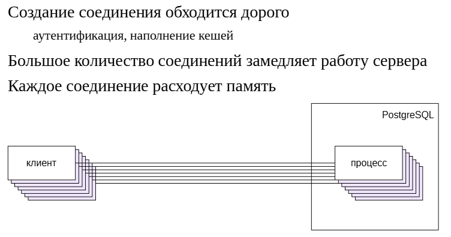
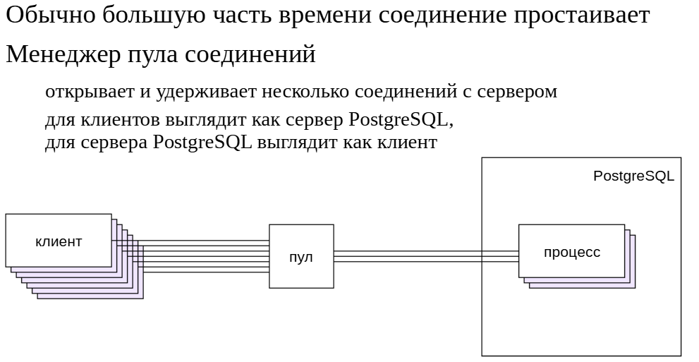
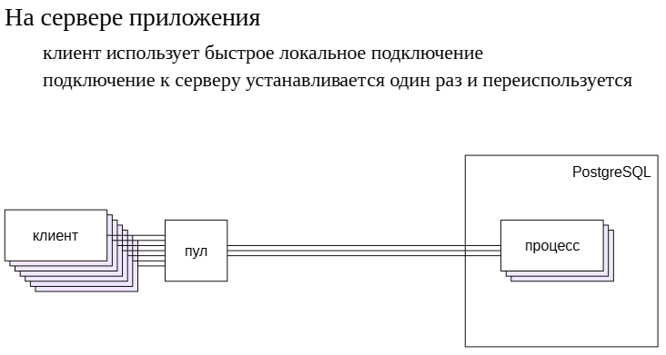
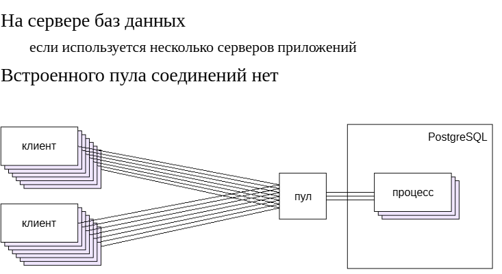
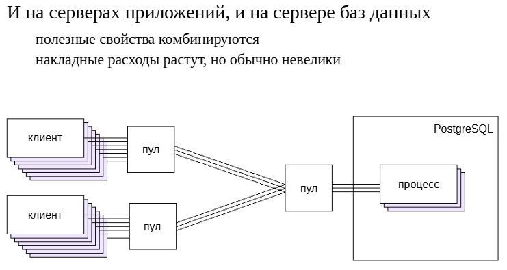
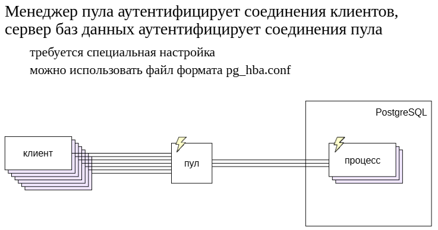
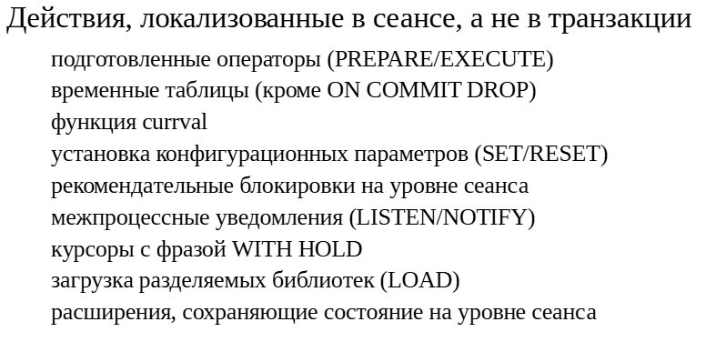
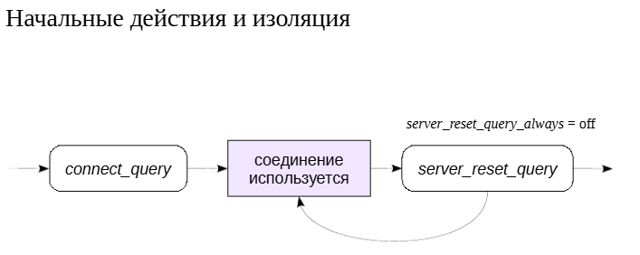

Пул соединений
##############

Один клиент - один процесс
**************************

Вспомним архитектуру PostgreSQL. Когда клиент подключаетсяк серверу, для него создается отдельный обслуживающий процесс,с которым и происходит вся дальнейшая работа этого клиента. 
Поэтому количество обслуживающих процессов на сервере равно количеству клиентов.

При большом количестве клиентов это вызывает проблемы:

- Создание соединений обходится дорого, в основном из-за того, что установка соединения требует аутентификации (особенно в случае шифрованных соединений) и наполнения кешей (например, кеша системного каталога).

- Большое количество процессов замедляет работу сервера. Основная причина в том, что для создания снимка данных (а это частая операция) приходится просматривать список всех имеющихся процессов. И такой просмотр требует блокировки внутренних структур данных.

- Каждый процесс занимает определенную часть памяти сервера.

Максимальное количество соединений, не вызывающее сложностей, зависит от многих факторов (наличие свободной памяти, количество ядер) и обычно лежит в диапазоне от нескольких сотен до нескольких тысяч.

Пул соединений
**************

Даже если клиент открывает соединение надолго, большую часть времени оно обычно простаивает, расходуя ресурсы. Если несколько клиентов смогут воспользоваться одним соединением, это поможет решить упомянутые проблемы. 
(Можно провести некоторую аналогиюс передачей данных по сети: между абонентами нет выделенного соединения, а данные передаются небольшими пакетами, используя имеющиеся каналы связи.)

Чтобы одновременно работать с большим количеством клиентов, используется **пул соединений**.

Специальная программа — *менеджер пула* — открывает и удерживает некоторое (небольшое) количество соединений с сервером БД. Для сервера БД все выглядит так, как будто имеются несколько долгоживущих соединений.

Клиенты подключаются *не к серверу БД*, а к *менеджеру пула*. Для этого он реализует тот же клиентский протокол, что и PostgreSQL, «притворяясь» для клиентов базой данных. 
Клиентские запросы переадресуются серверу БД, используя одно из имеющихся свободных соединений.

Место в архитектуре
*******************

	   
Можно по-разному встроить пул соединений в архитектуру информационной системы.

Один вариант — разместить менеджер пула на сервере приложения. Обычно это будет пул, предоставляемый самим сервером приложений или драйвером PostgreSQL, хотя при необходимости можно воспользоваться и сторонним решением.

При этом клиент получает возможность быстро подключатьсяк локальному менеджеру пула, а время установки соединенияс сервером БД перестает играть роль, поскольку выполняется только один раз. 
(Это не совсем верно, поскольку реализация пула может предусматривать динамическое добавление и отключение соединений с СУБД в зависимости от нагрузки, но идея остается той же самой — одно соединение используется многократно.)

	   

С другой стороны, если имеется несколько серверов приложений,то пул соединений имеет смысл устанавливать на сервере БД — иначе будет сложно ограничить количество соединений.

При этом в PostgreSQL пока нет встроенного пула соединений, нужно использовать сторонние решения.

Вообще говоря, в этом случае может иметь смысл использовать менеджеры пулов и на серверах приложений, и на сервере БД, чтобы одновременно и сократить время подключения, и ограничить количество соединений.

Следует учитывать, что каждый дополнительный узел на пути от клиента к серверу будет вносить определенные накладные расходы,но они, как правило, незначительны.

Программное обеспечение
************************

	   

Многие серверы приложений и просто драйверы, реализующие клиент-серверный протокол PostgreSQL, предоставляют возможность организации пула соединений на клиентской стороне. 

Встроенного менеджера пула в PostgreSQL пока нет, но есть сторонние продукты. Все представленные здесь менеджеры — проекты с открытым исходным кодом.

**PgBouncer** (https://www.pgbouncer.org/) используется очень широкои является стандартом де-факто. Это легкий пул соединений, без дополнительных функций. 

**Pgpool-II** (https://www.pgpool.net) разрабатывает компания SRA OSS (Япония). Это не только пул соединений, но и балансировщик нагрузки. Он реализует интересный функционал (например, анализ трафика для того чтобы отличать пишущие транзакции от только читающих).

**Odyssey** (https://github.com/yandex/odyssey) — пул соединений от компании Яндекс. Основное преимущество состоит в многопоточной архитектуре, позволяющей добиться высокой производительности.

Режимы работы
*************

Менеджер пула может работать в нескольких режимах.

В режиме **«пул сеансов»** клиенту предоставляется выделенное соединение из числа доступных. Этот режим полезен только в случае короткоживущих соединений: клиент подключается, выполняет транзакцию и тут же отключается. 
Например, это может быть система мониторинга, посылающая запросы раз в секунду.

Режим **«пул транзакций»** является наиболее универсальным и полезным. В нем соединение предоставляется отдельно для каждой транзакции. Такой режим полезен и в случае, когда клиент устанавливает долгоживущее соединение. 
Но из-за такого режима  возникают определенные особенности, которые необходимо учитывать при разработке приложений. 

Режим **«пул операторов»**. Но он фактически бесполезен, поскольку просто запрещает выполнение транзакций, состоящих более чем из одного оператора (работает только с режимом автофиксации).

Любое соединение с сервером всегда выполняется **к определенной базе данных** и под *определенной ролью*. Поэтому на каждую пару *«база данных — роль»* менеджер пулов создает *новый пул соединений*.

Из-за этого схема с пулом соединений вряд ли имеет смысл, если используется много различных ролей и баз данных.

Однако обычно все-таки используется одна база данных и ограниченное количество ролей (с аутентификацией конечных пользователей на уровне приложения).

Аутентификация
**************

Известно, что аутентификацию выполняет сервер БД. Но при наличии пула соединений нельзя полагаться только на нее.

Поскольку в данном случае менеджер пула является точкой входа для клиентов, он сам должен выполнять аутентификацию аналогично тому, как это делает сервер БД. 
Иначе любой клиент сможет получить несанкционированный доступ к уже открытому соединению (которое было аутентифицировано сервером БД один раз при открытии).

Таким образом, схема получается следующая:

1. Менеджер пула выполняет аутентификацию входящего соединения. Для этого ему требуются настройки, более или менее аналогичные имеющимся в PostgreSQL. 
PgBouncer позволяет обойтись более простыми настройками, но допускает и использование обычного файла формата *pg_hba.conf*. Необходимо учитывать, что менеджер пула может поддерживать не все методы аутентификации. 
Например, PgBouncer напрямую не поддерживает GSSAPI, LDAP и т. п. (Однако поддержка PAM позволяет использовать различные методы.)

2. При успешной аутентификации, если потребуется открыть новое соединение с базой данных, менеджер пула передает PostgreSQL информацию, полученную от клиента (например, имя и пароль),а PostgreSQL аутентифицирует входящее соединение обычным образом. 
(Хотя в общем случае менеджер пула может подключатьсяк PostgreSQL под другой ролью, игнорируя идентификацию клиента.)

ПРАКТИКА
========

**Минимальная настройка**

Файл настроек PgBouncer:

::

	student$ sudo ls -l /etc/pgbouncer/pgbouncer.ini
	-rw-r----- 1 postgres postgres 11217 ноя 26 19:09 /etc/pgbouncer/pgbouncer.ini

::

	student$ sudo grep '^[^;]' /etc/pgbouncer/pgbouncer.ini

	[databases]
	* = host=localhost port=5432
	[users]
	[pgbouncer]
	logfile = /var/log/postgresql/pgbouncer.log
	pidfile = /var/run/postgresql/pgbouncer.pid
	listen_addr = localhost
	listen_port = 6432
	unix_socket_dir = /var/run/postgresql
	auth_type = scram-sha-256
	auth_file = /etc/pgbouncer/userlist.txt
	admin_users = student
	pool_mode = transaction

Секция [databases] позволяет переадресовывать обращения к разным БД на разные серверы PostgreSQL (в нашем случае это не используется);

PgBouncer слушает порт **6432**;

Используется аутентификация **scram-sha-256**;

Роль **student** может выполнять администрирование PgBouncer;

Используется режим пула транзакций.

Файл пользователей:

::

	student$ sudo cat /etc/pgbouncer/userlist.txt

	"student"	
	"SCRAM-SHA-256$4096:Ivx0LbEUD35XlioHdX44IQ==$jk8pkIWipEmOtxAAzcQ7JKBGt50ery7XZ7Gchslu6yk=:
	6ddAByaDBYaR6UhPMJtPb9NMiWH/1frcb4FvKM4Rkmw="
	"web"	
	"SCRAM-SHA-256$4096:Q+xJq/zWx/Zb90njg3Y5kA==$Ky6A5tRLlCSiffTHrlCEdGOa3fSZBeZif6m8K38I9U0=:
	KqBzFxEQL+RQU/B9saKznrkbPftAnxooNTZROiCzUEM="
	"emp"	
	"SCRAM-SHA-256$4096:LUAZGsmu+pjdLYCW/O0unA==$de7ECec9KKVLDXgI0c8VGkRLRCo3lXnqMCdBnvScD5I=:
	ME0c0wscENrLDqBkBCqxD8s0yUiAOQVmTCn7aQsIivU="

Чтобы не синхронизировать пароли, можно получать их непосредственно с сервера БД:

::

	student$ sudo grep 'auth_query' /etc/pgbouncer/pgbouncer.ini
	;; use auth_user with auth_query if user not present in auth_file
	;; run auth_query on a specific database.
	;auth_query = SELECT rolname, CASE WHEN rolvaliduntil < pg_catalog.now() THEN NULL ELSE 
	rolpassword END FROM pg_authid WHERE rolname=$1 AND rolcanlogin
	;; Authentication database that can be set globally to run "auth_query".

Попробуем подключиться. Поскольку PgBouncer настроен на парольную scram-sha-256-аутентификацию, зададим пароль явно в строке подключения (можно было бы использовать файл ~/.pgpass):

::

	student$ psql postgresql://student@localhost:6432/student?password=student
	
	SELECT pg_backend_pid();
	 pg_backend_pid 
	----------------
			  19649
	(1 row)

Подключение работает.

Теперь закроем соединение и откроем его заново:

::

	\q

::

	student$ psql postgresql://student@localhost:6432/student?password=student

	SELECT pg_backend_pid();
	 pg_backend_pid 
	----------------
			  19649
	(1 row)

Фактически мы продолжаем работать в том же самом сеансе, который PgBouncer удерживает открытым.

Управление
**********

Для управления PgBouncer используется консоль, к которой можно подключиться с помощью обычного psql, указывая специальную БД pgbouncer.

Консоль позволяет запрашивать состояние системы и выполнять ряд команд. Например, можно приостановить поток запросов от клиентов на время перезагрузки сервера БД и т. п.

Практика
========

**Консоль управления**

Чтобы работать с консолью управления PgBouncer, необходимо подключиться к одноименной базе данных (это могут сделать пользователи, определенные в параметрах admin_users и stat_users).

::

	student$ psql postgresql://student@localhost:6432/pgbouncer?password=student

Теперь мы работаем не с PostgreSQL — команды обрабатывает сам PgBouncer.

Например, можно получить информацию об используемых пулах:

::

	SHOW POOLS \gx

	-[ RECORD 1 ]---------+------------
	database              | pgbouncer
	user                  | pgbouncer
	cl_active             | 1
	cl_waiting            | 0
	cl_active_cancel_req  | 0
	cl_waiting_cancel_req | 0
	sv_active             | 0
	sv_active_cancel      | 0
	sv_being_canceled     | 0
	sv_idle               | 0
	sv_used               | 0
	sv_tested             | 0
	sv_login              | 0
	maxwait               | 0
	maxwait_us            | 0
	pool_mode             | statement
	load_balance_hosts    | 
	-[ RECORD 2 ]---------+------------
	database              | student
	user                  | student
	cl_active             | 0
	cl_waiting            | 0
	cl_active_cancel_req  | 0
	cl_waiting_cancel_req | 0
	sv_active             | 0
	sv_active_cancel      | 0
	sv_being_canceled     | 0
	sv_idle               | 1
	sv_used               | 0
	sv_tested             | 0
	sv_login              | 0
	maxwait               | 0
	maxwait_us            | 0
	pool_mode             | transaction
	load_balance_hosts    | 

Работой пула управляет ряд параметров, которые мы уже видели в конфигурационном файле. Из консоли управления можно увидеть их текущие и умолчательные значения и при необходимости изменить их:

::

	SET max_prepared_statements = 10;
	SET max_prepared_statements=10

Вывод команды SHOW CONFIG, показывающий информацию о параметрах, достаточно объемный, поэтому отфильтруем его, чтобы увидеть только один параметр:

::

	SHOW CONFIG \gx

	------------------------------------
	key        | max_prepared_statements
	value      | 10
	default    | 200
	changeable | yes
	Пусть к пулу подключится новый клиент:

	student$ psql postgresql://student@localhost:6432/student?password=student
	А мы приостановим работу всех клиентов:

	PAUSE;
	PAUSE
	Новый клиент пытается выполнить запрос:

	SELECT now();
	Для него ситуация выглядит так, как будто база данных не отвечает.

	Теперь мы можем даже перезапустить PostgreSQL.

	student$ sudo pg_ctlcluster 16 main restart
	Возобновляем работу клиентов, и запрос успешно выполняется:

	RESUME;
	RESUME

				  now              
	-------------------------------
	 2025-11-26 19:10:00.058271+03
	(1 row)

Таким образом можно выполнять работы на сервере БД (например, обновление), не обрывая клиентские соединения.

Особенности разработки
**********************

Режим «пула транзакций» имеет для разработчика приложений особенности, связанные с тем, что две транзакции, выполняемыев одном клиентском сеансе, могут выполняться в разных сеансах сервера БД. 
Поэтому не будут работать (точнее, будут работать не так, как задумано) любые команды, действие которых распространяетсяна время сеанса, а не транзакции.

К ним относятся *подготовленные операторы* (если подготовкой управляет клиент), использование временных таблиц, функции currval, установка параметров и рекомендательных блокировок на уровне сеанса, межпроцессные уведомления, 
курсоры *WITH HOLD*, загрузка разделяемых библиотек в сеансе, установка таймаута бездействия сеанса (idle_session_timeout) и подобные. А также расширения, реализующие «глобальные переменные» уровня сеанса, 
такие как **pg_variables** (https://postgrespro.ru/docs/enterprise/16/pg-variables).

В версии pgBouncer 1.21 (16.10.2023) реализована поддержка подготовленных операторов на стороне клиента. Надо учитывать,что команды уровня SQL (PREPARE, EXECUTE, DEALLOCATE)по-прежнему направляются напрямую на сервер, 
поэтому подготовка операторов будет работать только при использовании драйверов, непосредственно формирующих сообщения протокола (например,для python или perl).https://www.pgbouncer.org/changelog.html#pgbouncer-121x

Практика
========

**Особенности пула транзакций**

Рассмотрим на примере подготовленных операторов — в случае, когда подготовкой управляет клиент.

::

	student$ psql postgresql://student@localhost:6432/student?password=student

::

	PREPARE hello AS SELECT 'Hello, world!';

	PREPARE

Теперь откроем еще один сеанс.

::

	student$ psql postgresql://student@localhost:6432/student?password=student

::

	| BEGIN;
	
	| BEGIN

::

	| SELECT name, statement, prepare_time, parameter_types, result_types FROM pg_prepared_statements \gx
	
	| -[ RECORD 1 ]---+-----------------------------------------
	| name            | hello
	| statement       | PREPARE hello AS SELECT 'Hello, world!';
	| prepare_time    | 2025-11-26 19:10:00.397935+03
	| parameter_types | {}
	| result_types    | {text}

	| SELECT pg_backend_pid();
	
	| pg_backend_pid 
	| ----------------
	|		  22784
	| (1 row)

Транзакция второго сеанса выполняется в том же соединении, поэтому ей доступен подготовленный оператор:

::

	| EXECUTE hello;
	
	| ?column?    
	| ---------------
	| Hello, world!
	| (1 row)

А какое соединение будет использоваться в первом сеансе?

::

	BEGIN;

	BEGIN

::

	SELECT pg_backend_pid();

	 pg_backend_pid 
	----------------
			  23127
	(1 row)

Уже другое, поскольку во втором сеансе транзакция не завершена.

::

	EXECUTE hello;

	ERROR:  prepared statement "hello" does not exist

Подготовленного оператора в памяти этого обслуживающего процесса нет.

::
	END;
	
	ROLLBACK

::

	| END;
	| COMMIT

Чтобы пользоваться и преимуществами пула соединений, и подготовленными операторами, надо переносить управление подготовкой на сторону сервера. 
Самый простой и удобный способ — **писать функции на языке PL/pgSQL**. В этом случае интерпретатор автоматически подготавливает все запросы.

Подготовка соединений
*********************

	   
PgBouncer предоставляет параметры, позволяющие с помощью SQL-команды:

- настраивать только что открытое соединение,

- очищать состояние соединения после использования его клиентом.

Запрос, заданный в атрибуте **connect_query** строки соединения, отрабатывает при открытии соединения (перед тем, как оно будет выдано первому клиенту).

Запрос, заданный в параметре **server_reset_query**, по умолчанию срабатывает только в режиме пула сеансов и полностью сбрасывает состояние сеанса, включая содержимое всех кешей. 

Если установить **server_reset_query_always = on**, запрос будет срабатывать и в режиме пула транзакций. 
Тогда, если приложение не обеспечивает должную изоляцию действий в транзакции, в такой запрос можно поместить действия по принудительной изоляции, такие как сброс параметров сеанса, 
удаление подготовленных операторов, очистка временных таблиц и др.

Практика
========

**Подготовка соединений и изоляция**

Настройки базы данных в PgBouncer позволяют при открытии соединения выполнять любую команду SQL. Для этого добавим атрибут connect_query в строку соединения:

::

	student$ sudo sed -i $'s/^* =.*/* = host=localhost port=5432 connect_query=\'PREPARE hello AS SELECT \'\'Привет, мир!\'\' greeting;\'/' /etc/pgbouncer/pgbouncer.ini

Либо добавить строки с помощью **vim**

В конфигурационном файле получили:

::

	student$ sudo grep '^* =' /etc/pgbouncer/pgbouncer.ini
	* = host=localhost port=5432 connect_query='PREPARE hello AS SELECT ''Привет, мир!'' greeting;'
	
Подключаемся к консоли управления и перечитываем настройки:

::

	\c pgbouncer
	You are now connected to database "pgbouncer" as user "student".

::

	RELOAD;

	RELOAD

При открытии соединения с сервером PostgreSQL в памяти обслуживающего процесса создается подготовленный оператор:

::

	| \c

	| You are now connected to database "student" as user "student".

::

	| SELECT * FROM pg_prepared_statements\gx

	| -[ RECORD 1 ]---+-------------------------------------------------
	| name            | hello
	| statement       | PREPARE hello AS SELECT 'Привет, мир!' greeting;
	| prepare_time    | 2025-11-26 19:10:01.789939+03
	| parameter_types | {}
	| result_types    | {text}
	| from_sql        | t
	| generic_plans   | 0
	| custom_plans    | 0

::

	| EXECUTE hello;

	|    greeting   
	| --------------
	|  Привет, мир!
	| (1 row)

Самостоятельно
**************

1. Убедитесь, что при работе приложения через пул соединений (порт 6432) разные пользователи обычно видят одну и ту же  корзину. Выясните причину ошибки и исправьте код хранимых функций так, чтобы приложение работало корректно как без пула соединений, 
так и с ним.

2. Использование пула мешает выводу в журнал сообщений сервера информации, относящейся только к одному клиенту. Наше приложение вызывает в начале каждой транзакции функцию **webapi.trace** (или **empapi.trace**), 
если в служебной панели установлен признак трассировки. Реализуйте эти функции так, чтобы они устанавливали параметр сервера **log_min_duration_statements = 0** и облегчали идентификацию клиента. Проверьте работу по журналу сообщений.

Пояснение:
==========

Во всех темах курса, начиная с этой, мы будем использовать подключение через пул соединений на порту 6432 (настройка по умолчанию). 
Pgbouncer настроен точно так же, как было показанов демонстрации.

1. Проблема воспроизводится следующим образом. Откройте две вкладки браузера с книжным магазином. В первой войдите как aliceи положите в корзину одну или несколько книг. 
Во второй зайдите как bob и проверьте корзину.Поскольку один пользователь видит корзину другого пользователя, можно предположить, что дело в разграничении доступа. 
Чтобы понять, в каком месте следует искать проблему, вспомните материал темы «Книжный магазин 2.0».

2. Необходимые функции уже имеются в базе данных, но ничего не делают. Функция **webapi.trace** принимает на вход токен аутентификации (или NULL, если пользователь не вошел в систему).

Для идентификации можно использовать параметр **log_line_prefixс маской %a**, выводящей имя приложения. Имя приложения устанавливается параметром **application_name**, в которое можно записать имя пользователя, если оно известно.

**Решение:**

https://edu.postgrespro.ru/16/dev2-16/dev2_07_ext_connpool.html

