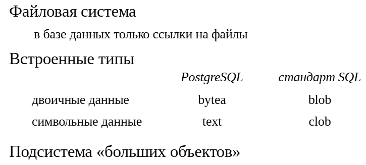
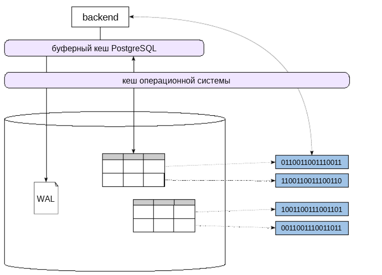
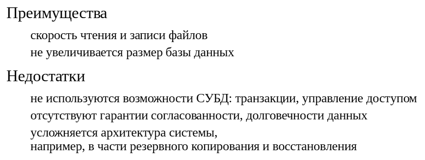
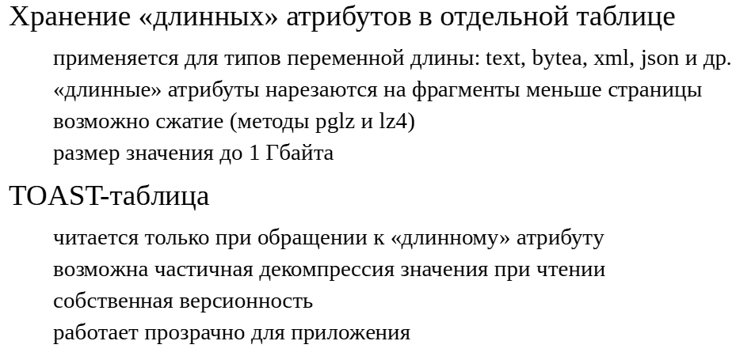
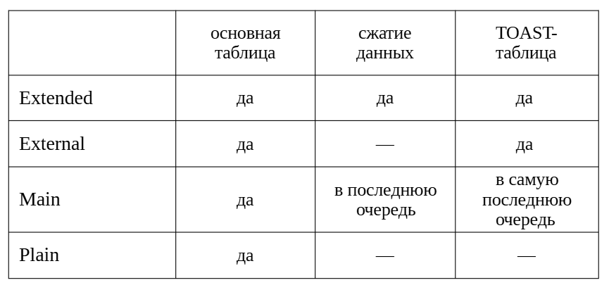
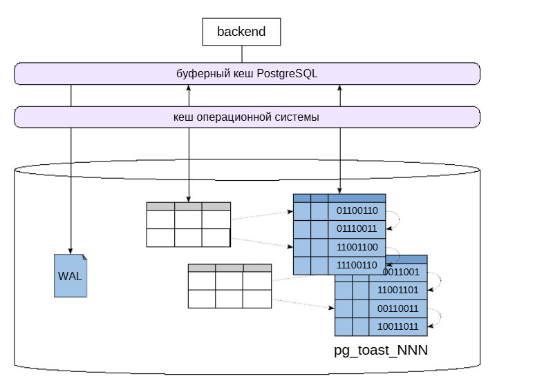
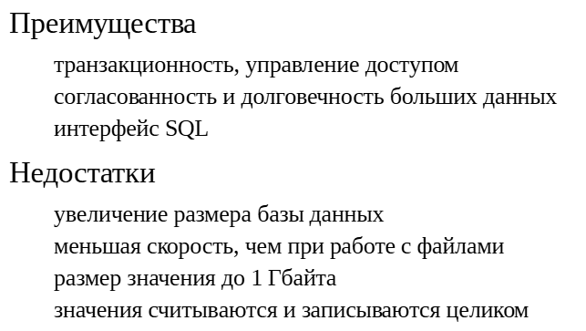
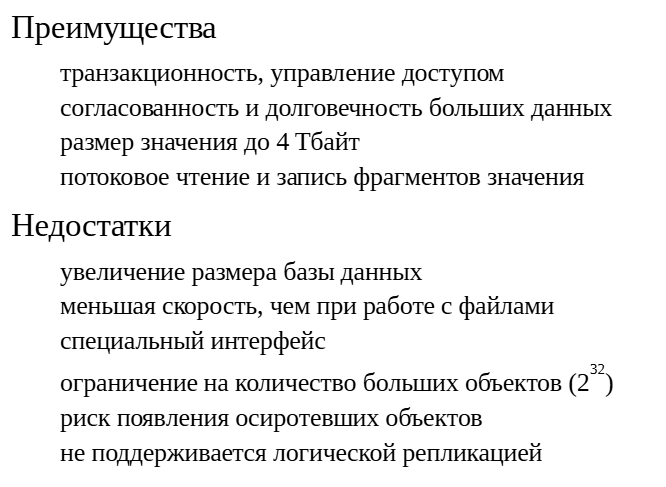

Типы для больших значений
#########################

Варианты хранения
*****************

Для хранения и обработки больших объемов данных в стандарте SQL предусмотрены типы:

- clob (character large object) — для символьных данных;

- blob (binary large object) — для двоичных данных.

В PostgreSQL типы *clob* и *blob* отсутствуют. Вместо них для символьных данных можно использовать тип **text**, а для двоичных —  **bytea** (*byte array*). 
Работа с данными типа **text** не зависит от размера значения, поэтому в дальнейшем будем говорить только о двоичных данных. Например, об изображениях, видео, аудио и пр. 
Как правило такие данные хранят содержимое файлов соответствующих форматов.

В качестве альтернативы типу **bytea**, можно использовать подсистему работы с *большими объектами*.

Но прежде чем размещать данные файлов внутри базы, следует рассмотреть возможность хранения их «в обычном виде» в файловой системе.

Хранение в файловой системе
===========================

Если говорить о двоичных данных большого объема, то один из вариантов — отказаться от размещения их в СУБД. 
В этом случае файлы с двоичными данными располагаются непосредственнов файловой системе, а внутри базы данных поддерживаются только ссылки на них.

Такой подход может быть оправдан в первую очередь производительностью. Скорость чтения и записи файлов увеличивается за счет избежания затрат, характерных для СУБД:

- двойная запись на диск (в WAL и файлы данных);

- двойное кеширование в оперативной памяти (файловый кеш и буферный кеш СУБД);

- накладные расходы на хранение в базе данных и обработку (нарезка на фрагменты для хранения и склейка их при чтении);

- возможное распухание таблиц и индексов приводитк дополнительному чтению устаревших фрагментов значения.

Кроме того, удается сократить расходы на обслуживание. Не требуется очистка и переиндексация таблиц с большими данными. Копирование файлов, в том числе инкрементальное, можно выполнять средствами ОС. 
А резервные копии только базы данных будут создаваться быстрее, меньшего размера и потребуют меньше времени на восстановление.

С другой стороны, становится невозможным использовать преимущества СУБД:

- транзакционная обработка: атомарность и согласованность записи, конкурентный доступ, восстановление после сбоя;

- управление доступом пользователей на чтение и запись данных.

Архитектура системы может потребовать пересмотра и доработки процедур резервного копирования и восстановления, использования реплик, обнаружения неиспользуемых файлов и пр.

TOAST
*****

Любая версия строки в PostgreSQL должна целиком помещаться на одну страницу. Для «длинных» версий строк применяется технология **TOAST — The Oversized Attributes Storage Technique**. 

Точнее, TOAST применяется к отдельным атрибутам, имеющим тип переменной длины, например, **text** и **bytea**, а также **xml** и **json**
. 
В любом случае размер одного значения (возможно сжатого) не должен превышать 1 Гбайта.

Для каждой основной таблицы при необходимости создается отдельная TOAST-таблица (и к ней специальный индекс). Версии строк в TOAST-таблице тоже должны помещаться на одну страницу, 
поэтому «длинные» значения хранятся порезанными на части, обычно около 2 Кбайт. Из этих частей PostgreSQL прозрачно для приложения «склеивает» необходимое значение.

TOAST-таблица используется только при обращении к «длинному» значению. Если эти данные упакованы, то начальные фрагменты сжатого атрибута считываются порциями и сразу распаковываются, 
позволяя избежать извлечения «длинного» значения целиком. Но если требуется изменить несколько байт значения, то оно будет считанои записано полностью.

Для TOAST-таблицы поддерживается своя версионность: если обновление данных не затрагивает «длинное» значение, новая версия строки будет ссылаться на то же самое значение в TOAST-таблице — это экономит место.

Стратегии хранения
==================

Столбцы таблиц используют одну из четырех стратегий хранения значений, устанавливаемую в зависимости от типа данных:

- **EXTENDED**. Допускается сжатие и перенос в таблицу TOAST.Для типов, поддерживающих перенос в TOAST, обычно используется эта стратегия.

- **EXTERNAL**. Допускается только перенос в таблицу TOAST, но не сжатие. Если загружаемые данные уже сжаты, имеет смысл выбрать стратегию EXTERNAL для экономии затрат на малоэффективное повторное сжатие.

- **MAIN**. Поля с этой стратегией сжимаются только в том случае, если обработки полей EXTENDED и EXTERNAL оказалось недостаточно, чтобы уместить версию строки на странице. Переносв таблицу TOAST тоже возможен, но только как крайняя мера.

- **PLAIN**. Хранение только в основной таблице. Используется для типов, значения которых имеют небольшой размер.

При создании пользовательского типа данных можно задать стратегию, применяемую по умолчанию.

На уровне столбца таблицы можно переопределить стратегию, а также указать метод сжатия.

https://postgrespro.ru/docs/postgresql/16/storage-toast

Тип bytea
*********

	   

Хранить двоичные объекты в базе данных можно двумя способами.
Первый способ заключается в создании столбцов с типом **bytea* в таблицах. 
Тип **bytea** использует технологию хранения **TOAST**. Поэтому значения большого размера размещаются не в самой таблице, а нарезаются на фрагменты и хранятся в TOAST-таблице, связанной с основной.

Главное преимущество хранения больших значений в базе данных — это использование возможностей СУБД. Транзакционный механизм  гарантирует согласованность данных и защиту от сбоев.

А разграничивать доступ пользователей к значениям можно при помощи средств СУБД.

Для работы с типом **bytea** используется язык SQL, что делает эти действия удобными.

Двоичные типы данных, функции и операторы для работы с ними:

https://postgrespro.ru/docs/postgresql/16/datatype-binary

https://postgrespro.ru/docs/postgresql/16/functions-binarystring

Как мы уже говорили ранее, хранение внутри базы данных увеличивает размер базы и расходы на ее сопровождение, а также уменьшает скорость чтения и записи данных из-за необходимости нарезать значение на фрагменты и склеивать их, 
помещая в дополнительный кеш.

К недостаткам использования типа **bytea** можно отнести и ограничение TOAST на размер одного значения в 1 Гбайт.

Также отметим, что при работе c TOAST изменение даже небольшой части значения приводит к считыванию в буферный кеш всех занятых значением страниц и к перезаписи всего значения. 

С чтением части значения дело обстоит лучше: возможно извлечение только необходимого фрагмента.

Практика
========

**Тип bytea и TOAST**

::

	CREATE DATABASE ext_lob;

	CREATE DATABASE

::

	\c ext_lob
	You are now connected to database "ext_lob" as user "student".

По умолчанию двоичные данные выводятся в шестнадцатеричном формате.

::

	SHOW bytea_output;

	 bytea_output 
	--------------
	 hex
	(1 row)

Значения начинаются с **'\x'**, далее каждый байт представлен двумя шестнадцатеричными цифрами:

::

	SELECT 'Hello'::bytea;

		bytea     
	--------------
	 \x48656c6c6f
	(1 row)

Добавим нулевой символ к строке:

::

	SELECT 'Hello'::bytea || '\x00'::bytea;

		?column?    
	----------------
	 \x48656c6c6f00
	(1 row)
	
Шестнадцатеричный формат появился в версии 9.0. До этого был доступен только формат «спецпоследовательностей».

::

	SET bytea_output = 'escape';

	SET

В этом формате ASCII-символы отображаются как есть, а остальные представлены спецпоследовательностями:

::

	SELECT 'Hello'::bytea || '\x00'::bytea;

	 ?column?  
	-----------
	 Hello\000
	(1 row)

Параметр bytea_output определяет только формат вывода двоичных данных. Входные данные принимаются в любом из этих двух форматов.

::

	RESET bytea_output;

	RESET

Теперь создадим таблицу со столбцом типа bytea.

::

	CREATE TABLE demo_bytea(
	  filename text, 
	  data bytea
	);

	CREATE TABLE

Таблица TOAST создается автоматически для хранения больших значений data и filename (значения типа text также могут быть большими). Найдем имя служебной таблицы:

::

	SELECT reltoastrelid::regclass AS toast_table 
	FROM pg_class 
	WHERE oid = 'demo_bytea'::regclass;

		   toast_table       
	-------------------------
	 pg_toast.pg_toast_16567
	(1 row)

Служебные таблицы TOAST всегда располагаются в специальной схеме pg_toast — чтобы не пересекаться с обычными объектами базы данных. Получить список TOAST-таблиц можно командой psql:

::

	\dtS pg_toast.pg_toast_16567*

					 List of relations
	  Schema  |      Name      |    Type     |  Owner  
	----------+----------------+-------------+---------
	 pg_toast | pg_toast_16567 | TOAST table | student
	(1 row)

Посмотрим на структуру TOAST-таблицы:

::

	\d pg_toast.pg_toast_16567

	TOAST table "pg_toast.pg_toast_16567"
	   Column   |  Type   
	------------+---------
	 chunk_id   | oid
	 chunk_seq  | integer
	 chunk_data | bytea
	Owning table: "public.demo_bytea"
	Indexes:
		"pg_toast_16567_index" PRIMARY KEY, btree (chunk_id, chunk_seq)

- chunk_id — идентификатор значения,

- chunk_seq — порядковый номер фрагмента значения,

- chunk_data — данные фрагмента.

Можно обратить внимание, что вывод команды **\d** для TOAST-таблиц содержит название основной таблицы.

Доступ к значениям в TOAST всегда осуществляется по индексу. Это самый быстрый способ получить все фрагменты одного значения для склейки, но доступ ко всем значениям будет заведомо неэффективен.

Кроме того, чтение большого объема данных из TOAST-таблиц может приводить к вытеснению полезных данных из буферного кеша. Механизм буферного кольца, предотвращающий массовое вытеснение, 
для TOAST-таблиц не используется, так как задействуется только при полном последовательном сканировании таблицы, но не при индексном доступе.

Добавим в *demo_bytea* строку. В качестве данных возьмем логическую резервную копию базы данных приложения.

::

	student$ pg_dump -d bookstore2 > /tmp/bookstore2.sql

	student$ ls -l /tmp/bookstore2.sql

	-rw-rw-r-- 1 student student 1791242 ноя 26 19:10 /tmp/bookstore2.sql0

Заметим время вставки.

\::

	timing on
	Timing is on.

Для считывания файла воспользуемся встроенной функцией pg_read_binary_file.

::

	INSERT INTO demo_bytea(filename, data) VALUES (
		'bookstore2.sql',
		pg_read_binary_file('/tmp/bookstore2.sql')
	);
	INSERT 0 1
	Time: 131,458 ms

::

	\timing off
	Timing is off.

Использование TOAST прозрачно для приложения. Нам не нужно обращаться к служебной таблице в запросах. Вот первые 16 байт загруженного файла в двоичном виде:

::

	SELECT substring(data,1,16) FROM demo_bytea;

				 substring              
	------------------------------------
	 \x2d2d0a2d2d20506f737467726553514c
	(1 row)

Общий размер загруженного значения соответствует размеру файла:

::

	SELECT length(data) FROM demo_bytea;

	 length  
	---------
	 1791242
	(1 row)

Однако размер таблицы demo_bytea составляет всего одну страницу, данных загруженного файла в ней нет:

::

	SELECT pg_relation_size('demo_bytea');

	 pg_relation_size 
	------------------
				 8192
	(1 row)

Значение столбца data попало в TOAST-таблицу. Можно убедиться, что в служебной таблице появилось одно значение:

::

	SELECT count(distinct(chunk_id)) FROM pg_toast.pg_toast_16567;

	 count 
	-------
		 1
	(1 row)

Сколько места требуется для хранения TOAST-таблицы, если сравнивать с размером файла: меньше, больше или ровно столько же?

::

	SELECT pg_relation_size('pg_toast.pg_toast_16567');

	 pg_relation_size 
	------------------
			   794624
	(1 row)

Почему потребовалось меньше места?

::

	\d+ demo_bytea

											Table "public.demo_bytea"
	  Column  | Type  | Collation | Nullable | Default | Storage  | Compression | Stats 
	target | Description 
	----------+-------+-----------+----------+---------+----------+-------------+-------------
	-+-------------
	 filename | text  |           |          |         | extended |             |             
	 | 
	 data     | bytea |           |          |         | extended |             |             
	 | 
	Access method: heap

Стратегия хранения **extended** предполагает сжатие данных при помещении в TOAST. А текстовые данные хорошо сжимаются.

Начиная с PostgreSQL 14 появилась возможность выбора метода сжатия: pglz (используется по умолчанию) и lz4. Изменим метод сжатия для столбца data и повторим наш опыт, предварительно опустошив таблицу.

::

	ALTER TABLE demo_bytea ALTER COLUMN data SET COMPRESSION lz4;
	ALTER TABLE
	TRUNCATE demo_bytea;
	TRUNCATE TABLE

::

	\timing on

	Timing is on.

::	

	INSERT INTO demo_bytea(filename, data) VALUES (
		'bookstore2.sql',
		pg_read_binary_file('/tmp/bookstore2.sql')
	);
	
	INSERT 0 1
	
	Time: 50,365 ms
	
::

	\timing off
	
	Timing is off.

Вставка данных выполнилась заметно быстрее, но места для сжатых данных потребуется больше — lz4 сжимает данные не так эффективно:

::

	SELECT pg_relation_size('pg_toast.pg_toast_16567');

	 pg_relation_size 
	------------------
			   892928
	(1 row)

Сжатие вообще можно запретить, выбрав стратегию external:

::

	ALTER TABLE demo_bytea ALTER COLUMN data SET STORAGE external;

	ALTER TABLE

Это изменение будет действовать только для новых строк, поэтому снова опустошим таблицу и загрузим файл заново.

::

	TRUNCATE demo_bytea;

	TRUNCATE TABLE

::

	INSERT INTO demo_bytea(filename, data) VALUES (
		'bookstore2.sql',
		pg_read_binary_file('/tmp/bookstore2.sql')
	);

	INSERT 0 1

Сколько теперь потребуется места для хранения TOAST-таблицы, если сравнивать с размером исходного файла: меньше, больше или ровно столько же?

::

	SELECT pg_relation_size('pg_toast.pg_toast_16567');

	 pg_relation_size 
	------------------
			  1843200
	(1 row)

Теперь для хранения используется немного больше места. Почему?

::

	SELECT chunk_id, chunk_seq, substring(chunk_data,1,16),
		length(chunk_data)
	FROM pg_toast.pg_toast_16567
	ORDER BY 1,2 LIMIT 3;

	 chunk_id | chunk_seq |             substring              | length 
	----------+-----------+------------------------------------+--------
		16580 |         0 | \x2d2d0a2d2d20506f737467726553514c |   1996
		16580 |         1 | \x726d617420746578742c20726174696e |   1996
		16580 |         2 | \x73656172636820746578742c206f7264 |   1996
	(3 rows)

На размер повлияли накладные расходы на хранение фрагментов в отдельных строках с дополнительными столбцами и служебной информацией.

Большие объекты
***************

.. 	figure:: img/08_08.png
       :scale: 100 %
       :align: center
       :alt: asda

Другой вариант хранения двоичных данных большого размера внутри базы данных — использование подсистемы «больших объектов», появившейся задолго до TOAST.

Все большие объекты сохраняются в отдельной таблице системного каталога **pg_largeobject**. Для ссылок на большие объекты в столбцах других таблиц предоставляются идентификаторы типа **oid**. 
Доступк этим объектам осуществляется при помощи специального интерфейса, похожего на интерфейс работы с файлами.

https://postgrespro.ru/docs/postgresql/16/largeobjects

Большие объекты наследуют те же преимущества и недостатки, чтои тип bytea, относительно хранения в файловой системе.

По сравнению с типом *bytea* у больших объектов есть преимущества. 

Во-первых, размер одного объекта может достигать 4 Тбайт.

А во-вторых, интерфейс для работы с большими объектами позволяет работать с произвольным фрагментом значения, а не со всем значением целиком, как обычно происходит с TOAST.

С другой стороны, использование специального интерфейса делает работу с большими объектами не такой удобной, как с чистым SQL.К тому же драйвер PostgreSQL должен поддерживать этот интерфейс.

Идентификатор большого объекта хранится в *4-байтовом* типе **oid**, что ограничивает количество объектов в системе числом 4 294 967 296. 
Таблицы **TOAST** тоже используют **oid**, но ограничение на количество значений действует *в пределах таблицы*, а не на всю систему.

Кроме того, хранение всех больших объектов в отдельной таблице увеличивает риск появления осиротевших объектов, на которыене осталось ссылок в обычных таблицах. 
Для поиска и удаления осиротевших объектов можно использовать утилиту **vacuumlo**, а для предотвращения их появления — расширение **lo**.

https://postgrespro.ru/docs/postgresql/16/lo

https://postgrespro.ru/docs/postgresql/16/vacuumlo

Логическая репликация не поддерживает изменения в таблицах системного каталога, в том числе в **pg_largeobject**, то есть большие объекты не реплицируются.

Практика
========

**Использование large objects**

Большие объекты хранятся в таблице системного каталога pg_largeobject, структура которой похожа на структуру TOAST-таблицы.

::

	\d pg_largeobject

			 Table "pg_catalog.pg_largeobject"
	 Column |  Type   | Collation | Nullable | Default 
	--------+---------+-----------+----------+---------
	 loid   | oid     |           | not null | 
	 pageno | integer |           | not null | 
	 data   | bytea   |           | not null | 
	Indexes:
		"pg_largeobject_loid_pn_index" PRIMARY KEY, btree (loid, pageno)

Создадим таблицу для хранения ссылок на большие объекты.

::

	CREATE TABLE demo_largeobject(
	  filename text,
	  link oid
	);

	CREATE TABLE

Для работы с большими объектами будем использовать интерфейсные функции SQL.

::

	INSERT INTO demo_largeobject VALUES (
		'bookstore2.sql',
		lo_import('/tmp/bookstore2.sql')
	);

	INSERT 0 1

Функция lo_import загружает файл с сервера в pg_largeobject и возвращает указатель на него (OID).

Функция lo_get считывает указанную часть значения:

::

	SELECT filename, link, lo_get(link,1,16) FROM demo_largeobject;

		filename    | link  |               lo_get               
	----------------+-------+------------------------------------
	 bookstore2.sql | 16586 | \x2d0a2d2d20506f737467726553514c20
	(1 row)

Что будет, если удалить строку из таблицы demo_largeobject?

::

	DELETE FROM demo_largeobject;

	DELETE 1

Строка удалится, а большой объект станет «потерянным»:

::

	\lo_list

			 Large objects
	  ID   |  Owner  | Description 
	-------+---------+-------------
	 16586 | student | 
	(1 row)

Дополнительная утилита **vacuumlo**, поставляемая с сервером, позволяет найти большие объекты, на которые не осталось ссылок, и удалить их:

::

	student$ vacuumlo --verbose ext_lob

	Connected to database "ext_lob"

	Checking link in public.demo_largeobject

	Removing lo  16586   
	Successfully removed 1 large objects from database "ext_lob".
	\lo_list
		  Large objects
	 ID | Owner | Description 
	----+-------+-------------
	(0 rows)

Для предотвращения потери ссылок также можно воспользоваться расширением **lo**.

::

	CREATE EXTENSION lo;

	CREATE EXTENSION

Расширение создает тип данных lo (обертка над oid) и функцию lo_manage для использования в триггерных функциях.

::

	CREATE TABLE demo_lo (filename text, link lo);

	CREATE TABLE

::

	CREATE TRIGGER t_link
	BEFORE UPDATE OR DELETE ON demo_lo
	FOR EACH ROW
	EXECUTE FUNCTION lo_manage(link);

	CREATE TRIGGER

Загрузим большой объект и поместим ссылку на него в таблицу.

::

	INSERT INTO demo_lo VALUES (
		'bookstore2.sql',
		lo_import('/tmp/bookstore2.sql')
	);

	INSERT 0 1

Убедимся, что все на месте, и удалим.

::

	SELECT filename, lo_get(link,1,16) FROM demo_lo;

		filename    |               lo_get               
	----------------+------------------------------------
	 bookstore2.sql | \x2d0a2d2d20506f737467726553514c20
	(1 row)

::

	DELETE FROM demo_lo;

	DELETE 1

	::

	\lo_list

		  Large objects
	 ID | Owner | Description 
	----+-------+-------------
	(0 rows)

Табличный триггер удалил связанный большой объект.

Самостоятельно
**************

1. Добавьте в таблицу books поле cover с типом bytea. Загрузите в поле *cover* обложки книг из файлов формата *jpeg*. Файлы находятся в каталоге **/home/student/covers**.

2. Создайте функцию **webapi.get_image**, возвращающую обложку книги по переданному идентификатору.

3. Сравните время, за которое выполняется запрос ко всем столбцам таблицы books (SELECT *) и к столбцам без cover.

**Пояснение**

1. Для чтения файлов можно использовать функцию **pg_read_binary_file**.

2. Функция **get_image** уже создана в базе данных, но ничего не возвращает. Заголовок функции:

::

	CREATE FUNCTION webapi.get_image(book_id integer) RETURNS bytea
