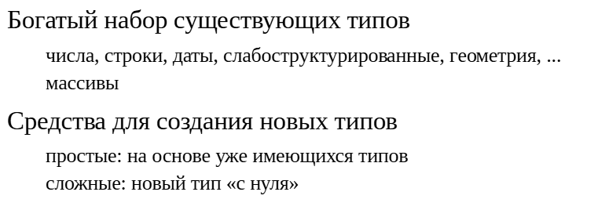
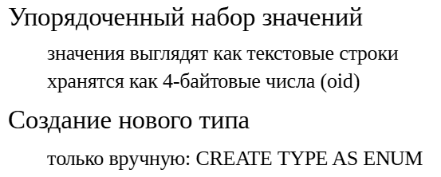
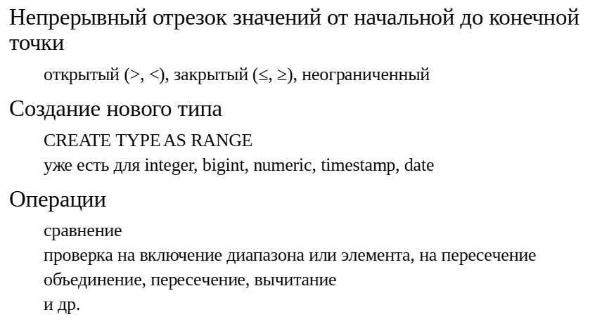
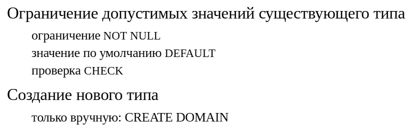
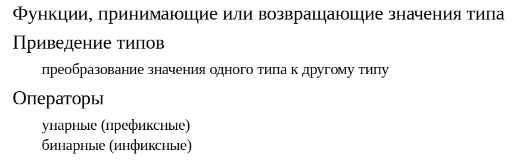

Пользовательские типы данных
############################

Фоновые процессы
****************

	   
PostgreSQL имеет множество встроенных типов данных (и поддержку массивов элементов любых типов данных).

https://postgrespro.ru/docs/postgresql/16/datatype

Вместе с тем имеются и средства для создания своих собственных типов данных.В простом случае новые типы создаются по одной из предопределен-ных схем из других, уже имеющихся, типов. 
Это составные типы, перечисления, диапазоны, домены.

Если же необходимый тип данных не может быть выражен с помощью этих простых средств, можно создать новый тип «с нуля», детально описав его поведение на низком уровне.
	   
	   
Составные типы
************** 
	   

.. 	figure:: img/09_02.png
       :scale: 100 %
       :align: center
       :alt: asda

Составные типы представляют собой набор именованных атрибутов каких-либо других типов данных. В разных языках программирования такие типы могут называться структурами или записями.

По сути, составной тип описывает табличную строку и поэтому создается автоматически при создании любой таблицы или представления.

Новый составной тип можно создать и вручную.

Составные типы определены в стандарте SQL. 

https://postgrespro.ru/docs/postgresql/16/rowtypes

https://postgrespro.ru/docs/postgresql/16/functions-comparisons#COMPOSITE-TYPE-COMPARISON

Типы перечислений
*****************

Тип перечисления создается простым перечислением всех допустимых значений.Значения задаются и используются в виде текстовых строк, которые хранятся в системном каталоге как упорядоченный набор значений. 
При использовании перечисления, например, в качестве типа столбца таблицы, каждое его значение будет представлено в виде 4-байтного целого числа (фактически, тип **oid**). 
Это позволяет использовать длинные (до 63 символов) описательные значения, не экономяна месте в таблице.

Стандартных типов перечисления в PostgreSQL нет.

https://postgrespro.ru/docs/postgresql/16/datatype-enum

https://postgrespro.ru/docs/postgresql/16/functions-enum

Практика
========

Типы перечислений

::

	CREATE DATABASE ext_datatypes;
	
	CREATE DATABASE

::

	\c ext_datatypes
	
	You are now connected to database "ext_datatypes" as user "student".

Создадим новые типы перечислений для старшинства карт:

::

	CREATE TYPE ranks AS ENUM (
		'6', '7', '8', '9', '10', 'Queen', 'King', 'Ace'
	);

	CREATE TYPE

И для мастей:

::

	CREATE TYPE suits AS ENUM (
		'clubs', 'diamonds', 'hearts', 'spades'
	);

	CREATE TYPE

Напомним, что тип данных — отдельный объект базы данных, который хранится в системном каталоге:

::

	\dT public.*

		  List of data types
	 Schema | Name  | Description 
	--------+-------+-------------
	 public | ranks | 
	 public | suits | 
	(2 rows)

Чтобы вспомнить и составные типы, определим еще тип для карты:

::

	CREATE TYPE cards AS (
		rank ranks,
		suit suits
	);
	CREATE TYPE
	DO $$
	DECLARE
		card cards;
	BEGIN
		card := ('Ace','spades');
		RAISE NOTICE '%', card;
		RAISE NOTICE 'Старшинство: % ... %',
			enum_first(card.rank), enum_last(card.rank);
		RAISE NOTICE 'Масти: % ... %',
				enum_first(card.suit), enum_last(card.suit);
	END;
	$$;

	NOTICE:  (Ace,spades)
	NOTICE:  Старшинство: 6 ... Ace
	NOTICE:  Масти: clubs ... spades
	DO

Обратите внимание, что названия значений перечислимого типа регистрозависимы.

Все значения в перечислении упорядочены, и этим можно пользоваться:

::

	SELECT '6'::ranks < 'Ace'::ranks;

	 ?column? 
	----------
	 t
	(1 row)

Однако сами типы перечислений считаются уникальными и поэтому значения разных перечислений нельзя сравнивать, даже если они определены одинаково:

::

	CREATE TYPE suits_bis AS ENUM (
		'clubs', 'diamonds', 'hearts', 'spades'
	);

	CREATE TYPE

::

	SELECT 'hearts'::suits = 'hearts'::suits_bis;

	ERROR:  operator does not exist: suits = suits_bis
	LINE 1: SELECT 'hearts'::suits = 'hearts'::suits_bis;
								   ^
	HINT:  No operator matches the given name and argument types. You might need to add 
	explicit type casts.

При необходимости выполнить подобное сравнение придется либо реализовать собственный оператор, либо явно преобразовать типы в запросе, например так:

::

	SELECT 'hearts'::suits::text = 'hearts'::suits_bis::text;

	 ?column? 
	----------
	 t
	(1 row)

Можно получить список значений в виде массива (функция enum_range смотрит только на тип параметра; само значение может быть любым):

::

	DO $$
	DECLARE
		suit suits;
		rank ranks;
		deck cards[];
	BEGIN
		RAISE NOTICE '%', enum_range(NULL::ranks);
		RAISE NOTICE '%', enum_range(NULL::suits);
		FOREACH rank IN ARRAY enum_range(NULL::ranks) LOOP
			FOREACH suit IN ARRAY enum_range(NULL::suits) LOOP
				deck := deck || (rank,suit)::cards;
			END LOOP;
		END LOOP;
	END;
	$$;

	NOTICE:  {6,7,8,9,10,Queen,King,Ace}
	NOTICE:  {clubs,diamonds,hearts,spades}
	DO

Кажется, мы забыли валета. Не беда, его можно добавить к перечислению:

::

	ALTER TYPE ranks ADD VALUE 'Jack' BEFORE 'Queen';

	ALTER TYPE

А вот удалить значение из типа невозможно. Единственный вариант — удалить тип и создать его заново.

Если мы заглянем в системный каталог, то увидим, что упорядоченность значений перечисления обеспечивает столбец типа real. Обратите внимание на его дробное значение для добавленного нами валета:

::

	SELECT enumsortorder, enumlabel FROM pg_enum WHERE enumtypid = 'ranks'::regtype ORDER BY enumsortorder;

	 enumsortorder | enumlabel 
	---------------+-----------
				 1 | 6
				 2 | 7
				 3 | 8
				 4 | 9
				 5 | 10
			   5.5 | Jack
				 6 | Queen
				 7 | King
				 8 | Ace
	(9 rows)

Диапазонные типы
*****************

Диапазонный тип представляет непрерывный отрезок значений скалярного типа. Концы отрезка могут быть открытыми (граничное значение не включается) или закрытыми (наоборот, включается), или отрезок может быть бесконечным, 
то есть не иметь одной или обеих границ.

Для диапазонов определено довольно много удобных операций,в том числе:

- проверки на включение одного диапазона в другой, на принадлежность значения диапазона, на пересечение двух диапазонов;

- обычные операции над множествами: объединение, пересечение, вычитание.

Диапазоны предопределены для различных числовых типов и дат (например, int4range для integer и др.). Можно создать и свой собственный диапазонный тип.

https://postgrespro.ru/docs/postgresql/16/rangetypes

https://postgrespro.ru/docs/postgresql/16/functions-range

Мультидиапазоны
===============

.. 	figure:: img/09_05.png
       :scale: 100 %
       :align: center
       :alt: asda

Для каждого диапазонного типа определен соответствующий мультидиапазонный тип. Такой тип по сути представляет собой массив отдельных диапазонов. 
Диапазоны внутри мультидиапазонного типа не должны пересекаться между собой, но между диапазонами могут быть пропуски. Большинство диапазонных операторов работаюти с мультидиапазонами. 
Кроме того, есть функции для работы именно с мультидиапазонными типами.

Мультидиапазонный тип определяется автоматически при определении диапазонного типа. По умолчанию имя мультидиапазонного типа генерируется PostgreSQL, но можно задать его и явно.

Практика
========

**Диапазонные типы**

Начнем с нескольких примеров работы с уже имеющимися диапазонными типами.

Диапазон целых чисел от 1 до 9, обе границы включаются (об этом говорят квадратные скобки). Что будет выведено?

::

	SELECT '[1,9]'::int4range;

	 int4range 
	-----------
	 [1,10)
	(1 row)

Результат выводится в каноническом виде, в котором левая граница включается, а правая — нет (круглая скобка). Конечно, значение правой границы при этом увеличивается на единицу. Канонический вид определен не для всех типов.

Диапазон может быть и открытым. Проверим, принадлежит ли число диапазону:

::

	SELECT -100 <@ '[1,)'::int4range, 100 <@ '[1,)'::int4range;

	 ?column? | ?column? 
	----------+----------
	 f        | t
	(1 row)

Точно так же можно проверить включение одного диапазона в другой:

::

	SELECT '[2,3]'::int4range <@ '[1,4]'::int4range;

	 ?column? 
	----------
	 t
	(1 row)

Удобны функции, позволяющие работать с диапазонами как с множествами. Например, можно легко найти пересечение (общие точки) двух диапазонов:

::

	SELECT '[1,3]'::int4range * '[2,4]'::int4range;

	 ?column? 
	----------
	 [2,4)
	(1 row)

При создании нового диапазонного типа указываются:

- базовый тип, значения которого должны быть сортируемыми;

- функция разности двух значений, которая должна возвращать результат типа double precision.

Например, в PostgreSQL нет типа для диапазонов времени (без даты). Чтобы определить его, нам потребуется функция, возвращающая разность между двумя временами. Обычная разность возвращает значение типа interval:

::

	SELECT '10:00'::time - '9:59'::time;

	 ?column? 
	----------
	 00:01:00
	(1 row)

Но мы можем воспользоваться функцией extract epoch, которая вернет длину диапазона в секундах:

::

	CREATE FUNCTION time_diff(a time, b time) RETURNS double precision
	LANGUAGE sql STRICT IMMUTABLE
	RETURN extract(epoch FROM (a - b));
	CREATE FUNCTION
	SELECT time_diff('10:00','9:59');

	 time_diff 
	-----------
			60
	(1 row)

Теперь можно определить тип диапазона, а вместе с ним — и мультидиапазона:

::

	CREATE TYPE timerange AS RANGE (
		subtype = time,
		subtype_diff = time_diff,
		multirange_type_name = timemultirange
	);

	CREATE TYPE

Последний параметр — необязательный, в его отсутствие соответствующий мультидиапазонный тип будет создан автоматически.

Новый тип можно использовать аналогично уже существующим. Например, найдем объединение (здесь показаны два способа записи констант диапазонного типа):

::

	SELECT timerange('9:00','11:00','[]') + '[10:00,12:00]'::timerange;

		  ?column?       
	---------------------
	 [09:00:00,12:00:00]
	(1 row)

Заметьте, что диапазон не приводится к каноническому виду. Чтобы это работало, необходимо реализовать соответствующую функцию и указать ее в определении типа. Мы не будем этого делать.

Новый мультидиапазонный тип позволяет представить несколько диапазонов как одно значение:

::

	SELECT timemultirange(
		  timerange('09:00', '13:00', '[)'),
		  timerange('08:00', '10:00', '[)'),
		  timerange('14:00', '18:00', '[)')
	) AS working_hours;

				   working_hours               
	-------------------------------------------
	 {[08:00:00,13:00:00),[14:00:00,18:00:00)}
	(1 row)

Обратите внимание, что пересекающиеся диапазоны были объединены.

Интервалы дат и времени
************************

.. 	figure:: img/09_06.png
       :scale: 100 %
       :align: center
       :alt: asda
	   
В PostgreSQL есть тип **interval**, на первый взгляд похожий на диапазон. Но, в отличие от диапазонных типов, интервал определяется длиной,а не начальной и конечной точкой. 
Кроме того, интервалы существуют только для *дат и времени*.

Отметим также, что при работе с этим типом есть ряд тонкостей, обусловленных особенностями хранения значений интервалов. Например, существуют специальные функции для корректировки числа дней и часов при их выходе за обычные границы 
(одну из них мы увидим в демонстрации).

Создание собственных типов, аналогичных interval, невозможно. 

https://postgrespro.ru/docs/postgresql/16/datatype-datetimehttps://postgrespro.ru/docs/postgresql/16/functions-datetime	   

	   
Практика
========

**Интервалы**

Значения типа **interval** определяют длину временного отрезка, в отличие от диапазонного типа, значения которого состоят из начальной и конечной точек.

Интервал появляется естественным образом при вычитании двух моментов времени:

::

	SELECT timestamp '01.02.2020' - timestamp '01.01.2020';

	 ?column? 
	----------
	 31 days
	(1 row)

(Хотя та же операция для дат (тип date) возвращает целое число.)

Интервалы используются в арифметике дат и времени. Например:

::

	SELECT now(), now() + 2 * interval '1 month';

				  now              |           ?column?            
	-------------------------------+-------------------------------
	 2025-11-26 19:10:35.108371+03 | 2026-01-26 19:10:35.108371+03
	(1 row)

Обратите внимание, что интервал '1 month' может иметь разную длину — от 28 до 31 дней в зависимости от месяца.

При необходимости можно преобразовать интервал так, чтобы, например, каждый 24-часовой период считался одним днем:

::

	SELECT interval '29 hours', justify_hours(interval '29 hours');

	 interval | justify_hours  
	----------+----------------
	 29:00:00 | 1 day 05:00:00
	(1 row)

Домены
******

Домен создается на базе любого существующего типа данных и служит для ограничения множества допустимых значений этого типа.

Определяя домен, можно запретить неопределенные значения(и определить значение по умолчанию), можно также указать произвольную проверку допустимости значения.

По сути, это похоже на ограничения целостности, накладываемыена столбцы при создании таблицы. 

Создав тип домена, его можно использовать в нескольких таблицах, не указывая каждый раз однии те же ограничения.

Домены определены в стандарте SQL.

https://postgrespro.ru/docs/postgresql/16/domainshttps://postgrespro.ru/docs/postgresql/16/sql-createdomain

Практика
========

**Домены**

Создадим доменный тип, ограничивающий временной диапазон рабочими часами и запрещающий неопределенные значения:

::

	CREATE DOMAIN work_timerange AS timerange
	NOT NULL
	CHECK (VALUE <@ '[10:00,19:00)'::timerange);

	CREATE DOMAIN

Его можно использовать при создании таблицы:

::

	CREATE TABLE work_events(
		event_name text,
		event_range work_timerange
	);

	CREATE TABLE

::

	INSERT INTO work_events VALUES (
		'обед', '[13:00,14:00)'
	);

	INSERT 0 1

А так получится?

::

	INSERT INTO work_events VALUES (
		'труд', '[14:00,22:00)'
	);

	ERROR:  value for domain work_timerange violates check constraint "work_timerange_check"

Нет — нарушено условие проверки. А так?

::

	INSERT INTO work_events VALUES (
		'лень', NULL
	);

	ERROR:  domain work_timerange does not allow null values

Нет — неопределенные значения не допускаются. А если так?

::

	INSERT INTO work_events VALUES (
		'лень', (SELECT event_range FROM work_events WHERE false)
	);

	INSERT 0 1

А так получится. Запрет неопределенных значений на уровне домена работает не так, как на уровне столбца. Ограничение NOT NULL надежнее указывать при создании таблицы.

Еще одна проблема связана с тем, что при любых операциях значения приводятся к базовому типу. Это не позволяет использовать домены для контроля типов в операциях. Вот пример:

::

	CREATE DOMAIN distance AS float;

	CREATE DOMAIN

::

	CREATE DOMAIN weight AS float;

	CREATE DOMAIN

Можно ли складывать метры с граммами?

::

	SELECT 2::distance + 3::weight;

	 ?column? 
	----------
			5
	(1 row)

Оказывается, можно.

Поэтому практическое применение доменных типов довольно ограничено.

Базовые типы
************

.. 	figure:: img/09_08.png
       :scale: 100 %
       :align: center
       :alt: asda
	   
Иногда может возникнуть потребность в совершенно новом типе, который нельзя представить как комбинацию уже существующих.

В этом случае потребуется определить все низкоуровневые детали внутреннего устройства типа, что можно сделать только на языке C. Это требует высокой квалификации разработчика.

Впрочем, множество различных типов данных доступны в виде расширений (в том числе сторонних), так что вероятность того, что потребуется совершенно новый тип, очень мала.

https://postgrespro.ru/docs/postgresql/16/sql-createtype	   

Действия над типами
===================

Мало определить новый тип данных — надо уметь его как-то использовать.
	
На функциях основаны и другие важные объекты — приведения типов и операторы, — которые могут определяться пользователем.

Приведения типов позволяют преобразовывать значения одного типак другому.

Операторы позволяют вместо вызова функции f(x,y) использовать инфиксную нотацию, например x+y, что позволяет сделать код прощеи нагляднее. 
Кроме того, как мы увидим в следующей теме «Классы операторов», операторы играют важную роль в индексировании.

Приведение типов в документации:
	
https://postgrespro.ru/docs/postgresql/16/sql-createcast

Операторы:

https://postgrespro.ru/docs/postgresql/16/xoper

https://postgrespro.ru/docs/postgresql/16/xoper-optimization

https://postgrespro.ru/docs/postgresql/16/sql-createoperator

Практика
==========

**Приведение типов**

В качестве примера рассмотрим приведение типа **timerange** к типу **interval**.

Сработает ли такое приведение само по себе?

::

	SELECT '[10:00,12:00]'::timerange::interval;

	ERROR:  cannot cast type timerange to interval
	LINE 1: SELECT '[10:00,12:00]'::timerange::interval;
                                         ^
Увы, нет. Чтобы создать такое приведение, сначала напишем функцию:

::

	CREATE FUNCTION timerange_to_interval(a timerange) RETURNS interval
	LANGUAGE sql STRICT IMMUTABLE
	RETURN make_interval(
		secs extract( epoch FROM (upper(a)-lower(a)) )
	);
	CREATE FUNCTION
	SELECT timerange_to_interval('[10:00,12:00]');

	 timerange_to_interval 
	-----------------------
	 02:00:00
	(1 row)

Теперь можно создать приведение типов. Здесь мы указываем AS IMPLICIT, чтобы приведение срабатывало и неявно.

::

	CREATE CAST (timerange AS interval)
	WITH FUNCTION timerange_to_interval
	AS IMPLICIT;
	CREATE CAST
	SELECT '[10:00,12:00]'::timerange::interval;

	 interval 
	----------
	 02:00:00
	(1 row)

**Операторы**

Пусть требуется узнать, сколько раз заданный интервал (тип interval) содержится в другом интервале. 
Например, сколько в интервале часов, или минут, или пятисекундных отрезков. Иными словами, нужно деление одного интервала на другой. 
Но в PostgreSQL для интервалов определен только оператор деления на целое число.

Напишем соответствующую функцию:

::

	CREATE FUNCTION interval_div(a interval, b interval) RETURNS double precision
	LANGUAGE sql STRICT IMMUTABLE
	RETURN extract(epoch FROM a) / extract(epoch FROM b);

	CREATE FUNCTION

Теперь мы можем узнать, сколько раз временной диапазон 6 минут 33 секунды укладывается в полтора часа времени:

::

	SELECT interval_div('1:30:00'::interval,'0:06:33'::interval);

		interval_div    
	--------------------
	 13.740458015267176
	(1 row)

Определим бинарный оператор, используя эту функцию:

::

	CREATE OPERATOR / (
		FUNCTION = interval_div,
		LEFTARG = interval,
		RIGHTARG = interval
	);

	CREATE OPERATOR

Имя оператора можно составлять только из специальных символов, список которых приведен в документации к команде **CREATE OPERATOR**. 

Если не указать **LEFTARG**, будет определен префиксный оператор. Постфиксные операторы не поддерживаются начиная с PostgreSQL 14.

Теперь можно пользоваться удобной инфиксной формой записи (здесь также показан другой способ записи интервалов):

::

	SELECT interval '1 hour 30 min' / interval '6 min 33 sec';

		  ?column?      
	--------------------
	 13.740458015267176
	(1 row)
	
	
Самостоятельно
**************

1. Реализуйте в приложении возможность установки розничной цены книг с указанной пользователем даты (сейчас дата просто игнорируется).
Предыдущая история изменений цен должна сохраняться.Для этого добавьте в таблицу **retail_prices** информациюо периоде действия цены и внесите необходимые изменения в функции **get_retail_price** и **set_retail_price**.

2. Создайте составной тип для формата издания, состоящего из размеров типографского листа и доли листа. Также создайте приведение для этого нового типа к текстовому.
Замените тип данных столбца **format** таблицы **books** и убедитесь, что интерфейс с приложением не изменился.

**Пояснение:**

1. Интервал действия розничной цены можно представить по-разному:
- двумя столбцами типа timestamptz («дата с» и «дата по»);

- одним столбцом типа timestamptz («дата с»), при этом цена считается действующей до следующей даты в другой строке таблицы;

- одним столбцом диапазонного типа tstzrange.Реализуйте последний вариант. 

Обратите внимание:

- В функции set_retail_price придется изменять две строки таблицы,и это должно корректно работать в случае, если несколько пользователей устанавливают цену одновременно.

- Функция get_retail_price должна получать цену на текущий момент. Используйте функцию current_timestamp (возвращающую время начала транзакции), а не clock_timestamp. Это будет важно при последующих изменениях.

2. Формат издания записывается в виде WxH/N, где W и H — ширинаи высота типографского листа, с которым работает печатная машина,и который разрезается потом на N одинаковых частей (страниц книги). Поэтому N как правило представляет собой степень двойки.

Несмотря на то, что отношение длины страницы к ширине может быть разным, форматы книг можно упорядочить, сравнивая площади страниц, которые равны W*H/N.
При замене типа столбца обратите внимание на блокировку, которая при этом удерживается.

**Решение:**

https://edu.postgrespro.ru/16/dev2-16/dev2_09_ext_datatypes.html

