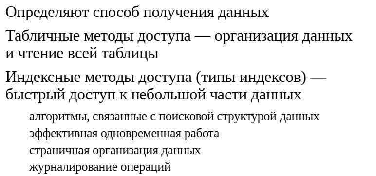
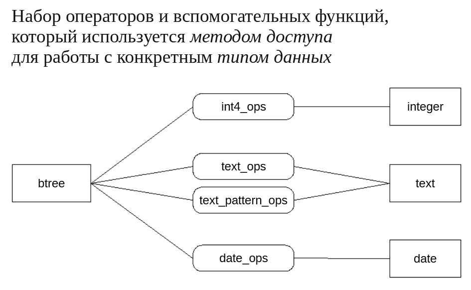
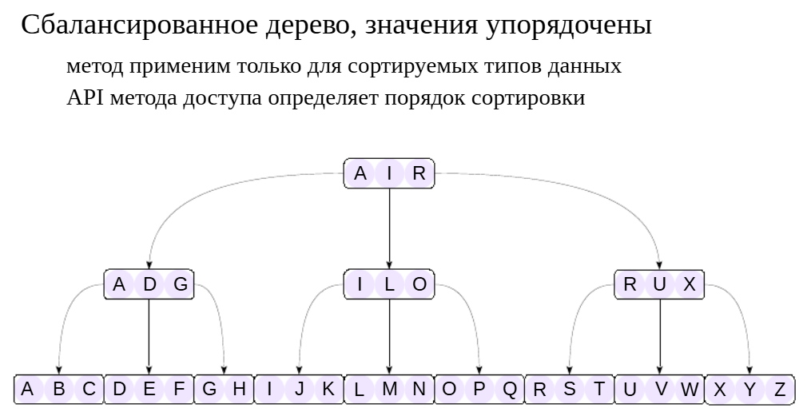
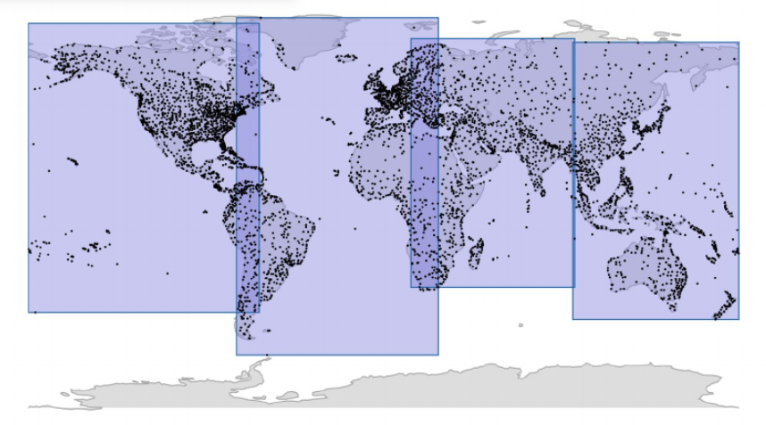
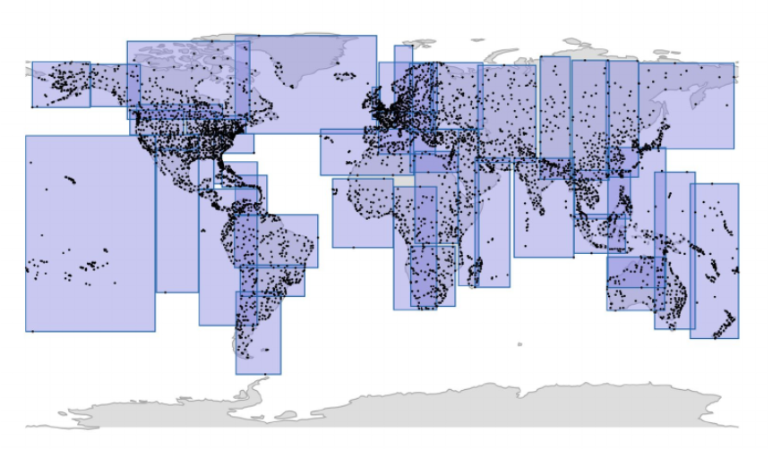
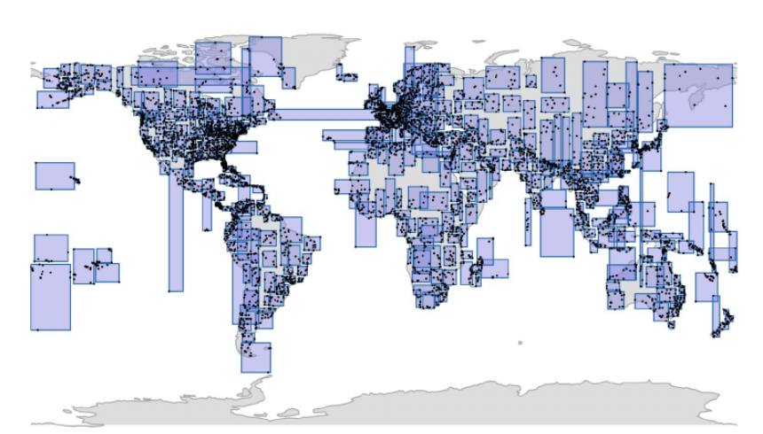

Классы операторов
#################

Методы доступа
**************

ПРАКТИКА
========

**Методы доступа**

::

	CREATE DATABASE ext_opclasses;

	CREATE DATABASE

::

	\c ext_opclasses

	You are now connected to database "ext_opclasses" as user "student".

В версии 16 имеется единственный встроенный табличный метод доступа:

::

	SELECT amname FROM pg_am WHERE amtype = 't';

	 amname 
	--------
	 heap
	(1 row)

Зато много различных индексных методов доступа:

::

	SELECT amname FROM pg_am WHERE amtype = 'i';

	 amname 
	--------
	 btree
	 hash
	 gist
	 gin
	 spgist
	 brin
	(6 rows)

**btree** — это «обычный» метод доступа на основе B-дерева, который используется по умолчанию и покрывает большинство потребностей. Остальные методы доступа также очень полезны, но в специальных ситуациях. Некоторые из них мы рассмотрим позже.

Для получения информации мы делали запросы к таблицам системного каталога, однако в арсенале psql есть удобная команда, позволяющая получить информацию о методах доступа, классах и семействах операторов, ей дальше мы и будем пользоваться:

::

	\dA

	List of access methods
	  Name  | Type  
	--------+-------
	 brin   | Index
	 btree  | Index
	 gin    | Index
	 gist   | Index
	 hash   | Index
	 heap   | Table
	 spgist | Index
	(7 rows)
	
	
Классы операторов
*****************

ПРАКТИКА
========

**Классы операторов**

Посмотрим, какие классы операторов определены для B-дерева и для разных типов данных. Для целых чисел:

::

	\dAc btree (smallint|integer|bigint)

					   List of operator classes
	  AM   | Input type | Storage type | Operator class | Default? 
	-------+------------+--------------+----------------+----------
	 btree | bigint     |              | int8_ops       | yes
	 btree | integer    |              | int4_ops       | yes
	 btree | smallint   |              | int2_ops       | yes
	(3 rows)

Для удобства такие «похожие по смыслу» классы операторов объединяются в семейства операторов:

::

	\dAf btree (smallint|integer|bigint)

				  List of operator families
	  AM   | Operator family |     Applicable types      
	-------+-----------------+---------------------------
	 btree | integer_ops     | smallint, integer, bigint
	(1 row)

Семейства операторов позволяют планировщику работать с выражениями разных (но «похожих») типов, даже если они не приведены к одному общему.

Вот классы операторов для типа text (если для одного типа есть несколько классов операторов, то один будет помечен для использования по умолчанию):

::

	\dAc btree text

						  List of operator classes
	  AM   | Input type | Storage type |   Operator class    | Default? 
	-------+------------+--------------+---------------------+----------
	 btree | text       |              | text_ops            | yes
	 btree | text       |              | text_pattern_ops    | no
	 btree | text       |              | varchar_ops         | no
	 btree | text       |              | varchar_pattern_ops | no
	(4 rows)

Классы операторов pattern_ops отличаются от обычных тем, что сравнивают строки посимвольно, игнорируя правила сортировки (collation).
А так можно посмотреть, какие операторы включены в конкретный класс операторов:

::

	\dAo btree bool_ops

				   List of operators of operator families
	  AM   | Operator family |      Operator       | Strategy | Purpose 
	-------+-----------------+---------------------+----------+---------
	 btree | bool_ops        | <(boolean,boolean)  |        1 | search
	 btree | bool_ops        | <=(boolean,boolean) |        2 | search
	 btree | bool_ops        | =(boolean,boolean)  |        3 | search
	 btree | bool_ops        | >=(boolean,boolean) |        4 | search
	 btree | bool_ops        | >(boolean,boolean)  |        5 | search
	(5 rows)

Метод доступа — это тип индекса, а собственно индекс — это конкретная структура, созданная на основе метода доступа, в которой для каждого столбца используется свой класс операторов.

Пусть имеется какая-нибудь таблица:

::

	CREATE TABLE t(
		id integer GENERATED ALWAYS AS IDENTITY,
		s text
	);
	CREATE TABLE
	
::

	INSERT INTO t(s) VALUES ('foo'), ('bar'), ('xy'), ('z');
	INSERT 0 4

Привычная команда создания индекса выглядит так:

::

	CREATE INDEX ON t(id, s);

Но это просто сокращение для:

::

	CREATE INDEX ON t
	USING btree -- метод доступа
	(
		id int4_ops, -- класс операторов для integer
		s  text_ops  -- класс операторов по умолчанию для text
	);
	
	CREATE INDEX
	
	
Метод доступа btree
*******************

	   
ПРАКТИКА
========

**Класс операторов для B-дерева**

Класс операторов для B-дерева определяет, как именно будут сортироваться значения в индексе. Для этого он включает пять операторов сравнения, как мы уже видели на примере bool_ops.

Определим перечислимый тип для единиц измерения информации:

::

	CREATE TYPE capacity_units AS ENUM (
		'B', 'kB', 'MB', 'GB', 'TB', 'PB'
	);
	CREATE TYPE

И объявим составной тип данных для представления объема информации:

::

	CREATE TYPE capacity AS (
		amount integer,
		unit capacity_units
	);

	CREATE TYPE

Используем новый тип в таблице, которую заполним случайными значениями.

::

	CREATE TABLE test (
		cap capacity
	);

	CREATE TABLE

::

	INSERT INTO test
		SELECT ( (random()*1023)::integer, u.unit )::capacity
		FROM generate_series(1,100),
			 unnest(enum_range(NULL::capacity_units)) AS u(unit);
	INSERT 0 600

По умолчанию значения составного типа сортируются в лексикографическом порядке, но этот порядок не совпадает с естественным порядком:

::

	SELECT * FROM test ORDER BY cap LIMIT 10;

	   cap   
	---------
	 (1,MB)
	 (5,PB)
	 (6,kB)
	 (7,B)
	 (7,TB)
	 (7,PB)
	 (13,PB)
	 (18,kB)
	 (18,PB)
	 (19,B)
	(10 rows)

Чтобы исправить сортировку, создадим класс операторов. Начнем с функции, которая пересчитает объем в байты.

::

	CREATE FUNCTION capacity_to_bytes(a capacity) RETURNS numeric
	LANGUAGE sql STRICT IMMUTABLE
	RETURN a.amount::numeric * 
		1024::numeric ^ ( array_position(enum_range(a.unit), a.unit)-1 );
	CREATE FUNCTION

Помимо операторов сравнения нам понадобится еще одна вспомогательная функция — тоже для сравнения. Она должна возвращать:

−1, если первый аргумент меньше второго;
0, если аргументы равны;
1, если первый аргумент больше второго.

::
	CREATE FUNCTION capacity_cmp(a capacity, b capacity) RETURNS integer
	LANGUAGE sql STRICT IMMUTABLE
	RETURN CASE
		WHEN capacity_to_bytes(a) < capacity_to_bytes(b) THEN -1
		WHEN capacity_to_bytes(a) > capacity_to_bytes(b) THEN 1
		ELSE 0
	END;
	
	CREATE FUNCTION

С помощью этой функции мы определим пять операторов сравнения (и функции для них). Начнем с «меньше»:

::

	CREATE FUNCTION capacity_lt(a capacity, b capacity) RETURNS boolean
	LANGUAGE sql IMMUTABLE STRICT
	RETURN capacity_cmp(a,b) < 0;
	CREATE FUNCTION
	CREATE OPERATOR <(
		LEFTARG = capacity,
		RIGHTARG = capacity,
		FUNCTION = capacity_lt
	);

	CREATE OPERATOR

И аналогично остальные четыре.

::

	CREATE FUNCTION capacity_le(a capacity, b capacity) RETURNS boolean
	LANGUAGE sql IMMUTABLE STRICT
	RETURN capacity_cmp(a,b) <= 0;
	CREATE FUNCTION
	CREATE OPERATOR <=(
		LEFTARG = capacity,
		RIGHTARG = capacity,
		FUNCTION = capacity_le
	);

	CREATE OPERATOR

::

	CREATE FUNCTION capacity_eq(a capacity, b capacity) RETURNS boolean
	LANGUAGE sql IMMUTABLE STRICT
	RETURN capacity_cmp(a,b) = 0;
	CREATE FUNCTION
	CREATE OPERATOR =(
		LEFTARG = capacity,
		RIGHTARG = capacity,
		FUNCTION = capacity_eq
	);

	CREATE OPERATOR

::

	CREATE FUNCTION capacity_ge(a capacity, b capacity) RETURNS boolean
	LANGUAGE sql IMMUTABLE STRICT
	RETURN capacity_cmp(a,b) >= 0;
	CREATE FUNCTION
	CREATE OPERATOR >=(
		LEFTARG = capacity,
		RIGHTARG = capacity,
		FUNCTION = capacity_ge
	);

	CREATE OPERATOR

::

	CREATE FUNCTION capacity_gt(a capacity, b capacity) RETURNS boolean
	LANGUAGE sql IMMUTABLE STRICT
	RETURN capacity_cmp(a,b) > 0;
	CREATE FUNCTION
	CREATE OPERATOR >(
		LEFTARG = capacity,
		RIGHTARG = capacity,
		FUNCTION = capacity_gt
	);

	CREATE OPERATOR

Готово. Мы уже можем правильно сравнивать объемы:

::

	SELECT (1,'MB')::capacity > (512, 'kB')::capacity;

	 ?column? 
	----------
	 t
	(1 row)

Чтобы значения были правильно упорядочены при выборке, нам осталось создать класс операторов. За каждым оператором закреплен собственный номер (в случае btree: 1 — «меньше» и т. д.), поэтому имена операторов могут быть любыми.

::

	CREATE OPERATOR CLASS capacity_ops
	DEFAULT FOR TYPE capacity
	USING btree AS
		OPERATOR 1 <,
		OPERATOR 2 <=,
		OPERATOR 3 =,
		OPERATOR 4 >=,
		OPERATOR 5 >,
		FUNCTION 1 capacity_cmp(capacity,capacity);

	CREATE OPERATOR CLASS

::

	SELECT * FROM test ORDER BY cap LIMIT 10;

	   cap   
	---------
	 (7,B)
	 (19,B)
	 (31,B)
	 (74,B)
	 (77,B)
	 (80,B)
	 (88,B)
	 (114,B)
	 (117,B)
	 (129,B)
	(10 rows)

Теперь значения отсортированы правильно.

Наш класс операторов будет использоваться по умолчанию при создании индекса:

::

	CREATE INDEX ON test(cap);

	CREATE INDEX

Любой индекс в PostgreSQL может использоваться только для выражений вида:

::

	<индексированное-поле>  <оператор>  <выражение>

Причем оператор должен входить в соответствующий класс операторов.

Будет ли использоваться созданный индекс в таком запросе?

::

	SET enable_seqscan = off;  -- временно отключим последовательное сканирование

	SET

::

	EXPLAIN (costs off)
	SELECT * FROM test WHERE cap < (100,'B')::capacity;

						   QUERY PLAN                       
	--------------------------------------------------------
	 Bitmap Heap Scan on test
	   Filter: (capacity_cmp(cap, '(100,B)'::capacity) < 0)
	   ->  Bitmap Index Scan on test_cap_idx
	(3 rows)

Да, поскольку:

поле test.cap проиндексировано с помощью метода доступа btree и класса операторов capacity_ops;
оператор < входит в класс операторов capacity_ops.
Поэтому и при доступе с помощью индекса значения будут возвращаться в правильном порядке:

::

	SELECT * FROM test WHERE cap < (100,'B')::capacity ORDER BY cap;

	  cap   
	--------
	 (7,B)
	 (19,B)
	 (31,B)
	 (74,B)
	 (77,B)
	 (80,B)
	 (88,B)
	(7 rows)
	
https://postgrespro.ru/docs/postgresql/16/btree

https://postgrespro.ru/docs/postgresql/16/xindex	   

Дополнительно:

https://habr.com/ru/articles/783012/

Метод доступа GIST
******************

	   

	   
https://postgrespro.ru/docs/postgresql/16/gist

ПРАКТИКА
========

**Метод доступа GiST**

Какие именно операторы поддерживает GiST-индекс, существенно зависит от класса операторов. Информацию можно получить как из документации, так и из системного каталога. Возьмем, например, тип данных point (точки).

Доступный класс операторов:

::

	\dAc gist point

					   List of operator classes
	  AM  | Input type | Storage type | Operator class | Default? 
	------+------------+--------------+----------------+----------
	 gist | point      | box          | point_ops      | yes
	(1 row)

Операторы в этом классе:

::

	\dAo gist point_ops

				  List of operators of operator families
	  AM  | Operator family |     Operator      | Strategy | Purpose  
	------+-----------------+-------------------+----------+----------
	 gist | point_ops       | <<(point,point)   |        1 | search
	 gist | point_ops       | >>(point,point)   |        5 | search
	 gist | point_ops       | ~=(point,point)   |        6 | search
	 gist | point_ops       | <<|(point,point)  |       10 | search
	 gist | point_ops       | |>>(point,point)  |       11 | search
	 gist | point_ops       | <->(point,point)  |       15 | ordering
	 gist | point_ops       | <^(point,point)   |       29 | search
	 gist | point_ops       | >^(point,point)   |       30 | search
	 gist | point_ops       | <@(point,box)     |       28 | search
	 gist | point_ops       | <@(point,circle)  |       68 | search
	 gist | point_ops       | <@(point,polygon) |       48 | search
	(11 rows)

В частности, оператор <@ проверяет, принадлежит ли точка одной из геометрических фигур.

Создадим таблицу со случайными точками:

::

	CREATE TABLE points (
		p point
	);

	CREATE TABLE

::

	INSERT INTO points(p)
		SELECT point(1 - random()*2, 1 - random()*2)
		FROM generate_series(1,10_000);

	INSERT 0 10000

Сколько точек расположено в круге радиуса 0.1?

::

	SELECT count(*) FROM points WHERE p <@ circle '((0,0),0.1)';

	 count 
	-------
		71
	(1 row)

Как выполняется такой запрос?

::

	EXPLAIN (costs off)
	SELECT * FROM points WHERE p <@ circle '((0,0),0.1)';

				   QUERY PLAN               
	----------------------------------------
	 Seq Scan on points
	   Filter: (p <@ '<(0,0),0.1>'::circle)
	(2 rows)

Полным перебором всей таблицы.

Создание GiST-индекса позволит ускорить эту операцию. Класс операторов можно не указывать, он один.

::

	CREATE INDEX ON points USING gist(p);
	CREATE INDEX

::

	EXPLAIN (costs off)
	SELECT * FROM points WHERE p <@ circle '((0,0),0.1)';

						QUERY PLAN                    
	--------------------------------------------------
	 Bitmap Heap Scan on points
	   Recheck Cond: (p <@ '<(0,0),0.1>'::circle)
	   ->  Bitmap Index Scan on points_p_idx
			 Index Cond: (p <@ '<(0,0),0.1>'::circle)
	(4 rows)

Еще один интересный оператор <-> вычисляет расстояние от одной точки до другой. Его можно использовать, чтобы найти точки, ближайшие к данной (так называемый поиск ближайших соседей, k-NN search):

::

	SELECT * FROM points ORDER BY p <-> point '(0,0)' LIMIT 5;

						   p                       
	-----------------------------------------------
	 (0.001371782341975436,0.0019697626458210493)
	 (-0.006101683502945043,-0.006880221229383476)
	 (0.012932877927132935,0.0045338493172835115)
	 (-0.02001397626689272,0.0011177625500025101)
	 (0.0184961566528572,0.010488124216478933)
	(5 rows)

Эта операция (весьма непростая, если реализовывать ее в приложении) также ускоряется индексом:

::

	EXPLAIN (costs off)
	SELECT * FROM points ORDER BY p <-> point '(0,0)' LIMIT 5;

						 QUERY PLAN                     
	----------------------------------------------------
	 Limit
	   ->  Index Only Scan using points_p_idx on points
			 Order By: (p <-> '(0,0)'::point)
	(3 rows)

GiST-индекс можно построить и для столбца диапазонного типа:

::

	\dAo gist range_ops

					  List of operators of operator families
	  AM  | Operator family |          Operator           | Strategy | Purpose 
	------+-----------------+-----------------------------+----------+---------
	 gist | range_ops       | <<(anyrange,anyrange)       |        1 | search
	 gist | range_ops       | &<(anyrange,anyrange)       |        2 | search
	 gist | range_ops       | &&(anyrange,anyrange)       |        3 | search
	 gist | range_ops       | &>(anyrange,anyrange)       |        4 | search
	 gist | range_ops       | >>(anyrange,anyrange)       |        5 | search
	 gist | range_ops       | -|-(anyrange,anyrange)      |        6 | search
	 gist | range_ops       | @>(anyrange,anyrange)       |        7 | search
	 gist | range_ops       | <@(anyrange,anyrange)       |        8 | search
	 gist | range_ops       | =(anyrange,anyrange)        |       18 | search
	 gist | range_ops       | @>(anyrange,anyelement)     |       16 | search
	 gist | range_ops       | <<(anyrange,anymultirange)  |        1 | search
	 gist | range_ops       | &<(anyrange,anymultirange)  |        2 | search
	 gist | range_ops       | &&(anyrange,anymultirange)  |        3 | search
	 gist | range_ops       | &>(anyrange,anymultirange)  |        4 | search
	 gist | range_ops       | >>(anyrange,anymultirange)  |        5 | search
	 gist | range_ops       | -|-(anyrange,anymultirange) |        6 | search
	 gist | range_ops       | @>(anyrange,anymultirange)  |        7 | search
	 gist | range_ops       | <@(anyrange,anymultirange)  |        8 | search
	(18 rows)

Здесь мы видим другой набор операторов.

Одно из применений GiST-индекса — поддержка ограничений целостности типа EXCLUDE (ограничения исключения).

Возьмем классический пример бронирования аудиторий:

::

	CREATE TABLE booking (
		during tstzrange NOT NULL
	);
	CREATE TABLE

Ограничение целостности можно сформулировать так: нельзя, чтобы в разных строках таблицы были два пересекающихся (оператор &&) диапазона. Такое ограничение можно задать декларативно на уровне базы данных:

::

	ALTER TABLE booking ADD CONSTRAINT no_intersect
		EXCLUDE USING gist(during WITH &&);
	ALTER TABLE

Проверим:

::

	INSERT INTO booking(during)
		VALUES ('[today 12:00,today 14:00)'::tstzrange);
	INSERT 0 1

::

	INSERT INTO booking(during)
		VALUES ('[today 13:00,today 16:00)'::tstzrange);

	ERROR:  conflicting key value violates exclusion constraint "no_intersect"
	DETAIL:  Key (during)=(["2025-11-26 13:00:00+03","2025-11-26 16:00:00+03")) conflicts 
	with existing key (during)=(["2025-11-26 12:00:00+03","2025-11-26 14:00:00+03")).

Частая ситуация — наличие дополнительного условия в таком ограничении целостности. Добавим номер аудитории:

::

	ALTER TABLE booking ADD room integer NOT NULL DEFAULT 1;

	ALTER TABLE

Но мы не сможем добавить этот столбец в ограничение целостности, поскольку класс операторов для метода gist и типа integer не определен.

::

	ALTER TABLE booking DROP CONSTRAINT no_intersect;
	
	ALTER TABLE

::

	ALTER TABLE booking ADD CONSTRAINT no_intersect
		EXCLUDE USING gist(during WITH &&, room WITH =);

	ERROR:  data type integer has no default operator class for access method "gist"
	HINT:  You must specify an operator class for the index or define a default operator 
	class for the data type.

В этом случае поможет расширение btree_gist, которое добавляет классы операторов для типов данных, которые обычно индексируются с помощью B-деревьев:

::

	CREATE EXTENSION btree_gist;

	CREATE EXTENSION

::

	ALTER TABLE booking ADD CONSTRAINT no_intersect
		EXCLUDE USING gist(during WITH &&, room WITH =);

	ALTER TABLE

Теперь разные аудитории можно бронировать на одно время:

::

	INSERT INTO booking(room, during)
		VALUES (2, '[today 13:00,today 16:00)'::tstzrange);
	
	INSERT 0 1

Но одну и ту же — нельзя:

::

	INSERT INTO booking(room, during)
		VALUES (1, '[today 13:00,today 16:00)'::tstzrange);
	ERROR:  conflictin
	g key value violates exclusion constraint "no_intersect"
	DETAIL:  Key (during, room)=(["2025-11-26 13:00:00+03","2025-11-26 16:00:00+03"), 1) 
	conflicts with existing key (during, room)=(["2025-11-26 12:00:00+03","2025-11-26 
	14:00:00+03"), 1).