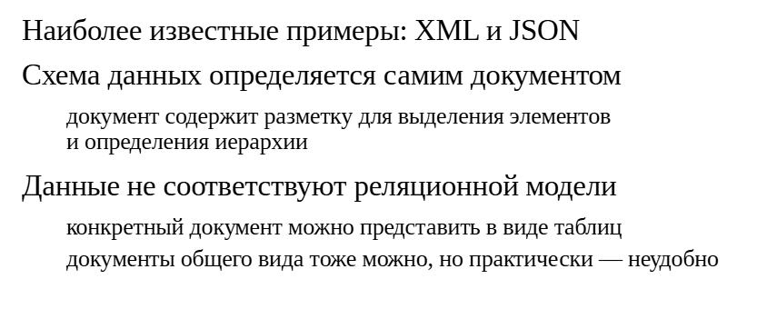
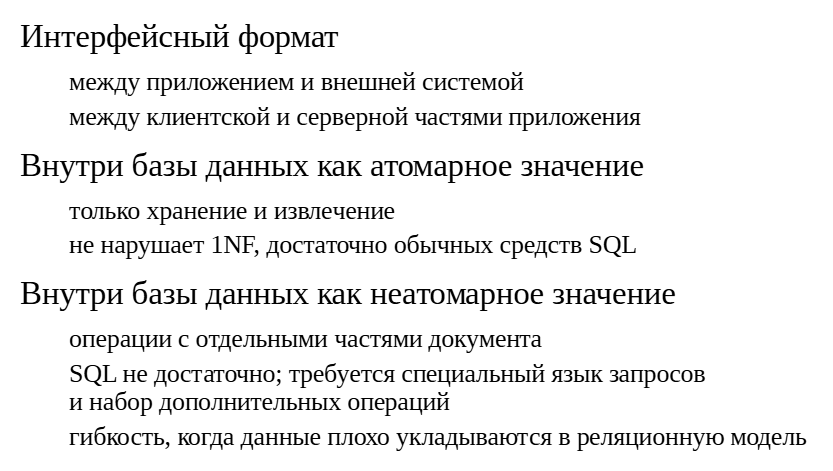
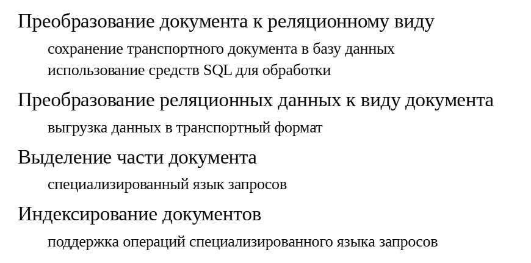
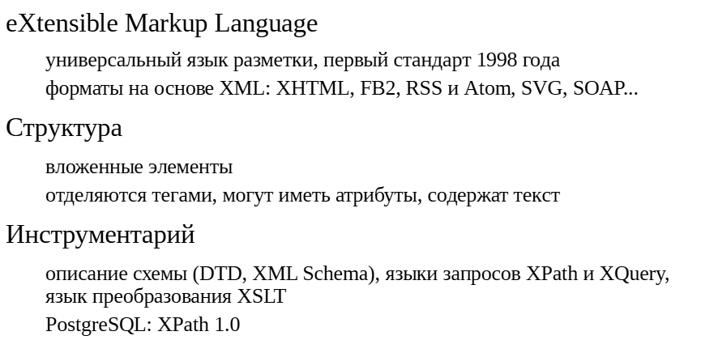
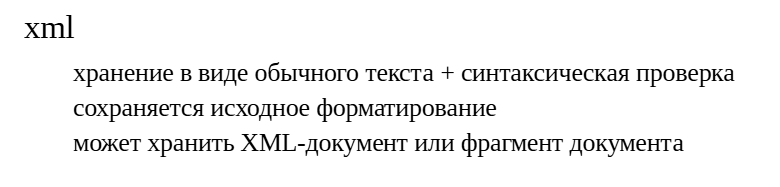
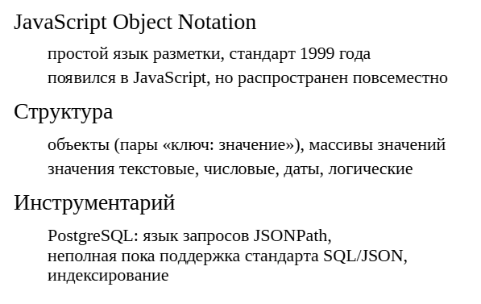
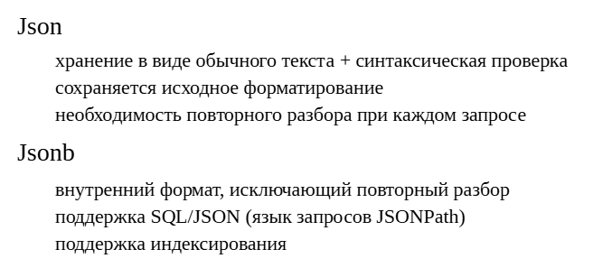
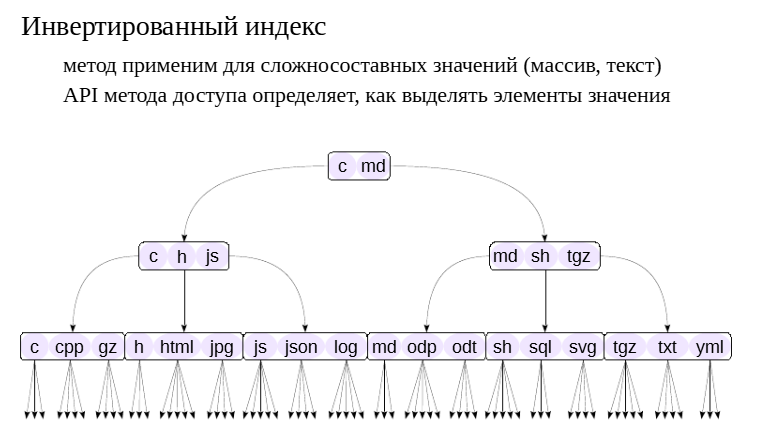

Слабоструктурированные данные
#############################

Методы доступа
**************

Слабоструктурированные (semi-structured) данные — это данные, представленные не в реляционном (табличном) виде. 
Обычно это текстовый документ, но в отличие от текста на естественном языке, документ содержит разметку, определяющую структурные единицы.

Широко известными примерами форматов (языков разметки) являются XML и JSON, в последнее время также популярен YAML.

Структура, или схема, документа определяется его собственной разметкой. (Это не исключает возможности определить структуру отдельно — например, для XML есть языки DTD, XMLSchema.)
Разметка, как правило, позволяет определить вложенные элементы, образующие иерархию.

Конечно, любую конкретную иерархию можно представить ив табличном виде. Можно уложить в таблицы и произвольную иерархию без жесткой схемы, 
но результат будет лишен типизации данных, возможности создания ограничений целостности, с ним будет крайне неудобно работать в терминах запросов SQL. 

Поэтому с некоторыми видами данных действительно удобнее и логичнее работать именнов таком, слабоструктурированном, виде.

Применение
**********

Документы XML или JSON могут применяться как удобный интерфейсный формат между разными компонентами, независимый от конкретной платформы или языка программирования. 
Например,для взаимодействия с внешними системами, или для обмена данными между клиентской и серверной частями системы. 
В последнем случае интерфейсный формат позволяет клиенту послать сложный запрос,а серверу выполнить его эффективным образом (в отличие от традиционного подхода, принятого в ORM, 
когда сервер базы данных нагружается большим количеством мелких запросов, не оставляя возможностей для оптимизации).

Если слабоструктурированные данные хранятся внутри самой базы данных, то все зависит от того, как эти данные используются. 
Если внутри SQL запросов не делается попыток работать с отдельными частями документов, то такие значения можно считать атомарнымис точки зрения СУБД. 
Тут достаточно обычных средств SQL.Конечно, более интересен случай, когда серверу необходимо выделять часть документа, фильтровать вывод на основе содержания документов и т. п. 
Для этого SQL уже не хватает и нужен специализированный язык доступа к слабоструктурированным данным. 
Если СУБД предоставляет такую возможность, это позволяет комбинировать строгий реляционный подход для данных, имеющих четкую структуру, и подход в духе NoSQL для данных, 
которые сложно представить в табличном виде.

Операции
********

Чтобы работать со слабоструктурированными документамив реляционной базе данных, понадобятся возможности для преобразования данных из одного вида в другой, поскольку в 
одних ситуациях удобнее использовать реляционные средства, в других — документоориентированные. 
Особенно это важно, если такой язык, как XML или JSON, используется в качестве транспортного формата.

Кроме этого, нужны средства для выделения части документа — каких-то отдельных значений, или какого-то подмножества элементов. 
Такие средства обычно представлены в виде специализированного языка запросов, который учитывает иерархическую структуру документов. 
Такие языки запросов можно использовать не только для выделения части документа, но и, например, для выбора тех документов, в которых присутствует заданный фрагмент.

Если слабоструктурированные документы используются в реляционной СУБД, встает задача индексирования таких данных. 
Для этого, как правило, не годятся обычные B-деревья, поскольку требуется поддерживать не операции сравнения документов, а операции, 
связанные со специализированным языком запросов.

Формат XML
**********

**XML** (eXtensible Markup Language) появился в контексте веба и разрабатывается консорциумом W3C. 
XML является текстовым документом, содержащим специальную разметку. 
XML определяет синтаксическую структуру разметки, которая с помощью тегов выделяет элементы (возможно, вложенные друг в друга), которые могут также иметь атрибуты. 
(Язык XML довольно сложен, в нем имеются также инструкции обработки, комментарии и другие сущности, но мы не будем на этом останавливаться.)

XML позволяет определить расширения XML, определяя конкретный набор элементов и их атрибутов, и наделяя их определенной семантикой. 
К известным расширениям относятся XHTML (более строгий HTML, совместимый с XML), FB2 (формат электронных книг), RSS и Atom (форматы для новостных лент), SVG (векторная графика), 
SOAP (формат сообщений веб-сервисов) и другие.

За время существования формата XML сформировался богатый инструментарий для работы с ним, включающий языки описания схемы документов (такие, как DTD, XMLSchema), 
языки запросов (базовый XPath и более богатый XQuery на его основе), языки преобразования документов XML (XSLT и XSL-FO на его основе).

В реляционных базах работу с XML регламентирует стандарт SQL/XML. PostgreSQL поддерживает только XPath 1.0. Преобразования XSLT доступны в расширениях (xml2 или в сторонних). 
Индексированиене реализовано (хотя все возможности для этого есть).

https://postgrespro.ru/docs/postgresql/16/datatype-xml

https://postgrespro.ru/docs/postgresql/16/functions-xml

Тип данных для XML
==================

Тип xml хранит документ в виде текстовой строки. Но по сравнениюс типом text он проверяет введенные значения на допустимостьпо правилам XML.

Допускается хранение корректно оформленных документов, а такжеих фрагментов, в которых может быть несколько элементов верхнего уровня или текстовых узлов.

Для типа xml не определены никакие операторы сравнения, поэтому столбец этого типа нельзя проиндексировать с помощью B-tree. 
Однако можно, например, использовать индекс по выражению, в котором вызывается XPath и результат приводится к строке символов.

Существуют и другие ограничения реализации этого типа в PostgreSQL.

https://postgrespro.ru/docs/postgresql/16/xml-limits-conformance    
	   
	   
ПРАКТИКА
========

**XML: тип xml**

::

	CREATE DATABASE ext_semistruct;
	
	CREATE DATABASE

::

	\c ext_semistruct
	You are now connected to database "ext_semistruct" as user "student".
Будем работать с документом, описывающим компоненты компьютера.

Теги выделяются угловыми скобками. Для каждого открывающего тега (<computer>) есть соответствующий ему закрывающий, имя которого начинается на косую черту (</computer>). Такая пара тегов определяет элемент (computer).
Атрибуты могут быть перечислены вместе со значениями в открывающем теге.
Текст внутри тегов составляет текстовый элемент.

::

	SELECT $xml$
	<computer>                                <!-- открывающий тег -->
	  <motherboard>
		<!-- текстовый элемент -->
		<cpu>Intel® Core™ i7-7567U</cpu>
		<ram>
		  <!-- тег с атрибутом -->
		  <dimm size_gb="32">Crucial DDR4-2400 SODIMM</dimm>
		</ram>
	  </motherboard>
	  <disks>
		<ssd size_gb="512">Intel 760p Series</ssd>
		<hdd size_gb="3000">Toshiba Canvio</hdd>
	  </disks>
	</computer>                               <!-- закрывающий тег -->
	$xml$ AS xml \gset
В PostgreSQL имеется тип xml, значение которого хранится в виде символьной строки, а при приведении к типу происходит проверка структуры. В зависимости от значения параметра xmloption проверка ожидает:

document — документ (с одним корнем),

content — фрагмент документа (любой набор элементов).

::

	SHOW xmloption;

	 xmloption 
	-----------
	 content
	(1 row)

При приведении к типу xml форматирование сохраняется:

::

	SELECT :'xml'::xml;

									xml                                 
	--------------------------------------------------------------------
	 <computer>                                <!-- открывающий тег -->+
	   <motherboard>                                                   +
		 <!-- текстовый элемент -->                                    +
		 <cpu>Intel® Core™ i7-7567U</cpu>                              +
		 <ram>                                                         +
		   <!-- тег с атрибутом -->                                    +
		   <dimm size_gb="32">Crucial DDR4-2400 SODIMM</dimm>          +
		 </ram>                                                        +
	   </motherboard>                                                  +
	   <disks>                                                         +
		 <ssd size_gb="512">Intel 760p Series</ssd>                    +
		 <hdd size_gb="3000">Toshiba Canvio</hdd>                      +
	   </disks>                                                        +
	 </computer>                               <!-- закрывающий тег -->+
	 
	(1 row)

А попытка привести некорректный фрагмент даст ошибку:

::

	SELECT '<tag>wrong xml<tag>'::xml;

	ERROR:  invalid XML content
	LINE 1: SELECT '<tag>wrong xml<tag>'::xml;
				   ^
	DETAIL:  line 1: Premature end of data in tag tag line 1
	<tag>wrong xml<tag>
                   ^
XML: выражения XPath
---------------------

Посмотрим, какие средства есть для получения части XML-документа. Для этого используются выражения языка запросов XPath 1.0. Мы не будем детально рассматривать все возможности XPath, но посмотрим некоторые примеры.

XML состоит из иерархии элементов, поэтому язык описывает перемещения по дереву. Часть документа, соответствующая пути от корня:

::

	SELECT xpath('/computer/motherboard/ram', :'xml');

							   xpath                            
	------------------------------------------------------------
	 {"<ram>                                                   +
		   <!-- тег с атрибутом -->                            +
		   <dimm size_gb=\"32\">Crucial DDR4-2400 SODIMM</dimm>+
		 </ram>"}
	(1 row)

В пути можно указывать не только непосредственные потомки:

::

	SELECT xpath('/computer//ram', :'xml');

							   xpath                            
	------------------------------------------------------------
	 {"<ram>                                                   +
		   <!-- тег с атрибутом -->                            +
		   <dimm size_gb=\"32\">Crucial DDR4-2400 SODIMM</dimm>+
		 </ram>"}
	(1 row)

По дереву элементов можно «двигаться» не только вниз к листьям, но и вверх к корню:

::

	SELECT xpath('//ram/dimm/..', :'xml');

							   xpath                            
	------------------------------------------------------------
	 {"<ram>                                                   +
		   <!-- тег с атрибутом -->                            +
		   <dimm size_gb=\"32\">Crucial DDR4-2400 SODIMM</dimm>+
		 </ram>"}
	(1 row)

Вместо конкретного имени элемента можно указать, что подходит любой:

::

	SELECT xpath('//disks/*', :'xml') \gx
	-[ RECORD 1 ]-----------------------------------------------------------------------------
	xpath | {"<ssd size_gb=\"512\">Intel 760p Series</ssd>","<hdd size_gb=\"3000\">Toshiba 
	Canvio</hdd>"}

Здесь мы получили в массиве две части XML-документа. Можно посчитать количество:

::

	SELECT xpath('count(//disks/*)', :'xml');

	 xpath 
	-------
	 {2}
	(1 row)

Можно извлечь не весь элемент, а только его текст:

::

	SELECT xpath('//cpu/text()', :'xml');

			   xpath           
	---------------------------
	 {"Intel® Core™ i7-7567U"}
	(1 row)

Атрибуты записываются с помощью «собаки». Найдем значения атрибутов size_gb:

::

	SELECT xpath('//@size_gb', :'xml');

		 xpath     
	---------------
	 {32,512,3000}
	(1 row)

Условия фильтрации записываются в квадратных скобках. Найдем все элементы, объем памяти которых начинается от 1000 гигабайт:

::

	SELECT xpath('//*[@size_gb >= 1000]', :'xml');

						 xpath                      
	------------------------------------------------
	 {"<hdd size_gb=\"3000\">Toshiba Canvio</hdd>"}
	(1 row)

Сравнение работает, потому что XPath поддерживает числовые типы. Кроме этого, поддерживаются строки и логический тип.

Выражения XPath применяются не только в функции xpath, но и в других. Например, можно проверить, содержит ли XML-документ указанный фрагмент:

::

	SELECT xmlexists(

		'//disks/*[starts-with(text(),''Toshiba'')]'
		PASSING :'xml'
	);
	 xmlexists 
	-----------
	 t
	(1 row)

::

	SELECT xmlexists(
		'//disks/*[starts-with(text(),''Seagate'')]'
		PASSING :'xml'
	);

	 xmlexists 
	-----------
	 f
	(1 row)

XML: преобразование в реляционный вид и обратно
Для того чтобы преобразовать XML-документ к реляционному (табличному) виду, используется функция xmltable.

Пусть у нас имеется таблица для дисковых накопителей:

::

	CREATE TABLE disks (
		drive_type text,
		name text,
		capacity integer
	);

	CREATE TABLE

Сначала выделим нужную часть документа:

::

	SELECT xpath('//disks/*', :'xml');
												 xpath                                        
		 
	------------------------------------------------------------------------------------------
	-----
	 {"<ssd size_gb=\"512\">Intel 760p Series</ssd>","<hdd size_gb=\"3000\">Toshiba 
	Canvio</hdd>"}
	(1 row)

Теперь можно написать вызов функции xmltable. В нем мы указываем выражение XPath, сам документ, а также описываем, как получать значения для столбцов таблицы с помощью дополнительных XPath-выражений:

::

	SELECT * FROM xmltable(
		'//disks/*'
		PASSING :'xml'
		COLUMNS
			drive_type  text PATH 'name()',
			name        text PATH 'text()',
			capacity integer PATH '@size_gb * 1024'
	);

	 drive_type |       name        | capacity 
	------------+-------------------+----------
	 ssd        | Intel 760p Series |   524288
	 hdd        | Toshiba Canvio    |  3072000
	(2 rows)

Обратите внимание:

выражения XPath для столбцов отсчитываются не от корня документа, а от текущего контекста (элемента, найденного основным выражением XPath);
в выражениях можно использовать некоторые арифметические операции.
Результат такого запроса можно непосредственно вставить в таблицу:

::

INSERT INTO disks(drive_type, name, capacity)
	SELECT * FROM xmltable(
		'//disks/*'
		PASSING :'xml'
		COLUMNS
			drive_type  text PATH 'name()',
			name        text PATH 'text()',
			capacity integer PATH '@size_gb * 1024'
	);

	INSERT 0 2
Для создания документов XML имеется довольно много функций, с помощью которых можно собрать документ «по кусочкам». Но есть также функции, позволяющие выгрузить в XML целую таблицу, или результат запроса, или даже всю базу данных в фиксированном формате.

::

	SELECT table_to_xml(
		tbl 'disks',
		nulls true,        -- выводить столбцы с NULL
		tableforest false, -- в корне один элемент <disks>
		targetns ''        -- пространство имен XML не нужно
	);

							 table_to_xml                          
	---------------------------------------------------------------
	 <disks xmlns:xsi="http://www.w3.org/2001/XMLSchema-instance">+
																  +
	 <row>                                                        +
	   <drive_type>ssd</drive_type>                               +
	   <name>Intel 760p Series</name>                             +
	   <capacity>524288</capacity>                                +
	 </row>                                                       +
																  +
	 <row>                                                        +
	   <drive_type>hdd</drive_type>                               +
	   <name>Toshiba Canvio</name>                                +
	   <capacity>3072000</capacity>                               +
	 </row>                                                       +
																  +
	 </disks>                                                     +
	 
	(1 row)

Формат JSON
***********

Формат JSON — подмножество языка JavaScript, описывающее:

- простые значения (текстовые, числовые, даты и логические);

- объекты, состоящие из пар «ключ — значение»;

- массивы значений.

В двух последних случаях значения могут быть как простыми, таки объектами или массивами, то есть документ имеет иерархическую структуру.

Несмотря на то, что JSON — «родной» формат для JavaScript,он получил огромное распространение благодаря своей простотеи удобству, и 
повсеместно используется в современном интернете.

Изначально PostgreSQL предоставлял собственные операции для работы с JSON; при необходимости более серьезного инструментария можно было воспользоваться расширением jsQuery. 
В настоящее время в PostgreSQL реализована часть стандарта SQL/JSON:2016, включая язык запросов JSONPath.

Имеется и индексирование документов JSON. Это позволяет комбинировать реляционные возможности PostgreSQLс возможностями, предоставляемыми NoSQL-базами.

https://postgrespro.ru/docs/postgresql/16/datatype-json

https://postgrespro.ru/docs/postgresql/16/functions-jsonhttps://github.com/postgrespro/jsquery

Типы данных для JSON
=====================

Имеются два типа данных для представления документов JSON: **json** и **jsonb**.

Первый появился раньше и, по сути, просто хранит документ в виде текстовой строки 
(при этом, конечно, проверяется, что строка является корректным документом JSON). Но при любом обращении к части документа JSON его приходится заново разбирать. 
Это вызывает большие накладные расходы. Кроме того, для формата json не реализован язык JSONPath и не работает индексирование. 
Поэтому json применяется редко.

Обычно используется тип **jsonb** (b — binary). Этот формат сохраняет однажды разобранную иерархию элементов, что позволяет эффективно работать с документом. 
Следует учитывать, что исходный вид документа при этом не сохраняется: нарушается порядок следования элементов, пропадают отступы и дублирующиеся ключи.

https://postgrespro.ru/docs/postgresql/16/datatype-json#DATATYPE-JSONPATH

ПРАКТИКА
----------

JSON: типы данных json и jsonb
Документ, описывающий компоненты компьютера, может выглядеть в JSON так:

::

	SELECT $js$
	{ "motherboard": {
		"cpu": "Intel® Core™ i7-7567U",
		"ram": [
		  { "type": "dimm",
			"size_gb": 32,
			"model": "Crucial DDR4-2400 SODIMM"
		  }
		]
	  },
	  "disks": [
		{ "type": "ssd",
		  "size_gb": 512,
		  "model": "Intel 760p Series"
		},
		{ "type": "hdd",
		  "size_gb": 3000,
		  "model": "Toshiba Canvio"
		}
	  ]
	}
	$js$ AS json \gset

Тип json хранит документ как обычный текст:

::

	SELECT :'json'::json;

						json                     
	---------------------------------------------
												+
	 { "motherboard": {                         +
		 "cpu": "Intel® Core™ i7-7567U",        +
		 "ram": [                               +
		   { "type": "dimm",                    +
			 "size_gb": 32,                     +
			 "model": "Crucial DDR4-2400 SODIMM"+
		   }                                    +
		 ]                                      +
	   },                                       +
	   "disks": [                               +
		 { "type": "ssd",                       +
		   "size_gb": 512,                      +
		   "model": "Intel 760p Series"         +
		 },                                     +
		 { "type": "hdd",                       +
		   "size_gb": 3000,                     +
		   "model": "Toshiba Canvio"            +
		 }                                      +
	   ]                                        +
	 }                                          +
	 
	(1 row)

В jsonb документ разбирается и записывается во внутреннем формате, сохраняющем структуру разбора. Из-за этого при выводе документ составляется заново в эквивалентном, но ином виде:

::

	SELECT :'json'::jsonb \gx

	-[ RECORD 1 ]-----------------------------------------------------------------------------
	jsonb | {"disks": [{"type": "ssd", "model": "Intel 760p Series", "size_gb": 512}, 
	{"type": "hdd", "model": "Toshiba Canvio", "size_gb": 3000}], "motherboard": {"cpu": 
	"Intel® Core™ i7-7567U", "ram": [{"type": "dimm", "model": "Crucial DDR4-2400 SODIMM", 
	"size_gb": 32}]}}

Чтобы вывести документ в человекочитаемом виде, можно использовать специальную функцию:

::

	SELECT jsonb_pretty(:'json'::jsonb);

						 jsonb_pretty                     
	------------------------------------------------------
	 {                                                   +
		 "disks": [                                      +
			 {                                           +
				 "type": "ssd",                          +
				 "model": "Intel 760p Series",           +
				 "size_gb": 512                          +
			 },                                          +
			 {                                           +
				 "type": "hdd",                          +
				 "model": "Toshiba Canvio",              +
				 "size_gb": 3000                         +
			 }                                           +
		 ],                                              +
		 "motherboard": {                                +
			 "cpu": "Intel® Core™ i7-7567U",             +
			 "ram": [                                    +
				 {                                       +
					 "type": "dimm",                     +
					 "model": "Crucial DDR4-2400 SODIMM",+
					 "size_gb": 32                       +
				 }                                       +
			 ]                                           +
		 }                                               +
	 }
	(1 row)

Дальше мы будем работать с типом jsonb, который предоставляет больше возможностей.

**JSON: выражения JSONPath и другие средства

Для получения части JSON-документа стандарт SQL:2016 определил язык запросов JSONPath. Вот некоторые примеры.

Так же, как и XPath, JSONPath позволяет спускаться по дереву элементов. Часть документа, соответствующая пути от корня:

::

	SELECT jsonb_pretty(jsonb_path_query(:'json', '$.motherboard.ram'));

					 jsonb_pretty                 
	----------------------------------------------
	 [                                           +
		 {                                       +
			 "type": "dimm",                     +
			 "model": "Crucial DDR4-2400 SODIMM",+
			 "size_gb": 32                       +
		 }                                       +
	 ]
	(1 row)

Элементы массива указываются в квадратных скобках:

::

	SELECT jsonb_pretty(jsonb_path_query(:'json', '$.disks[0]'));

			   jsonb_pretty            
	-----------------------------------
	 {                                +
		 "type": "ssd",               +
		 "model": "Intel 760p Series",+
		 "size_gb": 512               +
	 }
	(1 row)

Можно получить и все элементы сразу:

::

	SELECT jsonb_pretty(jsonb_path_query(:'json', '$.disks[*]'));

			   jsonb_pretty            
	-----------------------------------
	 {                                +
		 "type": "ssd",               +
		 "model": "Intel 760p Series",+
		 "size_gb": 512               +
	 }
	 {                                +
		 "type": "hdd",               +
		 "model": "Toshiba Canvio",   +
		 "size_gb": 3000              +
	 }
	(2 rows)

Условия фильтрации записываются в скобках после вопросительного знака. Символ @ обозначает текущий путь.

Найдем диски, объем памяти которых начинается от 1000 гигабайт:

::

	SELECT jsonb_pretty(
		jsonb_path_query(:'json', '$.disks ? (@.size_gb > 1000)')
	);
			  jsonb_pretty          
	--------------------------------
	 {                             +
		 "type": "hdd",            +
		 "model": "Toshiba Canvio",+
		 "size_gb": 3000           +
	 }
	(1 row)

Условия являются частью пути, который можно продолжить дальше. Выберем только модель:

::

	SELECT jsonb_pretty(
		jsonb_path_query(:'json', '$.disks ? (@.size_gb > 1000).model')
	);

	   jsonb_pretty   
	------------------
	 "Toshiba Canvio"
	(1 row)

В пути может быть и несколько условий:

::

	SELECT jsonb_pretty(
		jsonb_path_query(
			:'json',
			'$.disks ? (@.size_gb > 128).model ? (@ starts with "Intel")'
		)
	);

		jsonb_pretty     
	---------------------
	 "Intel 760p Series"
	(1 row)

Кроме средств JSONPath, можно применять и «традиционную» стрелочную нотацию.

Переходим к ключу motherboard, затем к ключу ram, затем берем первый (нулевой) элемент массива:

::

	SELECT jsonb_pretty( (:'json'::jsonb)->'motherboard'->'ram'->0 );

				   jsonb_pretty               
	------------------------------------------
	 {                                       +
		 "type": "dimm",                     +
		 "model": "Crucial DDR4-2400 SODIMM",+
		 "size_gb": 32                       +
	 }
	(1 row)

Двойная стрелка возвращает не jsonb, а текстовое представление (необходимые фильтрации придется выполнять уже на уровне SQL):

::

	SELECT (:'json'::jsonb)->'motherboard'->'ram'->0->>'model';

			 ?column?         
	--------------------------
	 Crucial DDR4-2400 SODIMM
	(1 row)

Начиная с версии PostgreSQL 14 для работы c jsonb можно использовать индексную нотацию:

::

	SELECT (:'json'::jsonb)['disks'][1]['model'];

		  jsonb       
	------------------
	 "Toshiba Canvio"
	(1 row)

JSON: преобразование в реляционный вид и обратно
Стандарт определяет функцию **jsontable**, но ее реализация ожидается только в PostgreSQL 17. Разумеется, можно выйти из положения и теми средствами, которые существуют. Сначала выделим все диски:

::

	TRUNCATE TABLE disks;

	TRUNCATE TABLE

::

	WITH dsk(d) AS (
		SELECT jsonb_path_query(:'json', '$.disks[*]')
	)
	SELECT d FROM dsk;

								   d                               
	---------------------------------------------------------------
	 {"type": "ssd", "model": "Intel 760p Series", "size_gb": 512}
	 {"type": "hdd", "model": "Toshiba Canvio", "size_gb": 3000}
	(2 rows)

На основе этого запроса несложно сделать вставку в таблицу:

::

	INSERT INTO disks(drive_type, name, capacity)
	WITH dsk(d) AS (
		SELECT jsonb_path_query(:'json', '$.disks[*]')
	)
	SELECT d->>'type', d->>'model', (d->>'size_gb')::integer FROM dsk;
	
	INSERT 0 2

Для обратного преобразования удобно воспользоваться функцией row_to_json:

::

	SELECT row_to_json(disks) FROM disks;

							  row_to_json                           
	----------------------------------------------------------------
	 {"drive_type":"ssd","name":"Intel 760p Series","capacity":512}
	 {"drive_type":"hdd","name":"Toshiba Canvio","capacity":3000}
	(2 rows)

Соединить строки в общий JSON-массив можно, например, так:

::

	SELECT json_agg(disks) FROM disks;

								 json_agg                              
	-------------------------------------------------------------------
	 [{"drive_type":"ssd","name":"Intel 760p Series","capacity":512}, +
	  {"drive_type":"hdd","name":"Toshiba Canvio","capacity":3000}]
	(1 row)

Здесь отдельные строки преобразуются в объекты JSON автоматически.

Метод доступа GIN
*****************

Идея метода доступа GIN (Generalized Inverted Index) основанана том, что для сложносоставных значений имеет смысл использоватьв качестве ключей элементы значений, 
а не значения целиком. 

Представьте предметный указатель в конце книги. Страницы книги — сложносоставные значения (текст), а указатель позволяет ответитьна вопрос 
«на каких страницах встречается такой-то термин?».

Для хранения элементов в GIN используется обычное B-дерево, поэтому элементы должны принадлежать к сортируемому типу данных. 

Основные отличия от B-дерева состоят в следующем:

- Когда нужно проиндексировать новое значение, это значение разбивается на элементы и индексируются сразу все элементы. Поэтому в индекс добавляется не один элемент, 
а сразу несколько (обычно много).

- Каждый элемент индекса ссылается на множество табличных строк.

- Хотя элементы и организованы в B-дерево, классы операторов GIN не поддерживают операции сравнения «больше», «меньше».

Таким образом, GIN оптимизирован для других условий использования, нежели B-дерево. (Но имеется расширение btree_gin, реализующее классы операторов GIN для обычных типов данных.)

https://postgrespro.ru/docs/postgresql/16/gin

https://postgrespro.ru/docs/postgresql/16/datatype-json#JSON-INDEXING

ПРАКТИКА
========

**Метод доступа GIN для индексирования JSON**

Пусть теперь таблица с дисками будет содержать JSON-документы.

::

	DROP TABLE disks;

	DROP TABLE

::

	CREATE TABLE disks(
		id integer PRIMARY KEY GENERATED ALWAYS AS IDENTITY,
		disk jsonb
	);
	CREATE TABLE

Заполним ее разными моделями, от 10 до 1000 Гбайт:

::

	INSERT INTO disks(disk)
	WITH rnd(r) AS (
		SELECT (10+random()*990)::integer FROM generate_series(1,100_000)
	),
	dsk(type, model, capacity, plates) AS (
		SELECT 'hdd', 'NoName '||r||' GB', r, (1 + random()*9)::integer
		FROM rnd
	)
	SELECT row_to_json(dsk) FROM dsk;

	INSERT 0 100000

::

	ANALYZE disks;

	ANALYZE

Вот что получилось:

::

	SELECT * FROM disks LIMIT 3;

	 id |                                  disk                                   
	----+-------------------------------------------------------------------------
	  1 | {"type": "hdd", "model": "NoName 16 GB", "plates": 4, "capacity": 16}
	  2 | {"type": "hdd", "model": "NoName 520 GB", "plates": 5, "capacity": 520}
	  3 | {"type": "hdd", "model": "NoName 868 GB", "plates": 1, "capacity": 868}
	(3 rows)

Сколько всего моделей имеют емкость 10 Гбайт и сколько времени займет поиск?

::

	\timing on

	Timing is on.

Оператор **@?** проверяет, есть ли в документе JSON заданный путь.

::

	SELECT count(*) FROM disks WHERE disk @? '$ ? (@.capacity == 10)';

	 count 
	-------
		56
	(1 row)

	Time: 74,790 ms

::

	\timing off

	Timing is off.

Как выполняется этот запрос?

::

	EXPLAIN (costs off)

	SELECT count(*) FROM disks WHERE disk @? '$ ? (@.capacity == 10)';
							  QUERY PLAN                          
	--------------------------------------------------------------
	 Aggregate
	   ->  Seq Scan on disks
			 Filter: (disk @? '$?(@."capacity" == 10)'::jsonpath)
	(3 rows)

Конечно, используется полное сканирование таблицы — у нас нет подходящего индекса.

Документы JSONB можно индексировать с помощью метода GIN. Для этого есть два доступных класса операторов:

::

	\dAc gin jsonb

					  List of operator classes
	 AM  | Input type | Storage type | Operator class | Default? 
	-----+------------+--------------+----------------+----------
	 gin | jsonb      | text         | jsonb_ops      | yes
	 gin | jsonb      | integer      | jsonb_path_ops | no
	(2 rows)

Класс по умолчанию, **jsonb_ops**, более универсален, но менее эффективен. Этот класс операторов помещает в индекс все ключи и значения. Из-за этого поиск получается неточным: значение 10 может быть найдено не только в контексте емкости (ключ capacity), но и как число пластин (ключ plates). Зато такой индекс поддерживает и другие операции с JSONB.

Попробуем.

::

	CREATE INDEX disks_json_idx ON disks USING gin(disk);

	CREATE INDEX

::

	\timing on

	Timing is on.

::

	SELECT count(*) FROM disks WHERE disk @? '$ ? (@.capacity == 10)';

	 count 
	-------
		56
	(1 row)

	Time: 11,645 ms

::

	\timing off

	Timing is off.

Доступ, тем не менее, ускоряется.

::

	EXPLAIN (costs off)
	SELECT count(*) FROM disks WHERE disk @? '$ ? (@.capacity == 10)';

								   QUERY PLAN                               
	------------------------------------------------------------------------
	 Aggregate
	   ->  Bitmap Heap Scan on disks
			 Recheck Cond: (disk @? '$?(@."capacity" == 10)'::jsonpath)
			 ->  Bitmap Index Scan on disks_json_idx
				   Index Cond: (disk @? '$?(@."capacity" == 10)'::jsonpath)
	(5 rows)

Другой класс операторов, **jsonb_path_ops**, помещает в индекс значения вместе с путем, который к ним ведет. За счет этого поиск становится более точным, хотя поддерживаются не все операции.

Проверим и этот способ:

::

	CREATE INDEX disks_json_path_idx
	ON disks USING gin(disk jsonb_path_ops);

	CREATE INDEX

::

	\timing on

	Timing is on.

::

	SELECT count(*) FROM disks WHERE disk @? '$ ? (@.capacity == 10)';

	 count 
	-------
		56
	(1 row)

	Time: 0,758 ms

::

	\timing off

	Timing is off.

Так гораздо лучше.

Еще один вариант — построить индекс на основе B-дерева по выражению. Вот так:

::

	CREATE INDEX disks_btree_idx ON disks( (disk->>'capacity') );

	CREATE INDEX

::

	\timing on

	Timing is on.

::

	SELECT count(*) FROM disks WHERE disk->>'capacity' = '10';

	 count 
	-------
		56
	(1 row)

	Time: 1,732 ms

::

	\timing off

	Timing is off.

Но такой способ, конечно, менее универсален — под каждый запрос потребуется создавать отдельный индекс.

Сравним размер индексов (для сравнения выводится и размер таблицы):

::

	SELECT indexname,
		pg_size_pretty(pg_total_relation_size(indexname::regclass))
	FROM pg_indexes
	WHERE tablename = 'disks'
	UNION ALL
	SELECT 'disks', pg_size_pretty(pg_table_size('disks'::regclass));

		  indexname      | pg_size_pretty 
	---------------------+----------------
	 disks_pkey          | 2208 kB
	 disks_json_idx      | 1904 kB
	 disks_json_path_idx | 1400 kB
	 disks_btree_idx     | 712 kB
	 disks               | 13 MB
	(5 rows)
