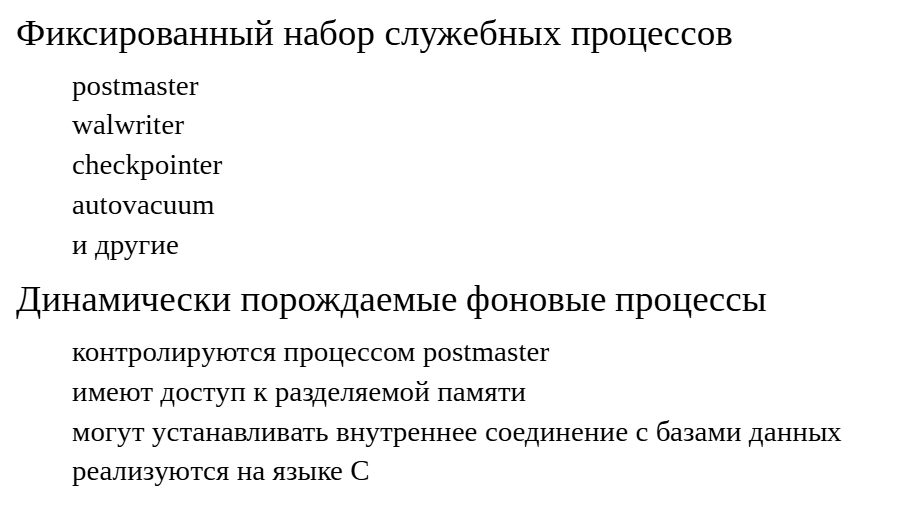
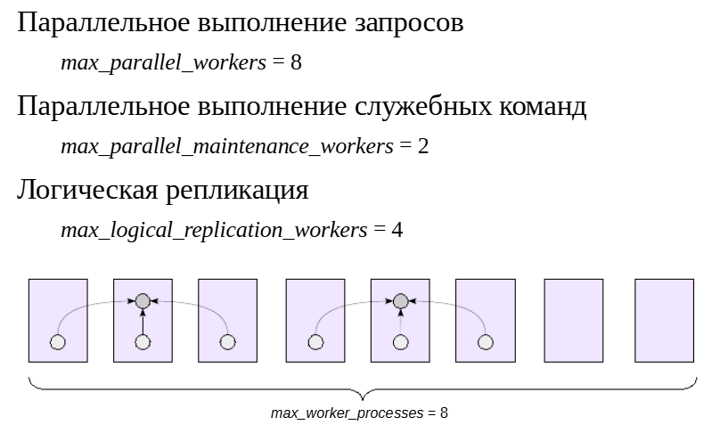

Фоновые процессы
################

Фоновые процессы
****************

PostgreSQL состоит из набора взаимодействующих процессов.За основными процессами закреплены собственные имена и ониимеют особый смысл для сервера. 
Например, при остановке экземпляра  нужно записать в журнал сообщение о завершении контрольной точки, поэтому процесс **walwriter** надо останавливать после **checkpointer**, и т. п.
Обычно (хотя и не всегда) такие процессы работают постоянно от старта сервера до его останова.

Но вместе с тем часто возникает необходимость временно запустить процесс, который выполнит необходимую работу и завершится. 
Такую возможность предоставляет механизм фоновых процессов (background workers): 

https://postgrespro.ru/docs/postgresql/16/bgworker

Как и все остальные, фоновые процессы порождаются и контролируются процессом **postmaster**. 
Фоновые процессы имеютвсе возможности, такие как доступ к разделяемой памяти сервера и соединение с базами данных по внутреннему протоколу 
SPI (рассматривается в теме «Языки программирования»).

Фоновые процессы должны быть написаны на языке C, пример можно найти в исходном коде (src/test/modules/worker_spi).

Заметим, что процесс автоочистки (*autovacuum launcher*) тоже динамически порождает рабочие процессы (*autovacuum worker*),но исторически делает это по-своему, 
не используя общий механизм фоновых процессов.

Использование
*************

	   
Фоновые процессы используются в PostgreSQL для различных целей.

1. Параллельное выполнение запросов.

2. Параллельное выполнение служебных команд (*CREATE INDEX* и *REINDEX* (в т. ч. *CONCURRENTLY*) для B-деревьев, *VACUUM*).
В этих случаях имеется ведущий процесс, инициирующий запуск рабочих процессов и получающий от них информацию.

3. Логическая репликация (для процессов на стороне сервера-подписчика).

Общее количество фоновых процессов в системе ограничено значением параметра 
**max_worker_processes**, и отдельными параметрами ограничено количество процессов для каждой из трех категорий. 
Если в пуле недостаточно фоновых процессов, то обработка будет выполняться последовательно, а не параллельно (а логическая репликация и вовсе не будет работать).

ПРАКТИКА
========

**Использование фоновых процессов**

Вот простой наглядный пример использования фоновых процессов для распараллеливания запросов. 
Если требуется посчитать количество строк в большой таблице, ведущий процесс запускает несколько рабочих процессов (в данном случае 2):

::

	EXPLAIN (analyze, costs off, timing off)
	SELECT count(*) FROM mail_messages;

										QUERY PLAN                                     
	-----------------------------------------------------------------------------------
	 Finalize Aggregate (actual rows=1 loops=1)
	   ->  Gather (actual rows=3 loops=1)
			 Workers Planned: 2
			 Workers Launched: 2
			 ->  Partial Aggregate (actual rows=1 loops=3)
				   ->  Parallel Seq Scan on mail_messages (actual rows=118708 loops=3)
	 Planning Time: 7.664 ms
	 Execution Time: 254.754 ms
	(8 rows)

Запланированное количество и число реально запущенных процессов могут отличаться, если на момент запуска запроса пул фоновых процессов будет исчерпан.

В конце частичные результаты собираются и агрегируются лидирующим процессом чтобы получить итоговое значение.

Прикладные задачи
*****************

.. 	figure:: img/12_03.png
       :scale: 100 %
       :align: center
       :alt: asda
	   
Кроме штатного использования, фоновые процессы можно приспособить и для решения пользовательских задач.

Например, можно организовать планировщик заданий внутри СУБД.

В отличие от, например, cron, такой планировщик не будет зависетьот используемой операционной системы. 
(Планировщик внутри СУБД реализован в Postgres Pro Enterprise и рассматривается в курсе PGPRO).

Можно выполнять асинхронную обработку событий.

Можно распараллеливать сложную длинную обработку больших объемов данных.

Можно реализовать автономные транзакции, хотя и весьма дорогим способом.

И так далее.

Однако писать прикладные задачи на языке С крайне неудобнои требует неоправданно высокой квалификации.

Расширение dlink
****************

Одно из возможных решений — использовать расширение dblink, которое предназначено для выполнения SQL-запросов на удаленном сервере PostgreSQL 
(в качестве удаленного может выступать и локальный сервер).

Это проверенное временем стандартное расширение. Однако ононе использует механизм фоновых процессов — устанавливается полноценное новое соединение с сервером, 
что существенно дороже.

https://postgrespro.ru/docs/postgresql/16/dblink

ПРАКТИКА
========

**Расширение dblink**

Это стандартное расширение. Установим его:

::

	CREATE DATABASE ext_bgworkers;

	CREATE DATABASE

::

	\c ext_bgworkers
	
	You are now connected to database "ext_bgworkers" as user "student".

::

	CREATE EXTENSION dblink;

	CREATE EXTENSION

Ниже — самый простой способ выполнить одиночный запрос на удаленном сервере. Первый параметр функции — строка соединения, второй — команда, которую надо выполнить.

Функция возвращает множество строк типа **record**, поэтому структуру составного типа необходимо указывать явно при ее вызове.

::

	SELECT * FROM dblink(
		'host=localhost port=5432 dbname=postgres user=postgres password=postgres',
		$$ SELECT * FROM generate_series(1,3); $$
	) AS (result integer);

	 result 
	--------
		  1
		  2
		  3
	(3 rows)

Команду, не возвращающую строки, можно выполнить с помощью другой функции:

::

	SELECT * FROM dblink_exec(
		'host=localhost port=5432 dbname=postgres user=postgres password=postgres',
		$$ VACUUM; $$
	);

	 dblink_exec 
	-------------
	 VACUUM
	(1 row)

Обе функции открывают соединение, выполняют команду и тут же закрывают соединение. Но есть возможность явно управлять соединением. Откроем его, указав имя:

::

	SELECT * FROM dblink_connect(
		'remote',
		'host=localhost port=5432 dbname=postgres user=postgres password=postgres'
	);

	 dblink_connect 
	----------------
	 OK
	(1 row)

Можно открыть и несколько соединений. Текущие открытые соединения показывает функция:

::

	SELECT * FROM dblink_get_connections();

	 dblink_get_connections 
	------------------------
	 {remote}
	(1 row)

Теперь можно выполнять команды, используя открытое соединение. В том числе можно вручную управлять транзакциями:

::

	SELECT * FROM dblink_exec(
		'remote',
		$$ BEGIN; $$
	);

	 dblink_exec 
	-------------
	 BEGIN
	(1 row)

::

	SELECT * FROM dblink(
		'remote',
		$$ SELECT pg_backend_pid(); $$
	) AS (pid integer);

	  pid  
	-------
	 34246
	(1 row)

::

	SELECT * FROM dblink_exec(
		'remote',
		$$ COMMIT; $$
	);

	 dblink_exec 
	-------------
	 COMMIT
	(1 row)

Важная возможность — асинхронные вызовы. Следующая функция отправит запрос на сервер и тут же вернет управление:

::

	SELECT * FROM dblink_send_query(
		'remote',
		$$ SELECT 'done' FROM pg_sleep(10); $$
	);

	 dblink_send_query 
	-------------------
					 1
	(1 row)

1 — успешно;

0 — ошибка.

Далее мы можем проверить, выполняется ли еще запрос:

::

	SELECT CASE dblink_is_busy('remote')
		WHEN 1 THEN 'еще выполняется'
		ELSE 'уже выполнился'
	END;

		  case       
	-----------------
	 еще выполняется
	(1 row)

Результат получаем так (если запрос еще не выполнился, функция сама дождется результатов):

::

	SELECT * FROM dblink_get_result(
		'remote'
	) AS (result text);

	 result 
	--------
	 done
	(1 row)

Не забываем закрыть соединение:

::

	SELECT * FROM dblink_disconnect('remote');

	 dblink_disconnect 
	-------------------
	 OK
	(1 row)

Расширение  pg_background
*************************

Есть и другое решение, которое позволяет прикладным разработчикам воспользоваться фоновыми процессами — стороннее расширение  **pg_background**:

https://github.com/vibhorkum/pg_background

Фактически это небольшая обертка над низкоуровневым API фоновых процессов, позволяющая запускать в фоновом режиме произвольные команды SQL. 

Разумеется, таким образом можно вызывать хранимые функции и процедуры, написанные на любых серверных языках программирования (например, PL/pgSQL).

ПРАКТИКА
========

**Расширение pg_background**

Расширение уже собрано и доступно для установки в виртуальной машине курса:

::

	CREATE EXTENSION pg_background;

	CREATE EXTENSION

Расширение предоставляет всего три функции.

Функция **pg_background_launch** запускает фоновый процесс, выполняющий одну SQL-команду.

Например, выполним в фоне простой запрос. Для удобства он будет работать 10 секунд:

::

	SELECT pg_background_launch(
		$$ SELECT 2+2 FROM (SELECT pg_sleep(10)) $$
	);

	 pg_background_launch 
	----------------------
					34704
	(1 row)

Пока запрос выполняется, мы можем увидеть процесс в **pg_stat_activity**:

::

	SELECT query, backend_type, wait_event_type, wait_event
	FROM pg_stat_activity WHERE pid = 34704 \gx

	-[ RECORD 1 ]---+----------------------------------------
	query           |  SELECT 2+2 FROM (SELECT pg_sleep(10)) 
	backend_type    | pg_background
	wait_event_type | Timeout
	wait_event      | PgSleep

Обратите внимание на ожидание.

Функция **pg_background_result** выводит результат выполнения фоновой команды (при необходимости дожидаясь ее окончания).

Функция возвращает значения типа record, поэтому для вывода необходимо конкретизировать названия и типы полей составного типа.

::

	SELECT * FROM pg_background_result(34704) AS (result integer);

	 result 
	--------
		  4
	(1 row)

Функция **pg_background_detach** отключает текущий процесс от ожидания результатов фонового процесса.
Из-за особенности текущей реализации между вызовами **pg_background_launch** и p**g_background_detach** должна быть небольшая задержка.

Передача результатов выполняется через очередь сообщений в разделяемой памяти сервера. 
Поэтому при переполнении очереди фоновый процесс будет ждать, пока мы не прочитаем накопившиеся сообщения, даже если они нас не интересуют.

Запустим процесс, возвращающий много информации:

::

	SELECT pg_background_launch(
		$$ SELECT * FROM generate_series(1,1_000_000) $$
	);

	 pg_background_launch 
	----------------------
					34880
	(1 row)

::

	SELECT query, backend_type, wait_event_type, wait_event
	FROM pg_stat_activity WHERE pid = 34880 \gx

	-[ RECORD 1 ]---+---------------------------------------------
	query           |  SELECT * FROM generate_series(1,1_000_000) 
	backend_type    | pg_background
	wait_event_type | IPC
	wait_event      | MessageQueuePutMessage

Обратите внимание на ожидание.

Отключимся от процесса:

::

	SELECT * FROM pg_background_detach(34880);
	 
	 pg_background_detach 
	----------------------
	 
	(1 row)

::

	SELECT query, backend_type, wait_event_type, wait_event
	FROM pg_stat_activity WHERE pid = 34880 \gx

	-[ RECORD 1 ]---+---------------------------------------------
	query           |  SELECT * FROM generate_series(1,1_000_000) 
	backend_type    | pg_background
	wait_event_type | 
	wait_event      | 

Больше фоновый процесс ничего не ждет (и, возможно, уже отработал).

Заметим, что в случае **dblink** сложностей с переполнением буфера не возникает, потому что используется не межпроцессное взаимодействие, 
а устанавливается обычное соединение по клиент-серверному протоколу.

Интересно, что изначально в состав расширения pg_background планировалось включить четвертую функция **pg_background_run(pid, query)**, 
которая должна была передавать новое задание уже запущенному процессу, избегая затрат на создание очередного фонового процесса. Однако пока что это не реализовано.