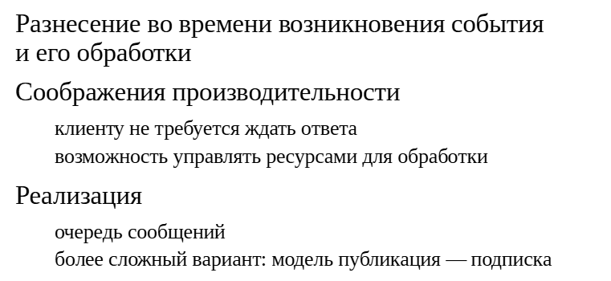
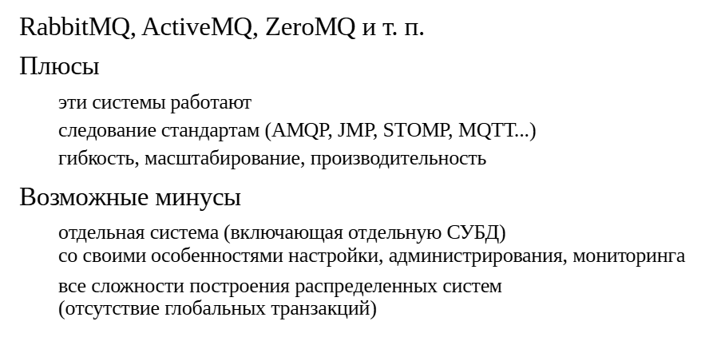
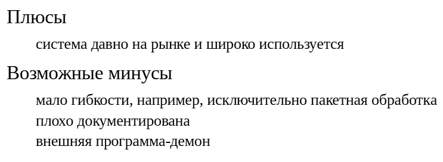
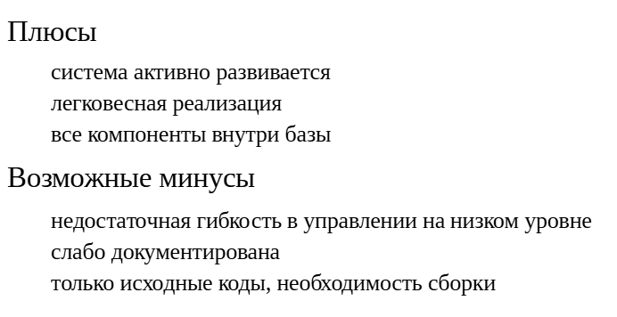
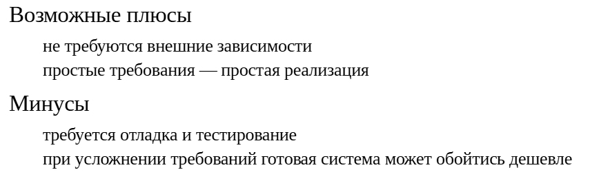
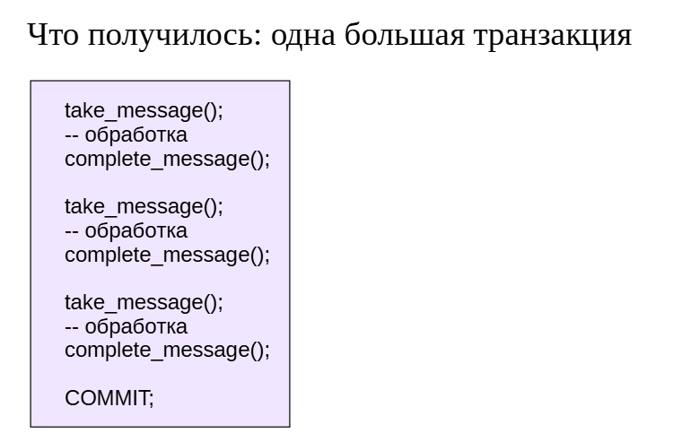
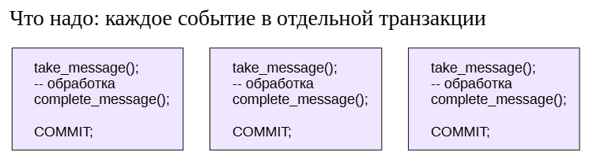
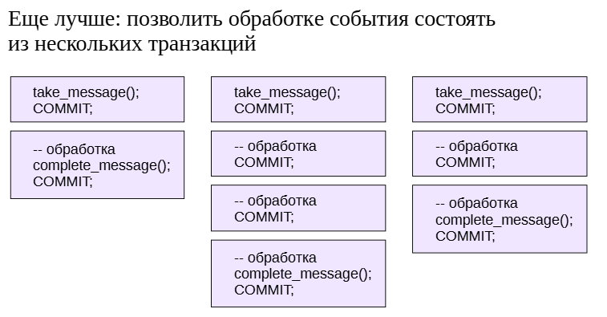
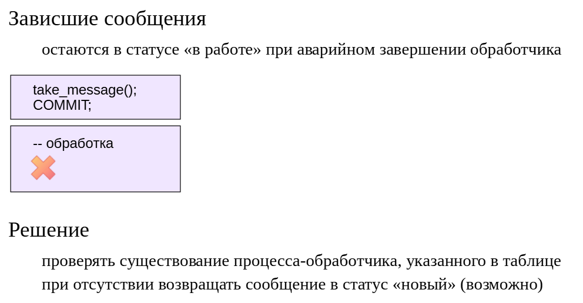
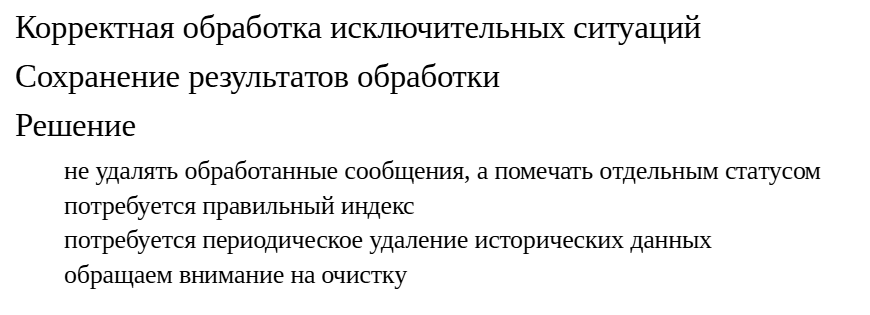

Асинхронная обработка
#####################

Асинхронная обработка
*********************

Идея асинхронной обработки событий состоит в том, что возникновение события и его обработка разносятся во времени.

Например, пользователь хочет получить детализацию расходов на мобильную связь. Детализация формируется несколько минут. 
Можно показать пользователю «песочные часы» и заставить его ждать (синхронная обработка), а можно выслать детализацию по электронной почте, 
когда она будет готова (асинхронная обработка).Другой пример: интеграция двух систем. Первая система обращается ко второй, передавая пакет сообщений. 
Обработка одного сообщения занимает несколько секунд, но в пакете может оказаться тысяча сообщений. 
Можно заставить первую систему ожидать получения результата (синхронная обработка), а можно ответить «работаем», обработать сообщения асинхронно и уже затем сообщить результат.

Асинхронная обработка сложнее синхронной, но часто оказывается очень удобной. Она позволяет работать эффективнее (клиенту не надо простаивать, дожидаясь ответа) 
и управлять ресурсами (обрабатывать события с удобной скоростью и в удобное время, а не немедленно).(Асинхронная обработка широко применяется и в ядре PostgreSQL. 
Вспомните режим асинхронной фиксации; процесс контрольной точки; процесс автоочистки.)Обычная реализация состоит в наличии очереди событий (сообщений): 
одни процессы создают события, другие — обрабатывают. 

Возможны более сложные модели, в которых есть возможность публиковать  события и подписываться на события нужного типа.

Внешние системы
***************

Одним из вариантов реализации очередей событий являются внешние системы. Названия многих из них традиционно заканчиваются на MQ — Message Queuing.

Как правило, это большие серьезные системы, обеспечивающие гибкость, масштабируемость, высокую производительность и прочие полезные свойства. 
К тому же они реализуют один или несколько стандартных протоколов работы с сообщениями, что позволяет интегрировать их с другими системами, понимающими те же протоколы.

Но надо понимать, что любая большая система потребует серьезных затрат на ее изучение и внедрение. 
Потребуется разобратьсяс особенностями настройки, администрирования, мониторинга. 
Заметим, что в состав систем работы с очередями входит и отдельная СУБД для надежного хранения очередей.

Кроме того, использование внешней системы приводит ко всем сложностям построения распределенных систем. 

При отсутствии глобальных транзакций, объединяющих разные системы, возможны случаи потери сообщений в результате сбоев.

Очереди
*******

Очереди внутри базы PgQ
=======================

Более простым решением может служить реализация очереди в самой СУБД. Особенно это имеет смысл, если события возникаюти обрабатываются на сервере баз данных.

Наиболее известна система PgQ, разработанная в свое время компанией Skype (https://github.com/pgq). 

Эта система достаточно широко используется и про нее известно, что она работает. Если требуется готовое решение, то ей можно и воспользоваться. 
Поддерживаются версии PostgreSQL 10+.

Из минусов этого решения отметим:

- Недостаточную гибкость. Например, возможна только пакетная обработка событий. Пока обработчик не пометит пакет, как полностью обработанный, 
все события пакета могут быть доставлены повторно в случае сбоя.

- Отсутствие качественной документации (есть описание API:https://pgq.github.io/extension/pgq/).

- Необходимость во внешней (относительно СУБД) программе, обеспечивающей работу очереди.

Очереди внутри базы pgmq
========================

Решение заявлено компанией Tembo как легковесная реализация очередей. 
Расширение **pgmq** написано на **Rust** и использует инфраструктуру сборки расширений **pgrx**.

Очереди и метаинформация представлены таблицами в базе данных,а элементы очереди («сообщения») — записями в таблицах. 
Сообщения можно помещать в очередь (в том числе по несколько сразу), читать из очереди, удалять и архивировать. 
Для выполнения этих основных действий (и еще ряда дополнительных) в расширении предусмотрен набор функций. 
Детали реализации очереди скрытыот пользователя, что упрощает работу.

Из минусов pgmq отметим следующие:

- Недостаточная гибкость в управлении на низком уровне. Связано с тем, что расширение **pgmq** базируется на фреймворке **pgrx**,в который встроено, 
в том числе, управление соединениямис сервером СУБД. Повлиять на него средствами уже собранного pgmq нельзя.

- Документация недостаточно подробна.

- В репозитории отсутствуют готовые пакеты, а сборка расширения  может оказаться нетривиальной и ресурсоемкой.

https://tembo.io/pgmq/https://github.com/tembo-io/pgmq

ПРАКТИКА
--------

**Очередь средствами расширения pgmq**

Создадим базу данных и подключимся к ней:

::

	CREATE DATABASE ext_async;

	CREATE DATABASE

::

	\c ext_async

You are now connected to database "ext_async" as user "student".

Расширение pgmq уже собрано и доступно для установки. Выполним команду создания расширения в нашей базе. Все его объекты будут размещены в схеме pgmq:

::

	CREATE EXTENSION pgmq;

	CREATE EXTENSION

Создадим очередь под названием pgmq_queue:

::

	SELECT pgmq.create('pgmq_queue');

	 create 
	--------
	 
	(1 row)

Информация об очередях хранится в таблице meta; посмотреть очереди можно с помощью табличной функции:

::

	SELECT * FROM pgmq.list_queues();

	 queue_name |          created_at           | is_partitioned | is_unlogged 
	------------+-------------------------------+----------------+-------------
	 pgmq_queue | 2025-11-26 19:13:04.549786+03 | f              | f
	(1 row)

Также были созданы таблицы для сообщений очереди: основная q_pgmq_queue и архивная a_pgmq_queue:

::

	\dt pgmq.*

				List of relations
	 Schema |     Name     | Type  |  Owner  
	--------+--------------+-------+---------
	 pgmq   | a_pgmq_queue | table | student
	 pgmq   | meta         | table | student
	 pgmq   | q_pgmq_queue | table | student
	(3 rows)

Поместим в очередь несколько сообщений (полезная информация представляется значением типа jsonb)...

::

	SELECT pgmq.send('pgmq_queue', to_jsonb(i))
	FROM (
		VALUES ('alpha'), ('beta'), ('gamma')
	) AS v(i);

	 send 
	------
		1
		2
		3
	(3 rows)

...и заглянем в основную таблицу очереди:

::

	SELECT msg_id, enqueued_at, message 
	FROM pgmq.q_pgmq_queue 
	ORDER BY msg_id;

	 msg_id |          enqueued_at          | message 
	--------+-------------------------------+---------
		  1 | 2025-11-26 19:13:04.959321+03 | "alpha"
		  2 | 2025-11-26 19:13:04.959321+03 | "beta"
		  3 | 2025-11-26 19:13:04.959321+03 | "gamma"
	(3 rows)

Простой способ забрать сообщение из очереди — вызвать функцию pop:

::

	SELECT msg_id, enqueued_at, message
	FROM pgmq.pop('pgmq_queue');

	 msg_id |          enqueued_at          | message 
	--------+-------------------------------+---------
		  1 | 2025-11-26 19:13:04.959321+03 | "alpha"
	(1 row)

Другие обработчики тоже могут брать сообщения:

::

	student$ psql -d ext_async

::

	SELECT msg_id, enqueued_at, message
	FROM pgmq.pop('pgmq_queue');

	 msg_id |          enqueued_at          | message 
	--------+-------------------------------+---------
		  2 | 2025-11-26 19:13:04.959321+03 | "beta"
	(1 row)

::

	student$ psql -d ext_async

::

	SELECT msg_id, enqueued_at, message
	FROM pgmq.pop('pgmq_queue');

	 msg_id |          enqueued_at          | message 
	--------+-------------------------------+---------
		  3 | 2025-11-26 19:13:04.959321+03 | "gamma"
	(1 row)

А первый при очередном обращении обнаружит, что очередь пуста:

::

	SELECT msg_id, enqueued_at, message
	FROM pgmq.pop('pgmq_queue');

	 msg_id | enqueued_at | message 
	--------+-------------+---------
	(0 rows)

И напоследок удалим саму очередь. При этом ее основная и архивная таблицы исчезнут, как и информация в таблице meta:

::

	SELECT pgmq.drop_queue('pgmq_queue');

	 drop_queue 
	------------
	 t
	(1 row)

::

	\dt pgmq.*

			List of relations
	 Schema | Name | Type  |  Owner  
	--------+------+-------+---------
	 pgmq   | meta | table | student
	(1 row)

Самостоятельная организация очереди
***********************************

Для решения простой задачи, требующей асинхронной обработки, использование сторонних систем может оказаться невыгодным. 
Возможно, проще написать собственную реализацию, чем приспосабливаться к особенностям сторонней системы.Конечно, нужно понимать, что:

- реализация должна быть сделана аккуратно, иначе она может привести к проблемам эксплуатации;

- если к системе очередей предъявляются серьезные требования(или есть шанс, что такие требования появятся в будущем), то развитие, тестирование и поддержка собственного решения, 
наоборот, может оказаться невыгодной.

ПРАКТИКА
========

**Реализация очереди сообщений**

Наша задача: реализовать простую очередь сообщений с возможностью конкурентного получения сообщений из нескольких процессов. 
Полезную информацию снова представим типом JSON — так очередь будет достаточно универсальна.

В каждый конкретный момент времени в таблице сообщений не будет много строк, но за все время работы их может оказаться существенное количество. 
Поэтому идентификатор надо сразу сделать 64-разрядным:

::

	CREATE TABLE msg_queue(
		id bigint PRIMARY KEY GENERATED ALWAYS AS IDENTITY,
		payload jsonb NOT NULL,
		pid integer DEFAULT NULL -- процесс-обработчик
	);

	CREATE TABLE

Вставка сообщений в очередь проста:

::

	INSERT INTO msg_queue(payload)
	VALUES
		(to_jsonb(1)),
		(to_jsonb(2)),
		(to_jsonb(3));
	INSERT 0 3

Теперь займемся функцией получения и блокирования очередного сообщения.

Нам требуется блокировать полученную строку, чтобы одно сообщение не могло быть выбрано два раза (двумя одновременно работающими обработчиками). 
Это можно сделать с помощью фразы **FOR UPDATE**:

::

	BEGIN;

	BEGIN

::

	SELECT * FROM msg_queue
	WHERE pid IS NULL -- никем не обрабатывается
	ORDER BY id LIMIT 1 -- одно в порядке поступления
	FOR UPDATE;

	 id | payload | pid 
	----+---------+-----
	  1 | 1       |    
	(1 row)

Но в таком случае аналогичный запрос в другом процессе будет заблокирован до завершения первой транзакции.

::

	\c ext_async
	
	You are now connected to database "ext_async" as user "student".

::

	| BEGIN;
	  BEGIN

::

	| SELECT * FROM msg_queue
	| WHERE pid IS NULL
	| ORDER BY id LIMIT 1
	| FOR UPDATE;

Вторая транзакция заблокирована.

::

	DELETE FROM msg_queue
	WHERE id = 1;
	
	DELETE 1
	
::

	COMMIT;
	COMMIT

::

	|	id | payload | pid 
	|----+---------+-----
	|  2 | 2       |    
	|(1 row)

::

	| COMMIT;
	| COMMIT

Для того чтобы не останавливаться на заблокированных строках, служит фраза **SKIP LOCKED** команды **SELECT**.

::

	BEGIN;

	BEGIN

::

	SELECT * FROM msg_queue
	WHERE pid IS NULL
	ORDER BY id LIMIT 1
	FOR UPDATE SKIP LOCKED;

	 id | payload | pid 
	----+---------+-----
	  2 | 2       |    
	(1 row)

::

	| BEGIN;
	| BEGIN
	
::
	
	| SELECT * FROM msg_queue
	| WHERE pid IS NULL
	| ORDER BY id LIMIT 1
	| FOR UPDATE SKIP LOCKED;
	
	| id | payload | pid 
	| ----+---------+-----
	|   3 | 3       |    
	| (1 row)

::

	COMMIT;
	COMMIT

::

	| COMMIT;

	| COMMIT

Итак, функция для получения и блокирования очередного сообщения может выглядеть следующим образом:

::

	CREATE FUNCTION take_message(OUT msg msg_queue)
	LANGUAGE sql VOLATILE
	BEGIN ATOMIC
		UPDATE msg_queue
		SET pid = pg_backend_pid()
		WHERE id = (SELECT id FROM msg_queue
		WHERE pid IS NULL
			ORDER BY id LIMIT 1
		FOR UPDATE SKIP LOCKED) RETURNING *;
	END;

	CREATE FUNCTION
	
 --------------------------

В практических заданиях к темам «Очистка» и «Фоновые задания» мы рассматривали типичное решение для получения пакета строк таблицы, например, с целью обновления или удаления. Запрос выглядел так:

::

	WITH batch AS (
		SELECT * FROM t
		WHERE /* необходимые условия */
		LIMIT /* размер пакета */
		FOR UPDATE SKIP LOCKED
	)
...
Как видите, в обоих случаях используется тот же самый подход: выбирается и блокируется часть строк (одна или несколько), при этом уже заблокированные строки пропускаются.

Теперь напишем функцию завершения работы с сообщением. Мы будем просто удалять его из очереди.

::

	CREATE FUNCTION complete_message(msg msg_queue) RETURNS void
	LANGUAGE sql VOLATILE
	BEGIN ATOMIC
	  DELETE FROM msg_queue WHERE id = msg.id;
	END;

	CREATE FUNCTION
	
 --------------------------------
 
Теперь мы готовы написать цикл обработки сообщений. Оформим его в виде процедуры.

::

	CREATE PROCEDURE process_queue() AS $$
	DECLARE
		msg msg_queue;
	BEGIN
		LOOP
			SELECT * INTO msg FROM take_message();
			EXIT WHEN msg.id IS NULL;

			-- обработка
			PERFORM pg_sleep(1);
			RAISE NOTICE '[%] processed %; n_tup_del=%, backend_xmin=%',
				pg_backend_pid(),
				msg.payload,

				(SELECT n_tup_del FROM pg_stat_xact_all_tables  -- статистика, накопленная внутри транзакции
				 WHERE relname = 'msg_queue'),

				(SELECT backend_xmin FROM pg_stat_activity
				 WHERE pid = pg_backend_pid());

			PERFORM complete_message(msg);
		END LOOP;
	END;
	$$ LANGUAGE plpgsql;

	CREATE PROCEDURE

В этом варианте цикл заканчивается, когда в очереди не остается необработанных сообщений. Вместо этого можно не прекращать цикл, но продолжать ожидать новые события, засыпая, например, на одну секунду.

Пробуем.

::

	CALL process_queue();

	NOTICE:  [35341] processed 2; n_tup_del=0, backend_xmin=833
	NOTICE:  [35341] processed 3; n_tup_del=1, backend_xmin=833
	CALL

Теперь в два потока.

::

	INSERT INTO msg_queue(payload)
	SELECT to_jsonb(id) FROM generate_series(1,10) id;
	
	INSERT 0 10

::

	\timing on

	Timing is on.

::

	CALL process_queue();

::

	| CALL process_queue();

	| NOTICE:  [36166] processed 2; n_tup_del=0, backend_xmin=835
	| NOTICE:  [36166] processed 4; n_tup_del=1, backend_xmin=835
	| NOTICE:  [36166] processed 6; n_tup_del=2, backend_xmin=835
	| NOTICE:  [36166] processed 8; n_tup_del=3, backend_xmin=835
	| NOTICE:  [36166] processed 10; n_tup_del=4, backend_xmin=835
	| CALL

::

	NOTICE:  [35341] processed 1; n_tup_del=0, backend_xmin=835
	NOTICE:  [35341] processed 3; n_tup_del=1, backend_xmin=835
	NOTICE:  [35341] processed 5; n_tup_del=2, backend_xmin=835
	NOTICE:  [35341] processed 7; n_tup_del=3, backend_xmin=835
	NOTICE:  [35341] processed 9; n_tup_del=4, backend_xmin=835
	CALL
	
	Time: 5009,451 ms (00:05,009)

::

	\timing off
	Timing is off.

Обработка 10 сообщений двумя потоками заняла около 5 секунд, но горизонт транзакций держался на одном уровне все время обработки очереди! 
Это будет мешать выполнению очистки и создавать проблемы для всей базы данных.

ГОРИЗОНТ
********

	   
Показанное решение имеет существенный недостаток: вся обработка выполняется в одной длинной транзакции. 
Вспоминая темы «Многоверсионность» и «Очистка» модуля «Архитектура», можно с уверенностью сказать, что обработка очереди будет мешать нормальной работе очистки.

	   
Чтобы таких проблем не возникало, надо раздробить длинную транзакцию на несколько более коротких. 
В нашем случае — обрабатывать каждое событие в собственной транзакции.

	   
Более того, обработка одного события тоже может (в принципе) разбиваться на несколько транзакций.

В таком случае мы сначала фиксируем изменение статуса событияв очереди («в работе»), затем выполняем обработку, 
а в конце фиксируем факт завершения работы с событием (например, удаляем его из таблицы).

ПРАКТИКА
========

Учитываем горизонт транзакций
Это легко сделать, поскольку процедура позволяет управлять транзакциями.

::

	CREATE OR REPLACE PROCEDURE process_queue() AS $$
	DECLARE
		msg msg_queue;
	BEGIN
		LOOP
			SELECT * INTO msg FROM take_message();
			COMMIT; --<<
			EXIT WHEN msg.id IS NULL;

			-- обработка
			PERFORM pg_sleep(1);
			RAISE NOTICE '[%] processed %; n_dead_tup=%, n_tup_del=%, backend_xmin=%',
				pg_backend_pid(),
				msg.payload,

				(SELECT n_dead_tup FROM pg_stat_all_tables  -- статистика, учитываемая автоочисткой
				 WHERE relname = 'msg_queue'),

				(SELECT n_tup_del FROM pg_stat_xact_all_tables
				 WHERE relname = 'msg_queue'),

				(SELECT backend_xmin FROM pg_stat_activity
				 WHERE pid = pg_backend_pid());

			PERFORM complete_message(msg);
			COMMIT; --<<
		END LOOP;
	END;
	$$ LANGUAGE plpgsql;

	CREATE PROCEDURE

Проверим:

::

	INSERT INTO msg_queue(payload)
	SELECT to_jsonb(id) FROM generate_series(1,5) id;

	INSERT 0 5

::

	CALL process_queue();

Теперь горизонт транзакций продвигается вперед и не мешает очистке. Однако момент срабатывания автоматической очистки определяется на основе данных статистики, которая обновляется лишь по окончании работы всего оператора CALL.

::

	SELECT n_dead_tup, n_live_tup, n_mod_since_analyze, n_ins_since_vacuum 
	FROM pg_stat_all_tables 
	WHERE relname = 'msg_queue';

	 n_dead_tup | n_live_tup | n_mod_since_analyze | n_ins_since_vacuum 
	------------+------------+---------------------+--------------------
			 10 |          0 |                  15 |                  5
	(1 row)

Таким образом, чтобы таблица с очередью вовремя очищалась, можно:

- модифицировать процедуру process_queue таким образом, чтобы обеспечить ее гарантированное периодическое завершение и положиться на автоочистку;

- периодически запускать обычную (неавтоматическую) очистку. Один из способов реализации — использование фоновых процессов.

Не хватает
**********

Чего не хватает в нашей реализации?Во-первых, обработчик может завершиться аварийно. 
Если мы фиксируем изменение статуса обработки, то событие «повиснет»в статусе «в работе» и не будет больше обрабатываться.

В нашей реализации мы уже сделали шаг в нужную сторону: в таблице сохраняется номер обслуживающего процесса (pid), который взял событие в работу. 
Можно написать простую проверку: если pid имеется в таблице, но процесса с таким номером нет в системе — значит, произошел сбой.Что делать в таком случае? 
Если обработка события выполняласьв одной транзакции, то она была прервана и, следовательно, можно безопасно вернуть событие в статус «новое» — оно будет обработано повторно.

Если же обработка делится на несколько транзакций, надо быть уверенным в том, что обработку можно запускать повторно.

	   
Во-вторых, наша реализация никак не обрабатывает исключительные ситуации. Это, конечно, несложно добавить. 
При возникновении исключения хотелось бы иметь информацию о том, что случилось.

Да и если событие обработано без ошибок, может быть полезным сохранять какую-то информацию об обработке. Это, конечно, зависит от конкретной задачи.

Наша реализация удаляет обработанные события из очереди, но вместо этого можно оставлять их, помечая специальным статусом («завершено», «ошибка» и т. п.). 
Тогда всю информацию об обработке можно иметь непосредственно в таблице с событиями. В таком случае потребуется эффективный доступ к еще не обработанным сообщениям: 
частичный индекс с условием pid IS NULL. (Другим решением может быть перенос обработанных событий в отдельную таблицу.)

За удобство потребуется платить реализацией периодического удаления «хвоста» очереди — исторических данных. Если период достаточно большой, то, возможно, 
удаление надо выполнять пакетами — чтобы не допускать лишнего разрастания таблицыи не мешать очистке.

И, поскольку таблица очередей изменяется довольно активно,надо обеспечить ее своевременную очистку, о чем говорилосьв демонстрации.

