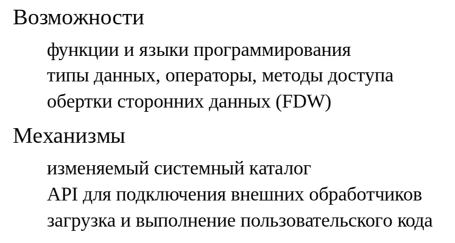
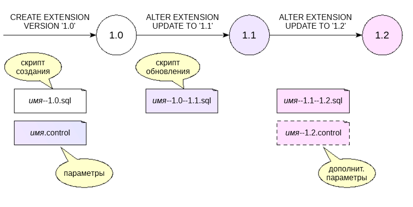

Создание расширений
###################

Расширяемость PostgreSQL
************************

Расширяемость — важнейшая черта PostgreSQL — это возможность подключать «на лету» новый функционал без изменения кода сервера.

Таким образом можно добавлять языки программированияи разрабатывать на них функции, определять новые типы данныхи операторы для работы с ними, создавать новые методы 
доступа для типов данных, разрабатывать обертки сторонних данных для подключения к внешним источникам.

Для того чтобы это было возможным, системный каталог PostgreSQL хранит большое количество информации об объектах БД. 
Эта информация не зашита жестко в код сервера. Пользователи могут изменять содержимое таблиц системного каталога, тем самым добавляя новые объекты и связанный с ними функционал.

Кроме того, в исходном коде PostgreSQL встроено большое количество хуков и различных API для подключения пользовательских функций. 
Это дает возможность разрабатывать такие расширения как pg_stat_statements, auto_explain, pldebugger и многие, многие другие.

Завершает картину возможность загружать в серверные процессы пользовательский код. Например, можно написать разделяемую библиотеку и подключать ее по ходу работы.

https://postgrespro.ru/docs/postgresql/16/extend-how

В качестве предостережения следует отметить, что выполнение процессами сервера неправильно написанного пользовательского кода  может привести к катастрофическим последствиям. 
Следует доверять только проверенному коду из надежных источников.

РАсширения
**********

.. 	figure:: img/14_02.png
       :scale: 100 %
       :align: center
       :alt: asda

Бывают ситуации, когда несколько объектов базы данных логически связаны между собой. Например, несколько типов данных, функциии операторы для работы с ними, классы операторов. 
Такую связь можно сделать явной с помощью механизма расширений.

Это облегчает управление объектами:

- все объекты устанавливаются одной командой;

- невозможно удалить отдельный объект — расширение можно удалить только полностью;

- связь между объектами сохраняется и при создании резервной копии с помощью утилиты pg_dump;

- есть инструменты для управления версиями расширений.

В состав PostgreSQL входит значительное количество полезных расширений, частью из которых мы уже пользовались.

https://postgrespro.ru/docs/postgresql/16/contribhttps://postgrespro.ru/docs/postgresql/16/contrib-prog

Другой источник — PostgreSQL Extension Network (PGXN) — сеть расширений по аналогии с CPAN 

для Perl: https://pgxn.org/

Расширения могут распространяться и другими способами, в том числе через пакетные репозитории дистрибутивов ОС.

Рассмотрим, как создавать собственные расширения.

Создание расширения
*******************

.. 	figure:: img/14_03.png
       :scale: 100 %
       :align: center
       :alt: asda

Расширение устанавливается в базу данных командой **CREATE EXTENSION**. При этом должны существовать два файла:

- управляющий файл «имя.control» с параметрами расширения;

- скрипт создания объектов расширения «имя--версия.sql».

Версия традиционно имеет вид «1.0», «1.1» и т. д., но это не обязательно: ее имя может состоять из любых символов (но не должно содержать «--» и начинаться или заканчиваться на «-»).

Обычно версию не указывают в команде **CREATE EXTENSION**, поскольку текущая актуальная версия записана в управляющем файле 
(параметр default_version) и используется по умолчанию.

Другие параметры расширения указывают зависимости от других расширений (requires), 
возможность перемещения объектов расширения между схемами (relocatable), возможность установки только суперпользователем (superuser) и др.

https://postgrespro.ru/docs/postgresql/16/extend-extensions

https://postgrespro.ru/docs/postgresql/16/sql-createextension

Расширение удаляется командой **DROP EXTENSION**. 

Скрипт для удаления объектов писать не нужно.

https://postgrespro.ru/docs/postgresql/16/sql-dropextension

ПРАКТИКА
========

**Создание расширения**

Создадим простое расширение — конвертер единиц измерения, и назовем его uom (units of measure).

Начнем с каталога, в котором будем создавать необходимые файлы:

::

	student$ mkdir /home/student/tmp/uom

Сначала создадим управляющий файл с настройками (мы можем сделать это в любом текстовом редакторе).

::

	default_version определяет версию по умолчанию, без этого параметра версию придется указывать явно;
	relocatable говорит о том, что расширение можно перемещать из схемы в схему (мы поговорим об этом чуть позже);
	encoding требуется, если используются символы, отличные от ASCII;
	comment определяет комментарий к расширению.
	/home/student/tmp/uom/uom.control
	default_version = '1.0'
	relocatable = true
	encoding = UTF8
	comment = 'Единицы измерения'

Это не все возможные параметры; полный список можно узнать из документации.

Теперь займемся файлом с командами, создающими объекты расширения.

- Первая строка файла предотвращает случайный запуск скрипта вручную.

- Все команды будут выполнены в одной транзакции — неявном блоке **BEGIN ... END**. Поэтому команды управления транзакциями (и служебные команды, такие, как VACUUM) здесь не допускаются.

- Путь поиска (параметр search_path) будет установлен на единственную схему — ту, в которой создаются объекты расширения.

**/home/student/tmp/uom/uom--1.0.sql**

::

	\echo Use "CREATE EXTENSION uom" to load this file. \quit

::

	-- Справочник единиц измерения
	CREATE TABLE uoms (
		uom text PRIMARY KEY,
		k numeric NOT NULL
	);

::

	GRANT SELECT ON uoms TO public;
	INSERT INTO uoms(uom,k) VALUES ('м',1), ('км',1000), ('см',0.01);

	-- Функция для перевода значения из одной единицы 
	в другую
	CREATE FUNCTION convert(value numeric, uom_from text, uom_to text) RETURNS numeric
	LANGUAGE sql STABLE STRICT
	RETURN convert.value *
		(SELECT k FROM uoms WHERE uom = convert.uom_from) /
		(SELECT k FROM uoms WHERE uom = convert.uom_to);

Чтобы PostgreSQL нашел созданные нами файлы, они должны оказаться в каталоге SHAREDIR/extension. Значение SHAREDIR можно узнать так:

::

	student$ pg_config --sharedir
	/usr/share/postgresql/16

Например, посмотрим на файлы расширения pg_background:

::

	student$ ls `pg_config --sharedir`/extension/pg_background*
	/usr/share/postgresql/16/extension/pg_background--1.0--1.4.sql
	/usr/share/postgresql/16/extension/pg_background--1.1--1.4.sql
	/usr/share/postgresql/16/extension/pg_background--1.2--1.4.sql
	/usr/share/postgresql/16/extension/pg_background--1.3--1.4.sql
	/usr/share/postgresql/16/extension/pg_background--1.4.sql
	/usr/share/postgresql/16/extension/pg_background.control

Конечно, файлы расширения можно скопировать вручную, но стандартный способ — воспользоваться утилитой make. Ей понадобится Makefile, который должен выглядеть, как показано ниже.

- Переменная EXTENSION задает имя расширения;

- Переменная DATA определяет список файлов, которые надо скопировать в SHAREDIR (кроме управляющего);

- Последние строки не меняются. 

Они подключают специальный **Makefile** для расширений, который содержит всю необходимую логику сборки и установки. 

Важно, чтобы утилита **pg_config** была доступна — иначе неизвестны пути, по которым установлен PostgreSQL.
	
::

	/home/student/tmp/uom/Makefile
	
	EXTENSION = uom
	DATA = uom--1.0.sql

	PG_CONFIG = pg_config
	PGXS := $(shell $(PG_CONFIG) --pgxs)
	include $(PGXS)

Теперь выполним **make install** в каталоге расширения:

::

	student$ sudo make install -C /home/student/tmp/uom

	make: Entering directory '/home/student/tmp/uom'

	/bin/mkdir -p '/usr/share/postgresql/16/extension'
	/bin/mkdir -p '/usr/share/postgresql/16/extension'
	/usr/bin/install -c -m 644 .//uom.control '/usr/share/postgresql/16/extension/'
	/usr/bin/install -c -m 644 .//uom--1.0.sql  '/usr/share/postgresql/16/extension/'

	make: Leaving directory '/home/student/tmp/uom'

Создадим базу данных и подключимся к ней:

::

	CREATE DATABASE ext_extensions;
	
	CREATE DATABASE

::

	\c ext_extensions
	You are now connected to database "ext_extensions" as user "student".

Проверим, доступно ли наше расширение?

::

	SELECT * FROM pg_available_extensions WHERE name = 'uom';

	 name | default_version | installed_version |      comment      
	------+-----------------+-------------------+-------------------
	 uom  | 1.0             |                   | Единицы измерения
	(1 row)

Попробуем создать в новой базе расширение uom:

::

	CREATE EXTENSION uom;

	CREATE EXTENSION

Мы не указали версию, поэтому было взято значение из управляющего файла (1.0).

::

	SELECT * FROM uoms;

	 uom |  k   
	-----+------
	 м   |    1
	 км  | 1000
	 см  | 0.01
	(3 rows)

::

	SELECT convert(2, 'км', 'м');

			convert        
	-----------------------
	 2000.0000000000000000
	(1 row)

Все работает.

Само расширение не относится к какой-либо схеме, но объекты расширения — относятся. В какой схеме они созданы?

::

	\dt uoms

			List of relations
	 Schema | Name | Type  |  Owner  
	--------+------+-------+---------
	 public | uoms | table | student
	(1 row)

Объекты установлены в схему, в которой они были бы созданы по умолчанию; в данном случае — public. При создании расширения мы можем указать эту схему явно:

::

	CREATE EXTENSION uom SCHEMA public;

Поскольку мы указали в управляющем файле, что расширение переносимо (relocatable), его можно переместить в другую схему:

::

	CREATE SCHEMA uom;

	CREATE SCHEMA

::

	ALTER EXTENSION uom SET SCHEMA uom;

	ALTER EXTENSION

Теперь все объекты находятся в схеме uom:

::

	\dt uom.*

			List of relations
	 Schema | Name | Type  |  Owner  
	--------+------+-------+---------
	 uom    | uoms | table | student
	(1 row)

::

	\df uom.*

									   List of functions
	 Schema |  Name   | Result data type |            Argument data types            | Type 
	--------+---------+------------------+-------------------------------------------+------
	 uom    | convert | numeric          | value numeric, uom_from text, uom_to text | func
	(1 row)

Можно ли прочитать данные из таблицы без указания схемы, где она расположена?

::

	SELECT * FROM uoms;

	ERROR:  relation "uoms" does not exist

	LINE 1: SELECT * FROM uoms;
                      ^
Нет, потому что теперь таблица не находится в пути поиска.

А будет ли работать функция, если при ее вызове мы явно укажем схему? Напомним, что в определении тела функции обращение к таблице не включало название схемы.

::

	SELECT uom.convert(2, 'км', 'м');

			convert        
	-----------------------
	 2000.0000000000000000
	(1 row)

Да, потому что код функции был оформлен в современном стиле стандарта SQL, а значит еще на этапе создания был выполнен его разбор и теперь 
обращение к таблице производится по ее идентификатору, а не по символическому имени.

Позаботимся о путях поиска; данные из таблицы читаются:

::

	SET search_path = uom, public;

	SET

::

	SELECT * FROM uoms;

	 uom |  k   
	-----+------
	 м   |    1
	 км  | 1000
	 см  | 0.01
	(3 rows)

Отметим, что некоторые расширения не допускают перемещения, но это бывает нечасто.

Обновление расширения
*********************

	   
Обновление версии расширения выполняется командой **ALTER EXTENSION UPDATE**. При этом должен существовать скрипт обновления «имя--старая-версия--новая-версия.sql», 
содержащий необходимые для обновления команды.

Также необходимо изменить управляющий файл «имя.control», обновив актуальную версию и, возможно, другие параметры.

При необходимости может существовать и отдельный управляющий файл, привязанный к версии. Например, если в версии 1.2 появилась зависимость от другого расширения, 
то эту зависимость неправильно  указывать в основном управляющем файле. Параметры, указанныев дополнительном управляющем файле, более приоритетны, чем параметры основного 
управляющего файла.В примере, приведенном на слайде, имеются скрипты обновления1.0→1.1 и 1.1→1.2. 

Можно создать и скрипт 1.0→1.2, но, как правило, это не требуется: механизм расширений сам берет на себя выбор пути с учетом доступных переходов между версиями. 

Например, если установлена версия 1.0, то ее можно обновить сразу до 1.2: сначала автоматически применится скрипт 1.0→1.1, а затем 1.1→1.2.

Как и при создании, при обновлении номер версии обычно не указывают — в этом случае обновление происходит до последней актуальной версии, записанной в основном управляющем файле.

https://postgrespro.ru/docs/postgresql/16/sql-alterextension

ПРАКТИКА
========

**Версии расширения и обновление**

При некотором размышлении мы можем сообразить, что не любые единицы допускают преобразование. 
Например, метры нельзя пересчитать в килограммы. Создадим версию 1.1 нашего расширения, которая это учитывает.

В управляющем файле исправим версию на 1.1:

/home/student/tmp/uom/uom.control

::

	default_version = '1.1'
	relocatable = true
	encoding = UTF8
	comment = 'Единицы изменения'

И создадим файл с командами для обновления:

/home/student/tmp/uom/uom--1.0--1.1.sql

::

	\echo Use "CREATE EXTENSION uom" to load this file. \quit

	-- Все, что было, отнесем к мерам длины
	ALTER TABLE uoms ADD uom_class text NOT NULL DEFAULT 'длина';

	-- Добавим единицы измерения массы
	INSERT INTO uoms(uom,k,uom_class) VALUES
		('г', 1,'масса'), ('кг', 1_000,'масса'),
		('ц', 100_000,'масса'), ('т', 1_000_000,'масса');

	-- Функция для перевода значения из одной единицы 
	в другую
	CREATE OR REPLACE FUNCTION convert(
		value numeric,
		uom_from text,
		uom_to text
	)
	RETURNS numeric AS $$
	DECLARE
		uoms_from uoms;
		uoms_to uoms;
	BEGIN
		SELECT * INTO uoms_from FROM uoms WHERE uom = convert.uom_from;
		SELECT * INTO uoms_to FROM uoms WHERE uom = convert.uom_to;
		IF uoms_from.uom_class != uoms_to.uom_class THEN
			RAISE EXCEPTION 'Невозможно преобразовать : % -> %',
				uoms_from.uom_class, uoms_to.uom_class;
		END IF;
		RETURN convert.value * uoms_from.k / uoms_to.k;
	END;
	$$ LANGUAGE plpgsql STABLE STRICT;

Добавим в Makefile новый файл в список DATA:

/home/student/tmp/uom/Makefile

::

	EXTENSION = uom
	DATA = uom--1.0.sql uom--1.0--1.1.sql

	PG_CONFIG = pg_config
	PGXS := $(shell $(PG_CONFIG) --pgxs)
	include $(PGXS)

Выполним **make install**, чтобы разместить файлы расширения:

::

	student$ sudo make install -C /home/student/tmp/uom

::

	make: Entering directory '/home/student/tmp/uom'
	/bin/mkdir -p '/usr/share/postgresql/16/extension'
	/bin/mkdir -p '/usr/share/postgresql/16/extension'
	/usr/bin/install -c -m 644 .//uom.control '/usr/share/postgresql/16/extension/'
	/usr/bin/install -c -m 644 .//uom--1.0.sql .//uom--1.0--1.1.sql  
	'/usr/share/postgresql/16/extension/'
	make: Leaving directory '/home/student/tmp/uom'

Какие версии расширения нам доступны?

::

	SELECT name, version, installed
	FROM pg_available_extension_versions
	WHERE name = 'uom';

	 name | version | installed 
	------+---------+-----------
	 uom  | 1.0     | t
	 uom  | 1.1     | f
	(2 rows)

Какие пути обновления доступны?

::

	SELECT * FROM pg_extension_update_paths('uom');

	 source | target |   path   
	--------+--------+----------
	 1.0    | 1.1    | 1.0--1.1
	 1.1    | 1.0    | 
	(2 rows)

Очевидно, путь один. Заметьте, что если бы мы создали файл «uom--1.1--1.0.sql», можно было бы «понизить версию». Для механизма расширений имена версий ничего не значат.

Выполним обновление:

::

	ALTER EXTENSION uom UPDATE;
	
	ALTER EXTENSION

Теперь нам доступен новый функционал:

::

	SELECT convert(2, 'ц', 'кг');

		   convert        
	----------------------
	 200.0000000000000000
	(1 row)

	SELECT convert(1, 'м', 'кг');
	
	ERROR:  Невозможно преобразовать : длина -> масса
	
	CONTEXT:  PL/pgSQL function convert(numeric,text,text) line 9 at RAISE

**Утилита pg_dump**

Что попадает в резервную копию базы данных, созданную с помощью утилиты **pg_dump**?

::

	student$ pg_dump ext_extensions | grep -v '^--'

::

	\restrict rMow9gRSaK0OVzwVhlhti5IJ0ts4H4bSit58Z1ijtn9S0VFGoq9O2bRTiSP7tbG

::

	SET statement_timeout = 0;
	SET lock_timeout = 0;
	SET idle_in_transaction_session_timeout = 0;
	SET client_encoding = 'UTF8';
	SET standard_conforming_strings = on;
	SELECT pg_catalog.set_config('search_path', '', false);
	SET check_function_bodies = false;
	SET xmloption = content;
	SET client_min_messages = warning;
	SET row_security = off;

	CREATE SCHEMA uom;

	ALTER SCHEMA uom OWNER TO student;

	CREATE EXTENSION IF NOT EXISTS uom WITH SCHEMA uom;

	COMMENT ON EXTENSION uom IS 'Единицы измерения';

	\unrestrict rMow9gRSaK0OVzwVhlhti5IJ0ts4H4bSit58Z1ijtn9S0VFGoq9O2bRTiSP7tbG

- Вначале идут установки различных параметров сервера;

- Объекты расширения не попадают в резервную копию, вместо этого выполняется команда CREATE EXTENSION — это позволяет сохранить зависимости между объектами.

------------------

В процессе работы с расширением пользователь может захотеть расширить справочник единиц измерения:

::

	INSERT INTO uoms(uom,k,uom_class) VALUES
		('верста',1066.8,'длина'), ('сажень',2.1336,'длина');

	INSERT 0 2

Что теперь попадает в резервную копию?

::

	student$ pg_dump ext_extensions | grep -v '^--'

::

	\restrict kS59Vd2QkJiX4NYXGLD1aOOxnU3pLft0Wh2deaerSMDT1SQK5QgZVsuavbIC3r5

	SET statement_timeout = 0;
	SET lock_timeout = 0;
	SET idle_in_transaction_session_timeout = 0;
	SET client_encoding = 'UTF8';
	SET standard_conforming_strings = on;
	SELECT pg_catalog.set_config('search_path', '', false);
	SET check_function_bodies = false;
	SET xmloption = content;
	SET client_min_messages = warning;
	SET row_security = off;

	CREATE SCHEMA uom;

	ALTER SCHEMA uom OWNER TO student;

	CREATE EXTENSION IF NOT EXISTS uom WITH SCHEMA uom;

	COMMENT ON EXTENSION uom IS 'Единицы измерения';

	\unrestrict kS59Vd2QkJiX4NYXGLD1aOOxnU3pLft0Wh2deaerSMDT1SQK5QgZVsuavbIC3r5

Сделанные пользователем изменения будут потеряны.

Но этого можно избежать, если мы сможем разделить предустановленные значения и пользовательские. 
Подготовим версию 1.2 расширения.

::

	DELETE FROM uoms WHERE uom IN ('верста', 'сажень');

	DELETE 2

В управляющем файле исправим версию на 1.2:

/home/student/tmp/uom/uom.control

::

	default_version = '1.2'
	relocatable = true
	encoding = UTF8
	comment = 'Единицы измерения'

Создадим файл с командами для обновления. Вызов функции **pg_extension_config_dump** определяет, какие строки таблицы требуют выгрузки.

/home/student/tmp/uom/uom--1.1--1.2.sql

::

	\echo Use "CREATE EXTENSION uom" to load this file. \quit

	-- Добавляем признак предустановленных данных
	ALTER TABLE uoms ADD seeded boolean NOT NULL DEFAULT false;
	UPDATE uoms SET seeded = true;

	SELECT pg_extension_config_dump('uoms', 'WHERE NOT seeded');

Добавим в Makefile новый файл в список DATA:

::

	/home/student/tmp/uom/Makefile
	EXTENSION = uom
	DATA = uom--1.0.sql uom--1.0--1.1.sql uom--1.1--1.2.sql

	PG_CONFIG = pg_config
	PGXS := $(shell $(PG_CONFIG) --pgxs)
	include $(PGXS)

Выполним *make install*, чтобы разместить файлы расширения:

::

	student$ sudo make install -C /home/student/tmp/uom

	make: Entering directory '/home/student/tmp/uom'
	/bin/mkdir -p '/usr/share/postgresql/16/extension'
	/bin/mkdir -p '/usr/share/postgresql/16/extension'
	/usr/bin/install -c -m 644 .//uom.control '/usr/share/postgresql/16/extension/'
	/usr/bin/install -c -m 644 .//uom--1.0.sql .//uom--1.0--1.1.sql .//uom--1.1--1.2.sql  
	'/usr/share/postgresql/16/extension/'
	make: Leaving directory '/home/student/tmp/uom'

И выполним обновление:

::
	ALTER EXTENSION uom UPDATE;
	ALTER EXTENSION

Повторим эксперимент:

::

	INSERT INTO uoms(uom, k, uom_class) VALUES
		('верста', 1066.8, 'длина'), ('сажень', 2.1336, 'длина');
	INSERT 0 2

Что теперь попадает в резервную копию?

::

	student$ pg_dump ext_extensions | grep -v '^--'

	\restrict OC36uBsXg1nDOKXHRc0fH0G0t5LWfXJq47ysDpfKadfvGRUY17pEXw9ud9u6uyh

	SET statement_timeout = 0;
	SET lock_timeout = 0;
	SET idle_in_transaction_session_timeout = 0;
	SET client_encoding = 'UTF8';
	SET standard_conforming_strings = on;
	SELECT pg_catalog.set_config('search_path', '', false);
	SET check_function_bodies = false;
	SET xmloption = content;
	SET client_min_messages = warning;
	SET row_security = off;

	CREATE SCHEMA uom;

	ALTER SCHEMA uom OWNER TO student;

	CREATE EXTENSION IF NOT EXISTS uom WITH SCHEMA uom;

	COMMENT ON EXTENSION uom IS 'Единицы измерения';

	COPY uom.uoms (uom, k, uom_class, seeded) FROM stdin;
	верста	1066.8	длина	f
	сажень	2.1336	длина	f
	\.

	\unrestrict OC36uBsXg1nDOKXHRc0fH0G0t5LWfXJq47ysDpfKadfvGRUY17pEXw9ud9u6uyh

На этот раз все правильно: после создания расширения в таблицу добавляются строки, созданные пользователем.