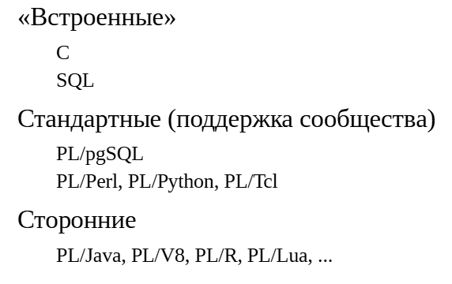
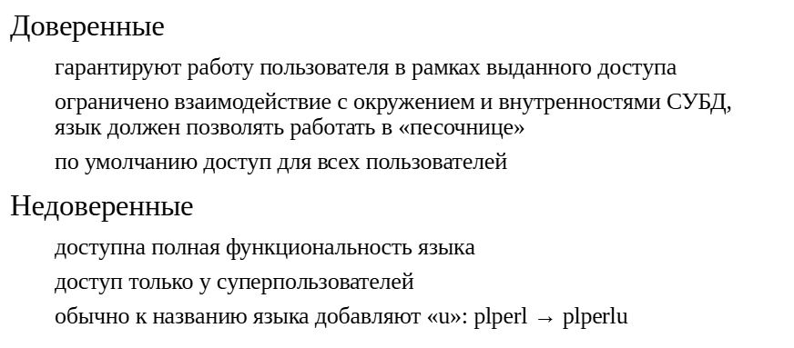
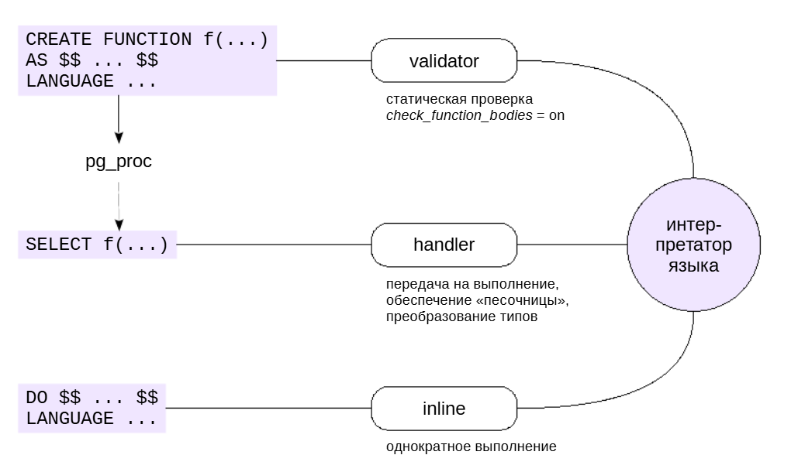
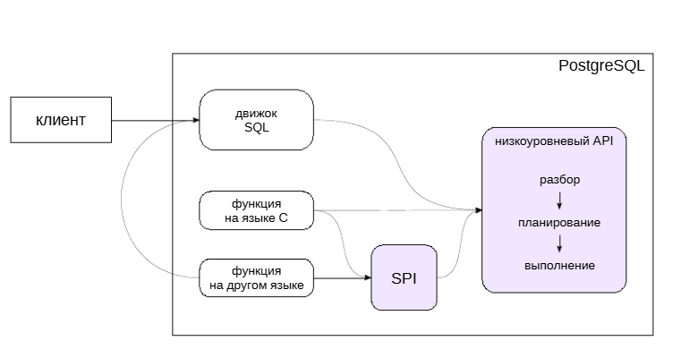
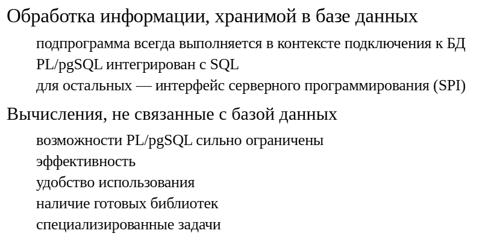
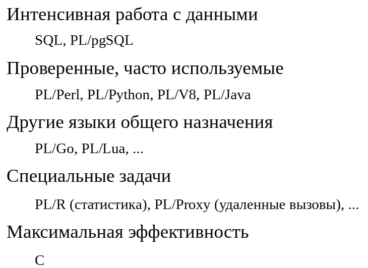

Языки программирования
######################

Языки программирования
**********************

Разумеется, к PostgreSQL можно обращаться «извне» из любых языков программирования (ЯП), для которых реализована поддержка клиент-серверного протокола. 
Но разные ЯП можно использовать и для программирования на стороне сервера: для написания хранимых функций и процедур.

В PostgreSQL «встроены» два ЯП: C, 
на котором написана вся система, и SQL. Эти языки доступны всегда.

В систему также входят четыре ЯП, которые имеются в стандартной поставке и поддерживаются сообществом. 
С одним из них —PL/pgSQL — мы уже хорошо знакомы. Он доступен по умолчаниюи наиболее часто используется на стороне сервера. 
Другие языки — PL/Perl, PL/Python (только Python3, поддержка Python2 прекращена)и PL/Tcl — надо устанавливать как расширения. 
Такой (несколько странный) выбор языков обусловлен историческими причинами.В документации языки, отличные от C и SQL, называются процедурными, 
отсюда и приставка «PL» в названиях. Название несколько неудачное: никто не мешает подключить к PostgreSQL функциональный или еще какой-нибудь язык. 
Поэтому лучше понимать PL как programming language, а не как procedural language.

https://postgrespro.ru/docs/postgresql/16/xplang

PostgreSQL — расширяемая система, поэтому имеется возможность добавления и других ЯП.

Доверенные языки
****************

ЯП разделяются на доверенные (**trusted**) и недоверенные (**untrusted**).

**Доверенные** языки должны соблюдать ограничения доступа, установленные в системе. Если пользователь не имеет доступа к данным, подпрограмма на доверенном языке 
не должна предоставить ему такой доступ.

По сути это означает, что язык должен ограничивать взаимодействие пользователя с окружением (например, с операционной системой) и с внутренностями СУБД 
(чтобы нельзя было обойти обычные проверки доступа). Не все реализации языков умеют работать в таком режиме «песочницы». 
Использование доверенного языка является безопасным, поэтому доступ к нему получают все пользователи (для роли *public* выдается привилегия *usage* на язык).

**Недоверенные** языки не имеют никаких ограничений. В частности, функция на таком языке может выполнять любые операции в ОС с правами пользователя, запустившего сервер базы данных. 
Это может быть небезопасным, поэтому доступ к такому языку имеют только суперпользователи PostgreSQL.

Напомним, что, если необходимо, суперпользователь может создать функцию на недоверенном языке, в том числе с указанием **SECURITY DEFINER**, 
и выдать право на ее исполнение обычным пользователям.

ПРАКТИКА
========

**Языки программирования**

::

	CREATE DATABASE ext_languages;

	CREATE DATABASE

::
	\c ext_languages

	You are now connected to database "ext_languages" as user "student".

Проверим список установленных языков:

::

	\dL

						  List of languages
	  Name   |  Owner   | Trusted |         Description          
	---------+----------+---------+------------------------------
	 plpgsql | postgres | t       | PL/pgSQL procedural language
	(1 row)

По умолчанию установлен только PL/pgSQL (C и SQL не в счет).

Новые языки принято оформлять как расширения. Вот какие доступны для установки:

::

	SELECT name, comment, installed_version
	FROM pg_available_extensions
	WHERE name LIKE 'pl%'
	ORDER BY name;

		name    |                  comment                  | installed_version 
	------------+-------------------------------------------+-------------------
	 plperl     | PL/Perl procedural language               | 
	 plperlu    | PL/PerlU untrusted procedural language    | 
	 plpgsql    | PL/pgSQL procedural language              | 1.0
	 plpython3u | PL/Python3U untrusted procedural language | 
	 plsh       | PL/sh procedural language                 | 
	 plxslt     | PL/XSLT procedural language               | 
	(6 rows)

Первые четыре — из числа стандартных, а с двумя последними мы познакомимся позже.

Установим в текущую базу данных два варианта языка PL/Perl: plperl (доверенный) и plperlu (недоверенный):

::

	CREATE EXTENSION plperl;
	CREATE EXTENSION
	CREATE EXTENSION plperlu;
	CREATE EXTENSION

::

	\dL

							   List of languages
	  Name   |  Owner   | Trusted |              Description               
	---------+----------+---------+----------------------------------------
	 plperl  | student  | t       | PL/Perl procedural language
	 plperlu | student  | f       | PL/PerlU untrusted procedural language
	 plpgsql | postgres | t       | PL/pgSQL procedural language
	(3 rows)

Чтобы языки автоматически появлялись во всех новых базах данных, расширения нужно установить в БД template1.

Недоверенный язык не имеет ограничений. Например, можно создать функцию, читающую любой файл (аналогично штатной функции pg_read_file):

::

	CREATE FUNCTION read_file_untrusted(fname text) RETURNS SETOF text
	AS $perl$
		my ($fname) = @_;
		open FILE, $fname or die "Cannot open file";
		chomp(my @f = <FILE>);
		close FILE;
		return \@f;
	$perl$ LANGUAGE plperlu VOLATILE;

	CREATE FUNCTION

::

	SELECT * FROM read_file_untrusted('/etc/passwd') LIMIT 3;

				   read_file_untrusted               
	-------------------------------------------------
	 root:x:0:0:root:/root:/bin/bash
	 daemon:x:1:1:daemon:/usr/sbin:/usr/sbin/nologin
	 bin:x:2:2:bin:/bin:/usr/sbin/nologin
	(3 rows)

Что будет, если попробовать сделать то же самое на доверенном языке?

::

	CREATE FUNCTION read_file_trusted(fname text) RETURNS SETOF text
	AS $perl$
		my ($fname) = @_;
		open FILE, $fname or die "Cannot open file";
		chomp(my @f = <FILE>);
		close FILE;
		return \@f;
	$perl$ LANGUAGE plperl VOLATILE;

	ERROR:  'open' trapped by operation mask at line 3.
	CONTEXT:  compilation of PL/Perl function "read_file_trusted"

Вызов open (в числе прочего) запрещен в доверенном языке.

Подключение нового языка
************************

Интерфейс подключения нового ЯП для использования на стороне сервера включает всего три функции.

При создании хранимой подпрограммы, ее код проверяется на наличие ошибок (*validator*). Если проверка проходит успешно, подпрограмма сохраняется в системном каталоге. 
При этом если подпрограмма оформлена *в стиле стандарта SQL*, то ее *тело хранится в виде дерева разбора* и будет обрабатываться обычным образом. 
В остальных случаях сохраняется только исходный код в виде текстовой строки. Компиляция поддерживается только для подпрограмм на языке C.

Проверку можно отключить параметром **check_function_bodies**; утилита **pg_dump** пользуется этим, чтобы снять зависимость от порядка создания объектов.

При вызове подпрограммы ее текст передается на выполнение интерпретатору языка, а полученный ответ возвращается в систему (*handler*). 
Если язык объявлен доверенным, интерпретатор должен запускаться в «песочнице». Здесь также решается важная задача преобразования типов. 
Не все типы SQL могут иметь аналоги в ЯП. Обычный подход в этом случае — передача текстового представления типа, но реализация может также учитывать определенные 
пользователем трансформации типов.

https://postgrespro.ru/docs/postgresql/16/sql-createtransform

При выполнении SQL-команды DO интерпретатору передается код для однократного выполнения (*inline*).

Из этих трех функций обязательна только функция - **handler**.

ПРАКТИКА
========

**Подключение нового языка**

Если заглянуть, что выполняет команда CREATE EXTENSION, то для недоверенного языка в скрипте мы увидим примерно следующее:

::

	CREATE LANGUAGE plperlu
	  HANDLER plperlu_call_handler
	  INLINE plperlu_inline_handler
	  VALIDATOR plperlu_validator;

А для доверенного (обратите внимание на слово TRUSTED):

::

	CREATE TRUSTED LANGUAGE plperl
	  HANDLER plperl_call_handler
	  INLINE plperl_inline_handler
	  VALIDATOR plperl_validator;

В этой команде указываются имена функций, реализующих точки входа основного обработчика, обработчика для DO и проверки.

Установим еще один язык — PL/Python. Он доступен только как недоверенный:

::

	CREATE EXTENSION plpython3u;

	CREATE EXTENSION

На его примере посмотрим, как происходит преобразование между системой типов SQL и системой типов языка. Для многих типов предусмотрены преобразования:

::

	CREATE FUNCTION test_py_types(n numeric, b boolean, s text, a int[])
	RETURNS void AS $python$
		plpy.info(n, type(n))
		plpy.info(b, type(b))
		plpy.info(s, type(s))
		plpy.info(a, type(a))
	$python$ LANGUAGE plpython3u IMMUTABLE;

	CREATE FUNCTION

::

	SELECT test_py_types(42,true,'foo',ARRAY[1,2,3]);
	
	INFO:  (Decimal('42'), <class 'decimal.Decimal'>)
	INFO:  (True, <class 'bool'>)
	INFO:  ('foo', <class 'str'>)
	INFO:  ([1, 2, 3], <class 'list'>)

	 test_py_types 
	---------------
	 
	(1 row)

А что мы увидим в таком случае?

::

	CREATE FUNCTION test_py_jsonb(j jsonb)
	RETURNS jsonb AS $python$
		plpy.info(j, type(j))
		return j
	$python$ LANGUAGE plpython3u IMMUTABLE;

	CREATE FUNCTION

::

	SELECT test_py_jsonb('{ "foo": "bar" }'::jsonb);
	
	INFO:  ('{"foo": "bar"}', <class 'str'>)

	 test_py_jsonb  
	----------------
	 {"foo": "bar"}
	(1 row)

Здесь SQL-тип json был передан в функцию как строка, а возвращаемое значение было вновь преобразовано в jsonb из текстового представления.

Трансформации типов

Чтобы помочь обработчику языка, можно создать дополнительные трансформации типов. Для нашего случая есть подходящее расширение:

::

	CREATE EXTENSION jsonb_plpython3u;

	CREATE EXTENSION

Фактически оно создает трансформацию таким образом (что позволяет передавать тип jsonb и в Python, и обратно в SQL):

::

	CREATE TRANSFORM FOR jsonb LANGUAGE plpython3u (
		FROM SQL WITH FUNCTION jsonb_to_plpython3(internal),
		TO SQL WITH FUNCTION plpython3_to_jsonb(internal)
	);

Трансформацию необходимо явно указать в определении функции:

::

	CREATE OR REPLACE FUNCTION test_py_jsonb(j jsonb)
	RETURNS jsonb
	TRANSFORM FOR TYPE jsonb -- использовать трансформацию
	AS $python$
		plpy.info(j, type(j))
		return j
	$python$ LANGUAGE plpython3u IMMUTABLE;

	CREATE FUNCTION

::

	SELECT test_py_jsonb('{ "foo": "bar" }'::jsonb);

	INFO:  ({'foo': 'bar'}, <class 'dict'>)

	 test_py_jsonb  
	----------------
	 {"foo": "bar"}
	(1 row)

Теперь SQL-тип jsonb передается в Python как тип dict — словарь (ассоциативный массив).

Интерфейс SPI
*************

PostgreSQL располагает внутренним низкоуровневым API для работыс базой данных. Сюда входят функции для разбора и переписывания запроса, построения плана, выполнения запроса 
(включая обращенияк таблицам, индексам и т. п.). Это самый эффективный способ работы с данными, но он требует внимания ко многим деталям, таким, как управление памятью, 
установка блокировок и т. д.

Движок SQL, являющийся частью каждого обслуживающего процесса, пользуется именно этим, низкоуровневым, API.

Для удобства имеется более высокоуровневый (но в ряде случаев менее эффективный) интерфейс: **SPI**, *Server Programming Interface*.

https://postgrespro.ru/docs/postgresql/16/spi

Интерфейс SPI рассчитан на язык C: подпрограмма на C может пользоваться как этим интерфейсом, так и — при необходимости — низкоуровневым.

Но, как правило, авторы языков программирования предоставляют обертки, позволяющие подпрограммам на этих языках тоже пользоваться SPI. 
Это значительно выгоднее, чем инициировать из подпрограммы новое соединение и использовать для работы с базой  клиент-серверный протокол.

ПРАКТИКА
========

**Интерфейс SPI**

Для доступа к возможностям SPI подпрограммы на языке Python автоматически импортируют модуль **plpy** (мы уже использовали функцию **info** из этого модуля — 
аналог команды **RAISE INFO** языка **PL/pgSQL**).

::

	CREATE TABLE test(
		n integer PRIMARY KEY,
		descr text
	);

	CREATE TABLE

::

	INSERT INTO test VALUES (1,'foo'), (2,'bar'), (3,'baz');

	INSERT 0 3

Напишем для примера функцию, возвращающую текстовое описание по ключу. Отсутствие ключа должно приводить к ошибке.

Какие конструкции здесь соответствуют обращению к SPI?

::

	CREATE FUNCTION get_descr_py(n integer) RETURNS text
	AS $python$
		if "plan_get_descr_py" in SD:
			plan = SD["plan_get_descr_py"]
		else:
			plan = plpy.prepare(
				"SELECT descr FROM test WHERE n = $1", ["integer"]
			)
			SD["plan_get_descr_py"] = plan
		rows = plan.execute([n])
		if rows.nrows() == 0:
			raise plpy.spiexceptions.NoDataFound()
		else:
			return rows[0]["descr"]
	$python$ LANGUAGE plpython3u STABLE;

	CREATE FUNCTION

Вызов **plpy.prepare** соответствует функции **SPI_prepare** (и **SPI_keepplan**), а **plpy.execute** — функции **SPI_execute_plan**. 
Также неявно вызывается **SPI_connect** и **SPI_finish**. То есть обертка языка может дополнительно упрощать интерфейс.

Обратите внимание:

Чтобы сохранить план подготовленного запроса, приходится использовать словарь **SD**, сохраняемый между вызовами функции;
Требуется явная проверка того, что строка была найдена.

::

	SELECT get_descr_py(1);

	 get_descr_py 
	--------------
	 foo
	(1 row)

::

	SELECT get_descr_py(42);

	ERROR:  spiexceptions.NoDataFound: 

	CONTEXT:  Traceback (most recent call last):
	  PL/Python function "get_descr_py", line 11, in <module>
		raise plpy.spiexceptions.NoDataFound()
	PL/Python function "get_descr_py"

Показательно сравнить с аналогичной функцией на языке PL/pgSQL:

::

	CREATE FUNCTION get_descr(n integer) RETURNS text
	AS $$
	DECLARE
		descr text;
	BEGIN
		SELECT t.descr INTO STRICT descr
		FROM test t WHERE t.n = get_descr.n;
		RETURN descr;
	END;
	$$ LANGUAGE plpgsql STABLE;

	CREATE FUNCTION

План подготавливается и переиспользуется автоматически;

Проверка существования строки указывается словом STRICT.

::

	SELECT get_descr(1);

	 get_descr 
	-----------
	 foo
	(1 row)

::

	SELECT get_descr(42);

	ERROR:  query returned no rows
	CONTEXT:  PL/pgSQL function get_descr(integer) line 5 at SQL statement

Другие языки могут предоставлять другой способ доступа к функциям SPI, а могут и не предоставлять.

Задачи
======

Задачи, для решения которых используются хранимые подпрограммы, можно условно поделить на две группы.

В первую входит работа с информацией, которая содержится внутри базы данных. Здесь любые хранимые подпрограммы выигрываюту внешних (клиентских) программ, поскольку они находятся ближек данным: 
во-первых, не требуется установка соединения с сервером, и во-вторых, не требуется пересылка лишнего по сети. PL/pgSQL очень удобен для таких задач, поскольку тесно интегрирован с SQL. 

Ко второй группе можно отнести обработку, не связанную с обращением к базе данных. Здесь возможности PL/pgSQL сильно ограничены. 
Начать с того, что он вычислительно не эффективен: любое выражение вычисляется с помощью запроса (для которого в ряде простых случаев исключен этап планирования).

Если бы были важны только эффективность и универсальность, можно было бы использовать язык C. 
Но писать на нем прикладной код крайне дорого и долго.

Кроме того, язык PL/pgSQL достаточно старомоден и не располагает возможностями и библиотеками, которые есть в современных ЯП, 
и он в принципе не пригоден для решения целого ряда задач.

Поэтому использование других языков (отличных от SQL, PL/pgSQL и C) для серверного программирования во многих случаях вполне оправдано.

Выбор
*****

Если подпрограммы используются **для интенсивной работы с данными**, лучшим выбором вероятно будут обычные **SQL** и **PL/pgSQL**.

Для других задач из штатных языков часто используют **PL/Perl** и **PL/Python**, а из сторонних — **PL/V8** и **PL/Java**. 
(С PL/V8 могут быть сложности из-за того, что Debian и Red Hat перестали поставлять это расширение в виде пакета из-за сложностей со сборкой.)

Можно попробовать и другие языки, например, **PL/Go** или **PL/Lua**, если в этом есть смысл. Обязательно обращайте внимание на состояние проекта, активность сообщества, 
возможность получить поддержку.

Есть ряд специализированных языков. Например, для статистической обработки данных пригодится **PL/R**, для удаленного вызова процедури шардинга можно использовать **PL/Proxy**.

В документации упомянуто некоторое количество языков:

https://postgrespro.ru/docs/postgresql/16/external-pl

Больше информации о доступных языках есть на вики:

https://wiki.postgresql.org/wiki/PL_Matrix

Но и это не полный список. Есть множество других проектов, хотя многие из них не продвигаются дальше первой версии. Не следует сбрасывать со счетов и язык C, если нужна максимальная эффективность. 
Это сложнее, но в документации и в исходном коде PostgreSQL есть множество соответствующих примеров.

ПРАКТИКА
========

**Пример специализированного языка: XSLT**

В качестве иллюстрации очень специализированного языка (который никак нельзя назвать процедурным!) посмотрим на PL/XSLT. Допустим, мы получаем данные для отчета с помощью запроса, и представляем их в формате XML:

::

	SELECT *
	FROM query_to_xml('SELECT n, descr FROM test',true,false,'');

							 query_to_xml                          
	---------------------------------------------------------------
	 <table xmlns:xsi="http://www.w3.org/2001/XMLSchema-instance">+
																  +
	 <row>                                                        +
	   <n>1</n>                                                   +
	   <descr>foo</descr>                                         +
	 </row>                                                       +
																  +
	 <row>                                                        +
	   <n>2</n>                                                   +
	   <descr>bar</descr>                                         +
	 </row>                                                       +
																  +
	 <row>                                                        +
	   <n>3</n>                                                   +
	   <descr>baz</descr>                                         +
	 </row>                                                       +
																  +
	 </table>                                                     +
	 
	(1 row)

Чтобы вывести отчет пользователю, его можно преобразовать в формат HTML с помощью XSLT-преобразования. Подключим язык PL/XSLT:

::

	CREATE EXTENSION plxslt;

	CREATE EXTENSION

Вот так может выглядеть простое преобразование:

::

	CREATE FUNCTION html_report(xml) RETURNS xml
	AS $xml$
	<?xml version="1.0"?>
	<xsl:stylesheet version="1.0" xmlns:xsl="http://www.w3.org/1999/XSL/Transform">
	<xsl:template match="/">
	<html><body><table>
		<xsl:for-each select="table/row">
			<tr>
			  <td><xsl:value-of select="n"/></td>
			  <td><xsl:value-of select="descr"/></td>
			</tr>
		</xsl:for-each>
	</table></body></html>
	</xsl:template>
	</xsl:stylesheet>
	$xml$ LANGUAGE xslt IMMUTABLE;
	CREATE FUNCTION
	И вот результат:

	SELECT * FROM html_report(
		query_to_xml('SELECT * FROM test',true,false,'')
	);

		  html_report       
	------------------------
	 <html><body><table>   +
	 <tr>                  +
	 <td>1</td>            +
	 <td>foo</td>          +
	 </tr>                 +
	 <tr>                  +
	 <td>2</td>            +
	 <td>bar</td>          +
	 </tr>                 +
	 <tr>                  +
	 <td>3</td>            +
	 <td>baz</td>          +
	 </tr>                 +
	 </table></body></html>+
	 
	(1 row)

Таким образом можно разделить логику отчета (обычный SQL-запрос) и его представление.

Самостоятельно
**************

1. Отправляйте пользователю, совершившему покупкув магазине, письмо-подтверждение с указанием суммы.

В виртуальной машине настроен локальный почтовый сервер, пересылающий любую исходящую почтув локальный ящик пользователя student. 
В PostgreSQL нет встроенной функции для отправки писем, но ее можно реализовать на каком-либо недоверенном языке.

Убедитесь, что письмо не может быть отправлено до того, как транзакция покупки будет завершена.

**Пояснение:**

1. Для отправки пользуйтесь уже готовой функцией **public.sendmail** (посмотрите ее определение) или напишите свою.

Посылать письмо внутри транзакции покупки неправильно: транзакция может быть оборвана по какой-либо причине, а письмо уже уйдет. 
Воспользуйтесь механизмом фоновых заданий: в транзакции добавляйте задание на отправку письма. 
В таком случае оно будет отправлено, только если транзакция завершится успешно.

