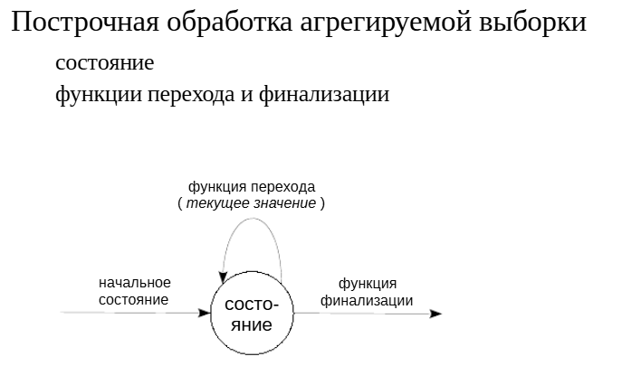
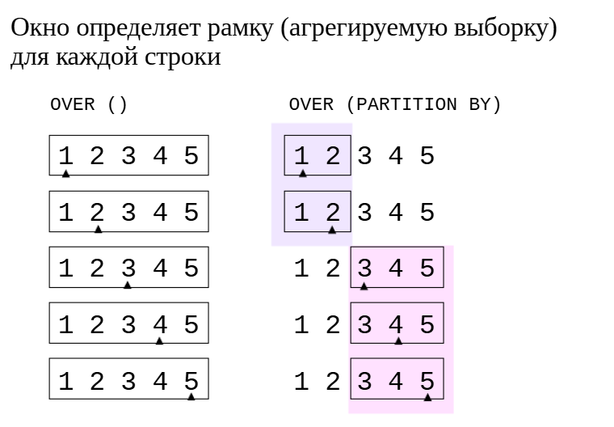
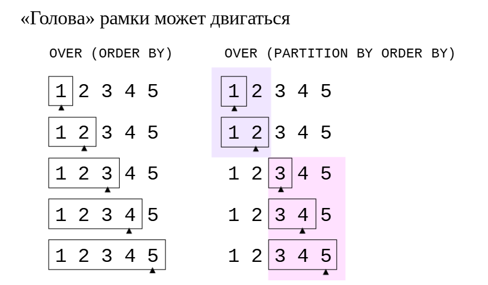
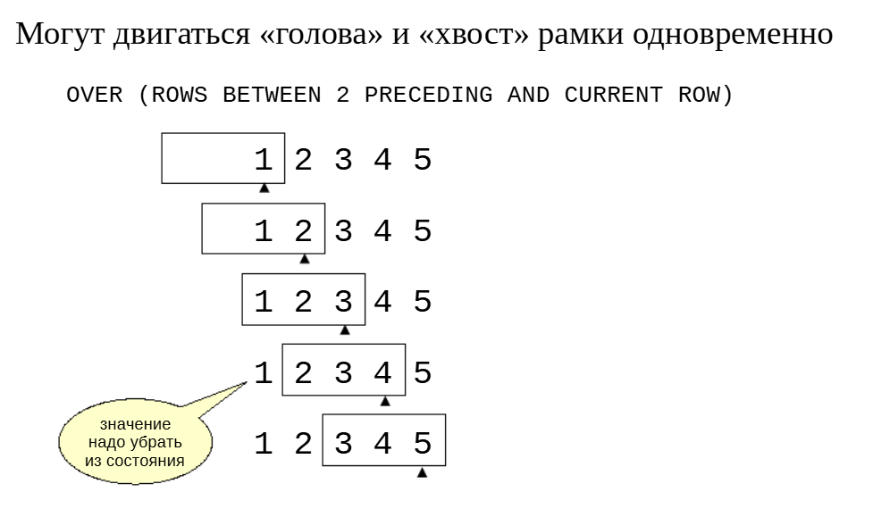
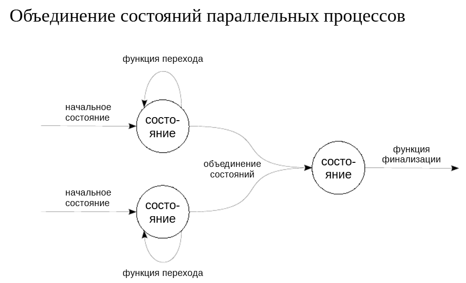

Агрегатные и оконные функции
############################

Агрегатные функции
******************

В PostgreSQL имеется достаточно много встроенных агрегатных функций. Часть из них определена стандартом (такие, как min, max, sum, count и т. п.), часть является расширением стандарта.

https://postgrespro.ru/docs/postgresql/16/functions-aggregate

Но иногда может оказаться полезным создать собственную агрегатную функцию. Такая функция работает очень просто.

Имеется некоторое *состояние*, представленное значением какого-либо типа данных, которое *инициализируется* определенным значением (например, тип *numeric* и начальное значение 0).

Для каждой строки агрегируемой выборки вызывается *функция перехода*, которая получает значение из текущей строки и должна *обновить состояние* (например, прибавляет текущее значениек состоянию).

В конце вызывается *функция финализации*, которая преобразует полученное в результате работы состояние в результат агрегатной функции 
(в нашем примере достаточно просто вернуть число — в итоге получается аналог функции *sum*).

https://postgrespro.ru/docs/postgresql/16/xaggr

ПРАКТИКА
========

**Агрегатные функции**

::

	CREATE DATABASE ext_aggregates;
	
	CREATE DATABASE

::

	\c ext_aggregates
	You are now connected to database "ext_aggregates" as user "student".

Мы будем писать функцию для получения среднего, аналог встроенной функции avg.

Начнем с того, что создадим таблицу:

::

	CREATE TABLE test (
		n float,
		grp text
	);

	CREATE TABLE

::

	INSERT INTO test(n,grp)
	VALUES (1,'A'), (2,'A'), (3,'B'), (4,'B'), (5,'B');

	INSERT 0 5

Состояние должно включать сумму значений и их количество. Для его хранения создадим составной тип:

::

	CREATE TYPE average_state AS (
		accum float,
		qty float
	);
	
	CREATE TYPE

Теперь определим функцию перехода. Она возвращает новое состояние на основе текущего, прибавляя текущее значение к сумме и единицу к количеству.

Мы также включим в функцию отладочный вывод, чтобы иметь возможность наблюдать за ее вызовом.

::

	CREATE FUNCTION average_transition(
		state average_state,
		val float
	)
	RETURNS average_state AS $$
	BEGIN
		RAISE NOTICE '%(%) + %', state.accum, state.qty, val;
		RETURN ROW(state.accum+val, state.qty+1)::average_state;
	END;
	$$ LANGUAGE plpgsql IMMUTABLE;

	CREATE FUNCTION

Функция финализации делит полученную сумму на количество, чтобы получить среднее:

::

	CREATE FUNCTION average_final(
		state average_state
	)
	RETURNS float AS $$
	BEGIN
		RAISE NOTICE '= %(%)', state.accum, state.qty;
		RETURN CASE
			WHEN state.qty > 0 THEN state.accum/state.qty
		END;
	END;
	$$ LANGUAGE plpgsql IMMUTABLE;

	CREATE FUNCTION

И наконец нужно создать агрегат, указав тип состояния и его начальное значение, а также функции перехода и финализации:

::

	CREATE AGGREGATE average(float) (
		stype     = average_state,
		initcond  = '(0,0)',
		sfunc     = average_transition,
		finalfunc = average_final
	);

	CREATE AGGREGATE

Можно пробовать нашу агрегатную функцию в работе:

::

	SELECT average(n) FROM test;

	NOTICE:  0(0) + 1
	NOTICE:  1(1) + 2
	NOTICE:  3(2) + 3
	NOTICE:  6(3) + 4
	NOTICE:  10(4) + 5
	NOTICE:  = 15(5)

	 average 
	---------
		   3
	(1 row)

Благодаря отладочному выводу хорошо видно, как изменяется начальное состояние (0,0).

Функция работает и при указании группировки **GROUP BY**:

::

	SELECT grp, average(n) FROM test GROUP BY grp;

	NOTICE:  0(0) + 1
	NOTICE:  1(1) + 2
	NOTICE:  0(0) + 3
	NOTICE:  3(1) + 4
	NOTICE:  7(2) + 5
	NOTICE:  = 12(3)
	NOTICE:  = 3(2)

	 grp | average 
	-----+---------
	 B   |       4
	 A   |     1.5
	(2 rows)

Здесь видно, что используются два разных состояния — свое для каждой группы.

Оконные функции
***************

	   
Оконные функции работают подобно агрегатным, вычисляя значение на основе некоторой выборки. Эта выборка называется рамкой.

Но, в отличие от агрегатных функций, строки не сворачиваются в одну общую, а вместо этого значение вычисляется для каждой строки выборки.

Окно задается в предложении **OVER** после имени функции.

Если окно указано как **OVER()**, то оконная функция вычисляетсяна основе всех строк — одинаково для каждой строки выборки.

Если определение окна включает фразу **PARTITION BY**, то оконная функция вычисляется на основе групп строк (аналогично группировке **GROUP BY**). 
В этом случае для всех строк одной группы будет получено одинаковое значение функции.

ПРАКТИКА
========

OVER()
Созданная нами агрегатная функция работает как оконная без всяких изменений:

::

	SELECT n, average(n) OVER() FROM test;

	NOTICE:  0(0) + 1
	NOTICE:  1(1) + 2
	NOTICE:  3(2) + 3
	NOTICE:  6(3) + 4
	NOTICE:  10(4) + 5
	NOTICE:  = 15(5)

	 n | average 
	---+---------
	 1 |       3
	 2 |       3
	 3 |       3
	 4 |       3
	 5 |       3
	(5 rows)

Обратите внимание, что, поскольку рамка для всех строк одинакова, значение вычисляется только один раз, а не для для каждой строки.

И для предложения **PARTITION BY**:

::

	SELECT n, grp, average(n) OVER(PARTITION BY grp) FROM test;

	NOTICE:  0(0) + 1
	NOTICE:  1(1) + 2
	NOTICE:  = 3(2)
	NOTICE:  0(0) + 3
	NOTICE:  3(1) + 4
	NOTICE:  7(2) + 5
	NOTICE:  = 12(3)

	 n | grp | average 
	---+-----+---------
	 1 | A   |     1.5
	 2 | A   |     1.5
	 3 | B   |       4
	 4 | B   |       4
	 5 | B   |       4
	(5 rows)

Здесь все работает точно так же, как для обычной группировки GROUP BY.

Нарастающий итог
****************

Как только в определении окна мы указываем предложение **ORDER BY**, упорядочивающее строки выборки, предполагается, что рамка окна охватывает строки от самой первой до текущей. 
Это можно записатьи явным образом: **ROWS BETWEEN UNBOUNDED PRECEDING AND CURRENT ROW**.

Например, если в качестве оконной функции используется **sum**, мы получаем сумму «нарастающим итогом».

Конечно, для каждой группы строк, определяемых предложением **PARTITION BY**, рамка будет располагаться в пределах этой группы.

ПРАКТИКА
========

OVER(ORDER BY)
Если добавить к определению окна предложение ORDER BY, получим рамку, «хвост» которой стоит на месте, а голова движется вместе с текущей строкой:

::

	SELECT n, average(n) OVER(ORDER BY n) FROM test;

	NOTICE:  0(0) + 1
	NOTICE:  = 1(1)
	NOTICE:  1(1) + 2
	NOTICE:  = 3(2)
	NOTICE:  3(2) + 3
	NOTICE:  = 6(3)
	NOTICE:  6(3) + 4
	NOTICE:  = 10(4)
	NOTICE:  10(4) + 5
	NOTICE:  = 15(5)

	 n | average 
	---+---------
	 1 |       1
	 2 |     1.5
	 3 |       2
	 4 |     2.5
	 5 |       3
	(5 rows)

Снова не понадобилось никаких изменений — все работает. Здесь видно, как каждая следующая строка последовательно добавляется к состоянию и вызывается функция финализации.

Полная форма того же запроса выглядит так:

::

	SELECT n, average(n) OVER(
		ORDER BY n                       -- сортировка
		ROWS BETWEEN UNBOUNDED PRECEDING -- от самого начала
				 AND CURRENT ROW         -- до текущей строки
	)
	FROM test;

То же самое работает и в сочетании с **PARTITION BY**:

::

	SELECT n, grp, average(n) OVER(PARTITION BY grp ORDER BY n)
	FROM test;

	NOTICE:  0(0) + 1
	NOTICE:  = 1(1)
	NOTICE:  1(1) + 2
	NOTICE:  = 3(2)
	NOTICE:  0(0) + 3
	NOTICE:  = 3(1)
	NOTICE:  3(1) + 4
	NOTICE:  = 7(2)
	NOTICE:  7(2) + 5
	NOTICE:  = 12(3)

	 n | grp | average 
	---+-----+---------
	 1 | A   |       1
	 2 | A   |     1.5
	 3 | B   |       3
	 4 | B   |     3.5
	 5 | B   |       4
	(5 rows)
	

Скользящая рамка
****************

Рамку можно указать явно в предложении ROWS BETWEEN. В том числе двигаться может не только «голова» рамки, но и ее «хвост».

https://postgrespro.ru/docs/postgresql/16/sql-expressions#SYNTAX-WINDOW-FUNCTIONS

Если в предыдущих примерах рамка только расширялась (в нее добавлялись все новые значения), то теперь ранее добавленные значения значения могут «уходить» из рамки.

Чтобы пользовательская агрегатная функция работала эффективнов таком режиме, нужно реализовать функцию инверсии, которая устраняет значение из состояния.

ПРАКТИКА
========

**OVER(ROWS BETWEEN)**

С помощью фразы ROWS BETWEEN можно задать любую необходимую конфигурацию рамки, указывая (в частности):

- **UNBOUNDED PRECEDING** — с самого начала;

- **n PRECEDING** — n предыдущих;

- **CURRENT ROW** — текущая строка;

- **n FOLLOWING** — n следующих;

- **UNBOUNDED FOLLOWING** — до самого конца.

Рассмотрим вычисление «скользящего среднего» для трех значений. В отличие от предыдущих примеров из состояния должно «вычитаться» значение, уходящее из рамки, но у нас есть только функция «добавления». Единственный способ выполнить запрос — пересчитывать всю рамку заново:

::

	SELECT n, average(n) OVER(ROWS BETWEEN 2 PRECEDING AND CURRENT ROW)
	FROM test;

	NOTICE:  0(0) + 1
	NOTICE:  = 1(1)
	NOTICE:  1(1) + 2
	NOTICE:  = 3(2)
	NOTICE:  3(2) + 3
	NOTICE:  = 6(3)
	NOTICE:  0(0) + 2
	NOTICE:  2(1) + 3
	NOTICE:  5(2) + 4
	NOTICE:  = 9(3)
	NOTICE:  0(0) + 3
	NOTICE:  3(1) + 4
	NOTICE:  7(2) + 5
	NOTICE:  = 12(3)

	 n | average 
	---+---------
	 1 |       1
	 2 |     1.5
	 3 |       2
	 4 |       3
	 5 |       4
	(5 rows)

Это, конечно, неэффективно, но мы можем написать недостающую функцию «инверсии»:

::

	CREATE FUNCTION average_inverse(
		state average_state,
		val float
	) RETURNS average_state AS $$
	BEGIN
		RAISE NOTICE '%(%) - %', state.accum, state.qty, val;
		RETURN ROW(state.accum-val, state.qty-1)::average_state;
	END;
	$$ LANGUAGE plpgsql IMMUTABLE;

	CREATE FUNCTION

Нужно указать эту функцию в определении агрегата:

	DROP AGGREGATE average(float);

	DROP AGGREGATE

::

	CREATE AGGREGATE average(float) (
		-- обычный агрегат
		stype      = average_state,
		initcond   = '(0,0)',
		sfunc      = average_transition,
		finalfunc  = average_final,
		-- вариант с обратной функцией
		mstype     = average_state,
		minitcond  = '(0,0)',
		msfunc     = average_transition,
		minvfunc   = average_inverse,
		mfinalfunc = average_final
	);
	CREATE AGGREGATE

Пробуем:

::

	SELECT n, average(n) OVER(ROWS BETWEEN 2 PRECEDING AND CURRENT ROW)
	FROM test;

	NOTICE:  0(0) + 1
	NOTICE:  = 1(1)
	NOTICE:  1(1) + 2
	NOTICE:  = 3(2)
	NOTICE:  3(2) + 3
	NOTICE:  = 6(3)
	NOTICE:  6(3) - 1
	NOTICE:  5(2) + 4
	NOTICE:  = 9(3)
	NOTICE:  9(3) - 2
	NOTICE:  7(2) + 5
	NOTICE:  = 12(3)

	 n | average 
	---+---------
	 1 |       1
	 2 |     1.5
	 3 |       2
	 4 |       3
	 5 |       4
	(5 rows)

Теперь лишние операции не выполняются.

Пераллелизм
***********

Агрегатные функции могут выполняться в параллельном режиме. Основной процесс, выполняющий запрос, может создать несколько фоновых рабочих процессов, каждый из которых будет выполнять параллельную обработку части данных в узле плана. 
Затем полученные результаты передаются в основной процесс, который собирает их и формирует общий результат.

Чтобы пользовательские агрегатные функции могли работать параллельно, нужно реализовать функцию объединения двух состояний в одно общее.

ПРАКТИКА
========

**Параллелизм**

Таблица с пятью строчками, конечно, слишком мала для параллельного выполнения. Возьмем больше данных:

::

	CREATE TABLE big (
		n float
	);
	CREATE TABLE
	INSERT INTO big
		SELECT random()*10::integer FROM generate_series(1,1_000_000);
	INSERT 0 1000000
	ANALYZE big;

	ANALYZE

Встроенные агрегатные функции могут выполняться в параллельном режиме:

::

	EXPLAIN SELECT sum(n) FROM big;

										  QUERY PLAN                                      
	--------------------------------------------------------------------------------------
	 Finalize Aggregate  (cost=10633.55..10633.56 rows=1 width=8)
	   ->  Gather  (cost=10633.33..10633.54 rows=2 width=8)
			 Workers Planned: 2
			 ->  Partial Aggregate  (cost=9633.33..9633.34 rows=1 width=8)
				   ->  Parallel Seq Scan on big  (cost=0.00..8591.67 rows=416667 width=8)
	(5 rows)

А наша функция — нет:

::

	EXPLAIN SELECT average(n) FROM big;

									   QUERY PLAN                                    
	---------------------------------------------------------------------------------
	 Aggregate  (cost=264425.25..264425.26 rows=1 width=8)
	   ->  Seq Scan on big  (cost=0.00..14425.00 rows=1000000 width=8)
	 JIT:
	   Functions: 3
	   Options: Inlining false, Optimization false, Expressions true, Deforming true
	(5 rows)

Чтобы поддержать параллельное выполнение, требуется еще одна функция для объединения двух состояний:

::

	CREATE FUNCTION average_combine(
		state1 average_state,
		state2 average_state
	) RETURNS average_state AS $$
	BEGIN
		RAISE NOTICE '%(%) & %(%)',
			state1.accum, state1.qty, state2.accum, state2.qty;
		RETURN ROW(
			state1.accum+state2.accum, 
			state1.qty+state2.qty
		)::average_state;
	END;
	$$ LANGUAGE plpgsql IMMUTABLE;

	CREATE FUNCTION

Кроме того, уберем отладочный вывод из функции перехода:

::

	CREATE OR REPLACE FUNCTION average_transition(
		state average_state,
		val float
	)
	RETURNS average_state
	LANGUAGE sql IMMUTABLE
	RETURN ROW(state.accum+val, state.qty+1)::average_state;

	CREATE FUNCTION

Пересоздадим агрегат, указав новую функцию и подтвердив безопасность параллельного выполнения:

::

	DROP AGGREGATE average(float);

	DROP AGGREGATE

::

	CREATE AGGREGATE average(float) (
		-- обычный агрегат
		stype       = average_state,
		initcond    = '(0,0)',
		sfunc       = average_transition,
		finalfunc   = average_final,
		combinefunc = average_combine,
		parallel    = safe,
		-- вариант с обратной функцией
		mstype      = average_state,
		minitcond   = '(0,0)',
		msfunc      = average_transition,
		minvfunc    = average_inverse,
		mfinalfunc  = average_final
	);

	CREATE AGGREGATE

Теперь наша функция тоже работает параллельно:

::

	EXPLAIN SELECT average(n) FROM big;

										  QUERY PLAN                                      
	--------------------------------------------------------------------------------------
	 Finalize Aggregate  (cost=113759.38..113759.39 rows=1 width=8)
	   ->  Gather  (cost=113758.42..113758.63 rows=2 width=32)
			 Workers Planned: 2
			 ->  Partial Aggregate  (cost=112758.42..112758.43 rows=1 width=32)
				   ->  Parallel Seq Scan on big  (cost=0.00..8591.67 rows=416667 width=8)
	 JIT:
	   Functions: 5
	   Options: Inlining false, Optimization false, Expressions true, Deforming true
	(8 rows)

::

	SELECT average(n) FROM big;

	NOTICE:  0(0) & 1676121.3839021407(335334)
	NOTICE:  1676121.3839021407(335334) & 1671223.890580739(334480)
	NOTICE:  3347345.27448288(669814) & 1649039.0739701388(330186)
	NOTICE:  = 4996384.348453019(1000000)
		  average      
	-------------------
	 4.996384348453018
	(1 row)

Здесь видно, что три процесса поделили работу примерно поровну, и затем три состояния были попарно объединены.

В оконном режиме параллельное выполнение не поддерживается, в том числе и для встроенных функций.