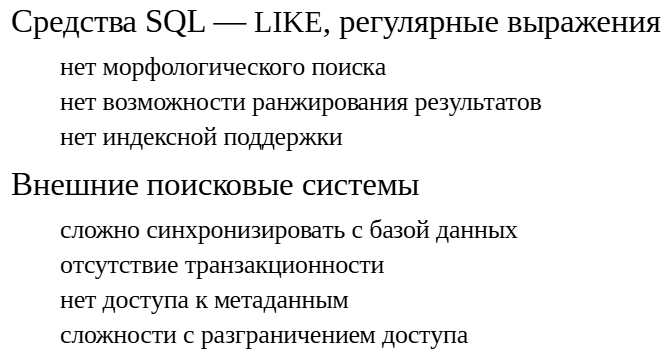
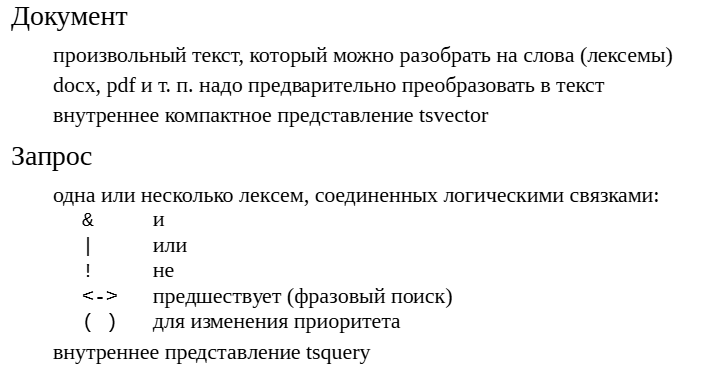
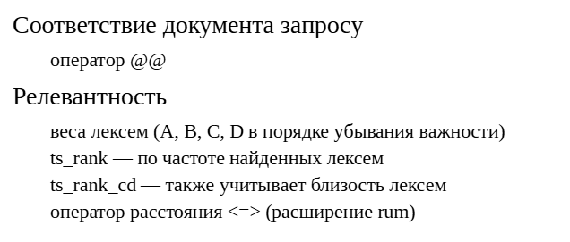
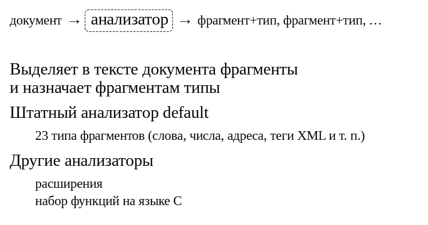
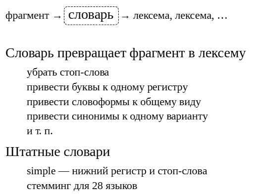
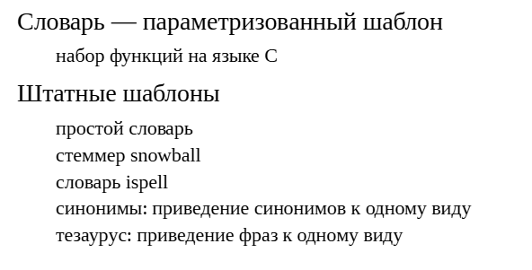
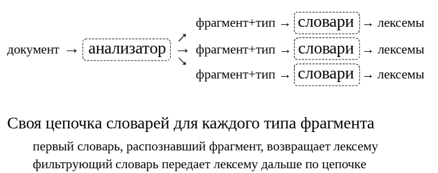
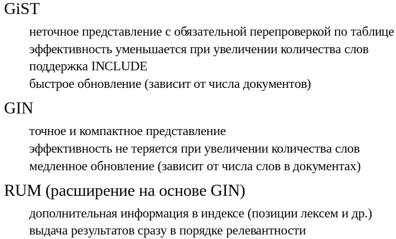

Полнотекстовый поиск
####################

Необходимость полнотекстового поиска
************************************

В инструментарии SQL уже есть средства поиска по тексту. Это и совсем простые команды **LIKE** и **ILIKE**, и упрощенные регулярные выражения **SIMILAR TO**, и полноценные регулярные выражения (оператор ~). 
Зачем нужен отдельный механизм?

Имеющиеся средства не позволяют искать с учетом разных словоформ, не позволяют отранжировать результаты по релевантности, имеют ограниченную индексную поддержку 
(для простого случая префиксного поиска, либо с помощью триграмм, как было показано в практике темы «Классы операторов»).Для поиска можно использовать внешние поисковые системы.

Но и они имеют ряд ограничений, которые невозможно преодолетьиз-за того, что такие системы оторваны от базы данных. Их сложно синхронизировать с актуальным содержимым БД; они не транзакционны; они видят только те документы, 
которые им показывают, и не видят остальной информации в базе; сложно реализовать разграничение прав доступа к информации.Полнотекстовый поиск позволяет преодолеть ограничения обычных средств SQL и сохранить все их преимущества.

https://postgrespro.ru/docs/postgresql/16/textsearch

Документы и запросы
*******************

Документ, по которому нужен поиск, должен быть предварительно переведен в специальное представление — тип данных **tsvector**.

Исходный документ может быть произвольным текстом, который можно разобрать на отдельные слова (точнее, лексемы — разницу подробнее рассмотрим дальше). 
По двоичным документам тоже можно искать, если предварительно перевести их в текстовый вид (с помощью сторонних библиотек).

Поисковый запрос также должен быть представлен значением специального типа — **tsquery**. Запрос может состоять либо из одной лексемы, либо из нескольких лексем, связанных логическими операторами «и», «или», «не». 
Также поддерживается оператор предшествования, который обеспечивает фразовый поиск: можно найти документ, содержащий заданные слова не в любом месте, 
а стоящие рядом (или на определенном расстоянии друг от друга).

https://postgrespro.ru/docs/postgresql/16/datatype-textsearch

Соответствие
************

Чтобы проверить, соответствует ли документ (точнее, его представление в виде *tsvector*) запросу (точнее, его представлению *tsquery*), надо использовать оператор **@@**.

Результаты запроса можно ранжировать по «релевантности», чтобы понять, какие из найденных документов больше соответствуют запросу, а какие — меньше.

Релевантность учитывает вес лексем, который может быть задан буквенной меткой от **A** до **D**. По умолчанию (если метки нету) лексеме присваивается наименьшая важность (**D**). 
Выделение весами позволяет считать более важными, например, слова из заголовка или краткой аннотации по сравнению со словами в основном тексте документа.

В PostgreSQL есть две встроенные функции: **ts_rank** (учитывает, насколько часто лексемы из запроса встречаются в документе)и **ts_rank_cd** (дополнительно учитывает близость найденных лексем). 
Обе функции позволяют отмасштабировать свой результат с учетом размера документа.

https://postgrespro.ru/docs/postgresql/16/functions-textsearch

Расширение rum (https://github.com/postgrespro/rum) вводит еще одну возможность: оператор расстояния **<=>**, представляющий собой комбинацию функций **ts_rank** и **ts_rank_cd**.

Заметим, что в PostgreSQL не реализована возможность поиска документов, «похожих» на другой документ (основанная, например,на методе *TF-IDF*).

ПРАКТИКА
========

**Язык запросов**

Будем знакомиться с полнотекстовым поиском на примере базы сообщений из рассылки **pgsql-hackers** за 1997-2017 года.

.. note:: **pgsql-hackers** — основной список рассылки для разработки PostgreSQL, включая обсуждение новых функций и подачу патчей. 

Эта база уже загружена из резервной копии командой

::

	student$ zcat ~/mail_messages.sql.gz | psql -d ext_fts_overview

::

	\c ext_fts_overview

	You are now connected to database "ext_fts_overview" as user "student".

База представлена одной таблицей:

::

	SELECT id, parent_id, sent, subject, author, left(body_plain,400) body
	FROM mail_messages LIMIT 1 \gx

	-[ RECORD 1 ]-------------------------------------------------------------------------
	id        | 1842152
	parent_id | 1842072
	sent      | 2014-04-05 07:39:03
	subject   | Re: [PATCH] Negative Transition Aggregate Functions (WIP)
	author    | Dean Rasheed <dean.a.rasheed@gmail.com>
	body      | On 4 April 2014 11:56, Florian Pflug <fgp@phlo.org> wrote:                +
			  | >                                                                         +
			  | >> On 04.04.2014, at 09:40, Dean Rasheed <dean.a.rasheed@gmail.com> wrote:+
			  | >>                                                                        +
			  | >> I'm not sure how much additional work is required to sort this out,    +
			  | >> but to me it looks more realistic to target 9.5 than 9.4, so at this   +
			  | >> point I tend to think that the patch ought to be marked as returned    +
			  | >> with feedback.                                                         +
			  | >                                                                         +
			  |                                                                           +
			  | Just doing the first optim

Мы преимущественно будем смотреть на темы писем, потому что они достаточно короткие.

Общее количество записей:

::

	SELECT count(*) FROM mail_messages;

	 count  
	--------
	 356125
	(1 row)

Чтобы воспользоваться полнотекстовым поиском, документ надо привести к типу tsvector, а запрос — к типу tsquery. Простой пример, в котором поисковый запрос состоит из одного слова:

::

	SELECT id, subject FROM mail_messages 
	WHERE to_tsvector(subject) @@ to_tsquery('magical') 
	ORDER BY id LIMIT 5;

	   id    |                                    subject                                    
	---------+-------------------------------------------------------------------------------
	 1589495 | Pid file magically disappears
	 1609344 | about the magic(?) of palloc() and variable-length user-defined data type
	 1609348 | Re: about the magic(?) of palloc() and variable-length user-defined data type
	 1609350 | Re: about the magic(?) of palloc() and variable-length user-defined data type
	 1678485 | Re: [PATCHES] Magic block for modules
	(5 rows)

Стоит обратить внимание, что найдены документы, содержащие разные формы слова magical, независимо от регистра букв. Позже мы узнаем, как это происходит.

Язык запросов позволяет использовать логические связки. Документы, содержащие magic и value:

::

	SELECT id, subject FROM mail_messages 
	WHERE to_tsvector(subject) @@ to_tsquery('magic & value') 
	ORDER BY id LIMIT 5;

	   id    |             subject              
	---------+----------------------------------
	 1778396 | Macros for time magic values
	 1778397 | Re: Macros for time magic values
	 1778398 | Re: Macros for time magic values
	 1778400 | Re: Macros for time magic values
	 1778439 | Re: Macros for time magic values
	(5 rows)

Документы, содержащие magic и value, но не time:

::

	SELECT id, subject FROM mail_messages 
	WHERE to_tsvector(subject) @@ to_tsquery('magic & value & !time') 
	ORDER BY id LIMIT 5;

	   id    |                            subject                             
	---------+----------------------------------------------------------------
	 1868223 | patch: change magic constants to DEFINE value for readability.
	(1 row)

Документы, содержащие magic и либо value, либо constant:

::

	SELECT id, subject FROM mail_messages 
	WHERE to_tsvector(subject) @@ to_tsquery('magic & (value | constant)') 
	ORDER BY id LIMIT 5;

	   id    |             subject              
	---------+----------------------------------
	 1743238 | magic constant -1
	 1743241 | Re: magic constant -1
	 1743248 | Re: magic constant -1
	 1778396 | Macros for time magic values
	 1778397 | Re: Macros for time magic values
	(5 rows)

Также доступен фразовый поиск, учитывающий порядок и близость позиций лексем. Например, для фразы «time value»:

::

	SELECT id, subject FROM mail_messages 
	WHERE to_tsvector(subject) @@ to_tsquery('time <-> value') 
	ORDER BY id LIMIT 5;
	   id    |                         subject                          
	---------+----------------------------------------------------------
	 1847875 | proposal: rounding up time value less than its unit.
	 1847989 | Re: proposal: rounding up time value less than its unit.
	 1847996 | Re: proposal: rounding up time value less than its unit.
	 1849919 | Re: proposal: rounding up time value less than its unit.
	 1849928 | Re: proposal: rounding up time value less than its unit.
	(5 rows)

Или та же фраза «time value», но между словами должно быть еще одно любое слово:

::

	SELECT id, subject FROM mail_messages 
	WHERE to_tsvector(subject) @@ to_tsquery('time <2> value') 
	ORDER BY id LIMIT 5;

	   id    |             subject              
	---------+----------------------------------
	 1778396 | Macros for time magic values
	 1778397 | Re: Macros for time magic values
	 1778398 | Re: Macros for time magic values
	 1778400 | Re: Macros for time magic values
	 1778439 | Re: Macros for time magic values
	(5 rows)

Имеется также функция, позволяющая получить поисковый запрос, не указывая логические связки, примерно как в веб-поиске. Например, такой запрос:

::

	to_tsquery('(time <-> value) & !magic')

эквивалентен следующему:

::

	SELECT id, subject FROM mail_messages 
	WHERE to_tsvector(subject) @@ websearch_to_tsquery('"time value" -magic') 
	ORDER BY id LIMIT 5;

	   id    |                         subject                          
	---------+----------------------------------------------------------
	 1847875 | proposal: rounding up time value less than its unit.
	 1847989 | Re: proposal: rounding up time value less than its unit.
	 1847996 | Re: proposal: rounding up time value less than its unit.
	 1849919 | Re: proposal: rounding up time value less than its unit.
	 1849928 | Re: proposal: rounding up time value less than its unit.
	(5 rows)

Как вывести результат, если поиск идет по большому документу? Запрос выдаст нам весь текст письма:

::

	SELECT body_plain FROM mail_messages 
	WHERE to_tsvector(body_plain) @@ to_tsquery('magic') 
	ORDER BY id LIMIT 1;

									body_plain                                
	--------------------------------------------------------------------------
	 I know that there has been some discussion on this, but thought a       +
	 more-or-less explicit roadmap to v7.0 might be helpful. Here are some   +
	 thoughts:                                                               +
																			 +
	 1) dump/reload is allowed or required on every formal release (e.g. for +
	 v6.1->v6.2). This will allow incremental improvements to the backend    +
	 code without having to put in everything at once.                       +
																			 +
	 2) time travel code can be removed during the v6.x releases. It has been+
	 unsupported and de-emphasized (not the word I'm thinking of, but can't  +
	 recall what de-x word I want) since v6.0.                               +
																			 +
	 3) the most visible improvements and changes from a user's point of view+
	 are in capabilities and user interfaces.                                +
																			 +
	 How about targeting an accumulation of capabilities for a v7.0 release? +
	 The accumulated changes might consist of Purifying the code, Vadim's    +
	 backend optimizations (fsync improvements, index improvements and       +
	 time-travel-removal?), SQL enhancements including subselects, unions,   +
	 and rules, and ?? Assuming that we will continue to get incremental     +
	 improvements in data types, parsing, etc, I think that subselects must  +
	 be high on the list of desirable features which may not magically appear+
	 without a concerted effort.                                             +
																			 +
	 I would guess that the SQL enhancements will take the most time and     +
	 would show up later in the v6.x releases than some of the other items...+
																			 +
	 Some statement like this on the Web page or attached to the ToDo list   +
	 might be helpful.                                                       +
																			 +
	 Comments?                                                               +
																			 +
							 - Tom                                           +
																			 +
	 ------------------------------
	(1 row)

Но можно воспользоваться функцией для форматирования результата, чтобы показать то место в документе, где обнаружено соответствие:

::

	SELECT id, translate(
	  ts_headline(body_plain,
				  to_tsquery('magic'),
				  'StartSel=*,StopSel=*,MinWords=8,MaxWords=10'),
	  E'\n',
	  ' '
	) FROM mail_messages 
	WHERE to_tsvector(body_plain) @@ to_tsquery('magic') 
	ORDER BY id LIMIT 5;

	   id    |                           translate                           
	---------+---------------------------------------------------------------
	 1562872 | *magically* appear without a concerted effort.  I would
	 1562878 | *magically* appear > without a concerted effort. >  > I would
	 1563678 | *magic* which I should not worry about? There
	 1563681 | *magic* which I should not worry about? There
	 1563878 | *magic* which I should not worry about? There
	(5 rows)

Анализатор
**********

Рассмотрим, как происходит превращение исходного документав **tsvector**, а запроса в **tsquery**.

Вначале документ пропускается через анализатор (**parser**), который выделяет в нем фрагменты (**tokens**). Более того, каждому фрагменту анализатор сопоставляет тип, который используется для дальнейшей обработки. 
Например, стандартный анализатор (единственный встроенный в PostgreSQL) выделяет 23 типа фрагментов: слова, числа, адреса url и email, XML-теги и другие. 
За счет этого он довольно универсален.

Чтобы использовать другой анализатор, его нужно написать на языке C, скомпилировать и подключить. Существуют расширения, которые устанавливают уже готовые анализаторы. 

Например, https://github.com/postgrespro/pg_tsparser — анализатор, построенный на базе стандартного, но он не считает подчеркивание и минус символами-разделителями слов (что полезно для индексации программного кода).

https://postgrespro.ru/docs/postgresql/16/textsearch-parsers

ПРАКТИКА
========

**Анализатор**

Единственный установленный анализатор называется default:

::

	\dFp

			List of text search parsers
	   Schema   |  Name   |     Description     
	------------+---------+---------------------
	 pg_catalog | default | default word parser
	(1 row)

Посмотрим, как он разбивает текст на фрагменты — с помощью служебной функции:

::

	SELECT *
	FROM ts_parse('default', 'The bells from the chapel went jingle-jangle');

	 tokid |     token     
	-------+---------------
		 1 | The
		12 |  
		 1 | bells
		12 |  
		 1 | from
		12 |  
		 1 | the
		12 |  
		 1 | chapel
		12 |  
		 1 | went
		12 |  
		16 | jingle-jangle
		11 | jingle
		12 | -
		11 | jangle
	(16 rows)

На этом этапе слова остаются без изменений. Обратите внимание, что из одного слова может получиться несколько «пересекающихся» фрагментов.

Типы фрагментов, выделяемые анализатором, можно посмотреть так:

::

	\dFp+

		Text search parser "pg_catalog.default"
		 Method      |    Function    | Description 
	-----------------+----------------+-------------
	 Start parse     | prsd_start     | (internal)
	 Get next token  | prsd_nexttoken | (internal)
	 End parse       | prsd_end       | (internal)
	 Get headline    | prsd_headline  | (internal)
	 Get token types | prsd_lextype   | (internal)

			Token types for parser "pg_catalog.default"
	   Token name    |               Description                
	-----------------+------------------------------------------
	 asciihword      | Hyphenated word, all ASCII
	 asciiword       | Word, all ASCII
	 blank           | Space symbols
	 email           | Email address
	 entity          | XML entity
	 file            | File or path name
	 float           | Decimal notation
	 host            | Host
	 hword           | Hyphenated word, all letters
	 hword_asciipart | Hyphenated word part, all ASCII
	 hword_numpart   | Hyphenated word part, letters and digits
	 hword_part      | Hyphenated word part, all letters
	 int             | Signed integer
	 numhword        | Hyphenated word, letters and digits
	 numword         | Word, letters and digits
	 protocol        | Protocol head
	 sfloat          | Scientific notation
	 tag             | XML tag
	 uint            | Unsigned integer
	 url             | URL
	 url_path        | URL path
	 version         | Version number
	 word            | Word, all letters
	(23 rows)

Словари
*******

	   

Полученный от анализатора фрагмент пропускается через словарь и превращается в лексему (**lexeme**) или в несколько лексем.

Смысл такого преобразования в том, чтобы «нормализовать» слова, привести их к такому виду, чтобы их было легко найти. 

Например:

- из текста можно убрать стоп-слова (которые встречаются почтив каждом документе, так что искать их бессмысленно);

- можно привести слова к одному регистру;

- можно отрезать от слов изменяющиеся части (окончания), чтобы находить любые словоформы (стемминг);

- можно свести все синонимы к одному.

В PostgreSQL изначально установлен словарь **simple**, а также словари стемминга для 28 языков, которые отрезают от слов изменяемые части. Такие словари работают быстро, но не всегда точно, потому что опираются не на словарь, а на алгоритмы.

https://postgrespro.ru/docs/postgresql/16/textsearch-dictionaries

Шаблоны словарей
================

	   
Чтобы добавить новый словарь, нужно воспользоваться шаблоном (template), параметризовав его. Шаблон — это, по сути, набор функций на C, реализующих словарь.

В PostgreSQL входят несколько шаблонов:

- простой словарь **simple** (выполняет преобразование в нижний регистр и проверяет результат по списку стоп-слов); 

- словарь **snowball** (использует специфический стеммер для заданного языка, есть возможность задать свой список стоп-слов);

- словарь **ispell** (поддерживает морфологические словари, в том числе MySpell и Hunspell, используемые, например, в OpenOffice);

- **словарь синонимов*, позволяющий определять синонимы для слов;

- **«тезаурус»**, позволяющий заменять синонимами целые фразы.

Практика
========

**Словари**

Посмотрим, как работает стемминг. Функция вернет нам заменяющую слово «The» лексему, обратившись к указанному в первом параметре словарю:

::

	SELECT ts_lexize('english_stem','The');

	 ts_lexize 
	-----------
	 {}
	(1 row)

Это стоп-слово, оно исчезает.

Другой пример:

	SELECT ts_lexize('english_stem','Bells');
	 ts_lexize 
	-----------
	 {bell}
	(1 row)

Слово приведено к нижнему регистру и отброшено окончание «s» — таким образом, мы найдем документ, если будем искать «bell» или «bells».

А превратится ли слово «went» в «go»?

::

	SELECT ts_lexize('english_stem','went');

	 ts_lexize 
	-----------
	 {went}
	(1 row)

Нет — стемминг не справится с формами слова, для этого нужен полноценный морфологический словарь.

Представим, что в нашем документе встречаются слова с диакритическими знаками. Обычный стемминг сохранит букву с умляутом, но с точки зрения поиска это может быть нежелательным:

::

	SELECT ts_lexize('english_stem','Röntgen');

	 ts_lexize 
	-----------
	 {röntgen}
	(1 row)

Воспользуемся расширением unaccent, чтобы избавиться от умляута.

::

	CREATE EXTENSION unaccent;

	CREATE EXTENSION

::

	SELECT ts_lexize('unaccent','Röntgen');

	 ts_lexize 
	-----------
	 {Rontgen}
	(1 row)

Конфигурация
************

Итак, документ пропускается через **анализатор**, который выделяетв нем фрагменты. Какие именно словари будут использоваться для преобразования фрагмента в лексемы, определяется его типом.

Таким образом можно по-разному обрабатывать слова, числа и т. п.

Анализатор и цепочки словарей для каждого типа фрагмента настраиваются и называются *конфигурацией* текстового поиска.

Каждый словарь в цепочке решает, что именно делать с фрагментом:

- Фрагмент можно отфильтровать как стоп-слово. На этом обработка фрагмента, очевидно, прекращается.

- Фрагмент можно заменить на лексему и прекратить обработку. Например, словарь simple переводит любое слово в нижний регистри умеет фильтровать стоп-слова.

- Фрагмент можно заменить на лексему, но передать ее дальше, чтобы другие словари также смогли обработать ее (такой словарь называется фильтрующим).

- Наконец, словарь может не опознать фрагмент и передать его дальше без изменений. Так, например, поступает словарь синонимов: если синоним не найден, фрагмент передается дальше по цепочке.

https://postgrespro.ru/docs/postgresql/16/textsearch-configuration

ПРАКТИКА
========

**Настройка конфигурации**

Для каждого типа фрагментов настраивается цепочка словарей — такая настройка называется конфигурацией. Доступные конфигурации:

::

	\dF

				   List of text search configurations
	   Schema   |    Name    |              Description              
	------------+------------+---------------------------------------
	 pg_catalog | arabic     | configuration for arabic language
	 pg_catalog | armenian   | configuration for armenian language
	 pg_catalog | basque     | configuration for basque language
	 pg_catalog | catalan    | configuration for catalan language
	 pg_catalog | danish     | configuration for danish language
	 pg_catalog | dutch      | configuration for dutch language
	 pg_catalog | english    | configuration for english language
	 pg_catalog | finnish    | configuration for finnish language
	 pg_catalog | french     | configuration for french language
	 pg_catalog | german     | configuration for german language
	 pg_catalog | greek      | configuration for greek language
	 pg_catalog | hindi      | configuration for hindi language
	 pg_catalog | hungarian  | configuration for hungarian language
	 pg_catalog | indonesian | configuration for indonesian language
	 pg_catalog | irish      | configuration for irish language
	 pg_catalog | italian    | configuration for italian language
	 pg_catalog | lithuanian | configuration for lithuanian language
	 pg_catalog | nepali     | configuration for nepali language
	 pg_catalog | norwegian  | configuration for norwegian language
	 pg_catalog | portuguese | configuration for portuguese language
	 pg_catalog | romanian   | configuration for romanian language
	 pg_catalog | russian    | configuration for russian language
	 pg_catalog | serbian    | configuration for serbian language
	 pg_catalog | simple     | simple configuration
	 pg_catalog | spanish    | configuration for spanish language
	 pg_catalog | swedish    | configuration for swedish language
	 pg_catalog | tamil      | configuration for tamil language
	 pg_catalog | turkish    | configuration for turkish language
	 pg_catalog | yiddish    | configuration for yiddish language
	(29 rows)

Одна из них выбирается в качестве конфигурации по умолчанию и используется, если явно не указать другую:

::

	SHOW default_text_search_config;

	 default_text_search_config 
	----------------------------
	 pg_catalog.english
	(1 row)

Посмотрим на эту конфигурацию подробнее:

::

	\dF+ english

	Text search configuration "pg_catalog.english"

	Parser: "pg_catalog.default"
		  Token      | Dictionaries 
	-----------------+--------------
	 asciihword      | english_stem
	 asciiword       | english_stem
	 email           | simple
	 file            | simple
	 float           | simple
	 host            | simple
	 hword           | english_stem
	 hword_asciipart | english_stem
	 hword_numpart   | simple
	 hword_part      | english_stem
	 int             | simple
	 numhword        | simple
	 numword         | simple
	 sfloat          | simple
	 uint            | simple
	 url             | simple
	 url_path        | simple
	 version         | simple
	 word            | english_stem

Например, для слов (word) используется стемминг английского языка (english_stem).

Встроим в конфигурацию словарь, который при обработке английских слов устраняет диакритические знаки. Для этого зададим цепочку словарей для лексем типа «слово» (word):

::

	ALTER TEXT SEARCH CONFIGURATION english
	ALTER MAPPING FOR word WITH unaccent, english_stem;
	ALTER TEXT SEARCH CONFIGURATION

::

	\dF+ english

	Text search configuration "pg_catalog.english"
	Parser: "pg_catalog.default"

		  Token      |     Dictionaries      
	-----------------+-----------------------
	 asciihword      | english_stem
	 asciiword       | english_stem
	 email           | simple
	 file            | simple
	 float           | simple
	 host            | simple
	 hword           | english_stem
	 hword_asciipart | english_stem
	 hword_numpart   | simple
	 hword_part      | english_stem
	 int             | simple
	 numhword        | simple
	 numword         | simple
	 sfloat          | simple
	 uint            | simple
	 url             | simple
	 url_path        | simple
	 version         | simple
	 word            | unaccent,english_stem

**Unaccent** — фильтрующий словарь, поэтому к полученной лексеме далее будет применен стемминг. Проверим:

::

	SELECT to_tsvector('Wilhelm Röntgen');

		   to_tsvector       
	-------------------------
	 'rontgen':2 'wilhelm':1
	(1 row)

Итак, во что же превращается исходный текст при преобразовании в **tsvector**?

::

	SELECT to_tsvector('The bells from the chapel went jingle-jangle');

								to_tsvector                            
	-------------------------------------------------------------------
	 'bell':2 'chapel':5 'jangl':9 'jingl':8 'jingle-jangl':7 'went':6
	(1 row)

Конечный результат — список лексем и их позиций в документе.

Аналогичное преобразование проходит и поисковый запрос:

::

	SELECT to_tsquery('Jingle & bells');

		to_tsquery    
	------------------
	 'jingl' & 'bell'
	(1 row)
	
Индексная поддержка
*******************

От полнотекстового поиска требуется не только функциональность, но и скорость работы. 
Для ускорения поиска используются индексы нескольких типов.

Индекс **GiST** хорош быстрым обновлением (что важно, если документы активно изменяются) и поддерживает функциональность **INCLUDE** (поможет стать покрывающим для запроса). 
Однако он не обеспечивает высокой скорости поиска и его эффективность понижается с ростом числа слов.

Индекс **GIN** — основной выбор для полнотекстового поиска. Он обеспечивает быстрый поиск (производительность не деградируетс увеличением числа слов), хотя и медленно обновляется при изменении документов.

Проблемы этих двух традиционных индексов в том, что они учитывают только *лексемы*, но отбрасывают их позиции в документе и другую вспомогательную информацию, в том числе веса. 
Поэтому они хороши для поиска, но в принципе не могут ускорить ранжирование. По той же причине не ускоряется фразовый поиск.

Индекс **RUM** (доступный как расширение: https://github.com/postgrespro/rum) нацелен на устранение этого недостатка: он позволяет выдавать результаты сразу в порядке релевантности и ускоряет поиск фраз.

https://postgrespro.ru/docs/postgresql/16/textsearch-indexes

ПРАКТИКА
========

**Производительность текстового поиска**

Вернемся к примеру с архивом почтовых рассылок. Как мы видели, поиск может выполняться довольно долго, даже если искать по темам писем:

::

	\timing on

	Timing is on.

::

	SELECT count(*) FROM mail_messages 
	WHERE to_tsvector(subject) @@ to_tsquery('magic');

	 count 
	-------
	   103
	(1 row)

	Time: 6678,102 ms (00:06,678)

::

	\timing off

	Timing is off.

Что можно сделать? Во-первых, необходимо избавиться от преобразования документов в **tsvector** каждый раз, когда требуется что-то найти.

Добавим в таблицу столбец типа **tsvector** и заполним его. Учтем сразу и тему письма, и текст. У вектора поиска есть ограничение на размер слова, поэтому слишком длинные последовательности символов игнорируются.

Благодаря конструкции **GENERATED ALWAYS**, значения в столбце будут автоматически вычисляться для новых и измененных строк. 
Единственное ограничение: выражение должно иметь категорию изменчивости *IMMUTABLE*. Другой традиционный способ — обновлять значение с помощью триггера.

Создание отдельного столбца для **tsvector** — наиболее эффективное решение. Единственный минус состоит в том, что требуется дополнительное место для хранения **tsvector**.

Вместо создания столбца можно было бы сразу построить индекс по соответствующему выражению. В этом случае места нужно меньше, но эффективность поиска может страдать из-за необходимости повторных вычислений tsvector по документу.

::

	ALTER TABLE mail_messages
	ADD search_vector tsvector GENERATED ALWAYS AS (
		to_tsvector('english',subject) || to_tsvector('english',body_plain)
	) STORED;

	NOTICE:  word is too long to be indexed
	DETAIL:  Words longer than 2047 characters are ignored.
	NOTICE:  word is too long to be indexed
	DETAIL:  Words longer than 2047 characters are ignored.
	NOTICE:  word is too long to be indexed
	DETAIL:  Words longer than 2047 characters are ignored.
	NOTICE:  word is too long to be indexed
	DETAIL:  Words longer than 2047 characters are ignored.
	NOTICE:  word is too long to be indexed
	DETAIL:  Words longer than 2047 characters are ignored.

	ALTER TABLE

Теперь в запросе можно использовать уже готовое поле, но, конечно, будет по-прежнему просматриваться вся таблица:

::

	EXPLAIN (costs off)
	SELECT count(*) FROM mail_messages 
	WHERE search_vector @@ to_tsquery('magic');

									QUERY PLAN                                
	--------------------------------------------------------------------------
	 Finalize Aggregate
	   ->  Gather
			 Workers Planned: 2
			 ->  Partial Aggregate
				   ->  Parallel Seq Scan on mail_messages
						 Filter: (search_vector @@ to_tsquery('magic'::text))
	(6 rows)

Поэтому следующий шаг к ускорению поиска — индексная поддержка.

Мы создадим индекс типа **GIN**. Это обычный выбор для полнотекстового поиска: индекс имеет сравнительно небольшой размер и обеспечивает более высокую точность поиска, чем **GiST**.

::

	CREATE INDEX ON mail_messages USING gin(search_vector);

	CREATE INDEX

::

	EXPLAIN (costs off)
	SELECT count(*) FROM mail_messages 
	WHERE search_vector @@ to_tsquery('magic');

								   QUERY PLAN                               
	------------------------------------------------------------------------
	 Aggregate
	   ->  Bitmap Heap Scan on mail_messages
			 Recheck Cond: (search_vector @@ to_tsquery('magic'::text))
			 ->  Bitmap Index Scan on mail_messages_search_vector_idx
				   Index Cond: (search_vector @@ to_tsquery('magic'::text))
	(5 rows)

::

	\timing on

	Timing is on.

::

	SELECT count(*) FROM mail_messages 
	WHERE search_vector @@ to_tsquery('magic');

	 count 
	-------
	  3148
	(1 row)

	Time: 611,978 ms

::

	\timing off

	Timing is off.

Как видно, поиск теперь использует индекс и выполняется гораздо быстрее.

Вряд ли нам нужны все несколько тысяч результатов. Допустим, мы хотим получить десять наиболее релевантных.

::

	EXPLAIN (costs off)
	SELECT id, subject, ts_rank(search_vector, to_tsquery('magic')) rank
	FROM mail_messages
	WHERE search_vector @@ to_tsquery('magic')
	ORDER BY rank DESC LIMIT 10;

									  QUERY PLAN                                  
	------------------------------------------------------------------------------
	 Limit
	   ->  Sort
			 Sort Key: (ts_rank(search_vector, to_tsquery('magic'::text))) DESC
			 ->  Bitmap Heap Scan on mail_messages
				   Recheck Cond: (search_vector @@ to_tsquery('magic'::text))
				   ->  Bitmap Index Scan on mail_messages_search_vector_idx
						 Index Cond: (search_vector @@ to_tsquery('magic'::text))
	(7 rows)

Сначала находятся все результаты, ранжируются, сортируются, и только потом отбираются 10 лучших. Конечно, это неэффективно.

Такие запросы можно ускорить с помощью RUM-индекса.

::

	CREATE EXTENSION rum;

	CREATE EXTENSION

Индекс типа RUM устроен так же, как GIN, но дополнительно хранит информацию о позициях лексем. Это позволяет вычислять релевантность (степень соответствия документа поисковому запросу) непосредственно при обходе индекса.

::

	CREATE INDEX ON mail_messages USING rum(search_vector);

	CREATE INDEX

Вот как выглядит запрос, использующий упорядочивающий оператор <=>:

::

	EXPLAIN (costs off)
	SELECT id, subject, search_vector <to_tsquery('magic') distance
	FROM mail_messages
	WHERE search_vector @@ to_tsquery('magic')
	ORDER BY search_vector <to_tsquery('magic')
	LIMIT 10;

									QUERY PLAN                                
	--------------------------------------------------------------------------
	 Limit
	   ->  Index Scan using mail_messages_search_vector_idx1 on mail_messages
			 Index Cond: (search_vector @@ to_tsquery('magic'::text))
			 Order By: (search_vector <to_tsquery('magic'::text))
	(4 rows)

::
	\timing on

	Timing is on.

::

	SELECT id, subject, search_vector <to_tsquery('magic') distance
	FROM mail_messages
	WHERE search_vector @@ to_tsquery('magic')
	ORDER BY search_vector <to_tsquery('magic')
	LIMIT 10;

	   id    |                                 subject                                  |  
	distance  
	---------+--------------------------------------------------------------------------+-----
	-------
	 2304690 | Re: [HACKERS] Radix tree for character conversion                        |  
	10.471326
	 2303834 | Re: [HACKERS] Radix tree for character conversion                        |  
	10.471326
	 1847532 | Re: WAL replay bugs                                                      |  
	10.614068
	 1847429 | Re: WAL replay bugs                                                      | 
	10.6830015
	 1847613 | Re: WAL replay bugs                                                      | 
	10.6830015
	 1813935 | [PATCH 3/5] Split out xlog reading into its own module called xlogreader |  
	10.769349
	 1767721 | Protecting against unexpected zero-pages: proposal                       |  
	10.769349
	 1834012 | Re: invalid magic number in log segment                                  |  
	10.769349
	 1754494 | Problem of Magic Block in Postgres 8.2                                   |  
	10.880653
	 1595154 | Proposal for fixing IPC key assignment                                   |  
	10.880653
	(10 rows)

	Time: 135,144 ms

::

	\timing off
	Timing is off.