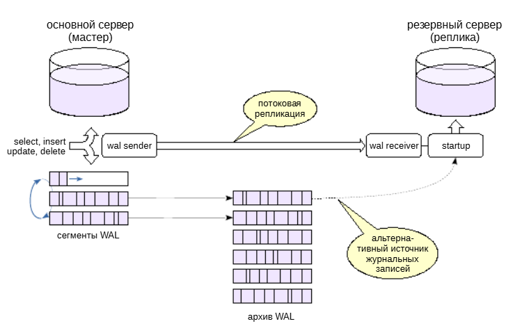
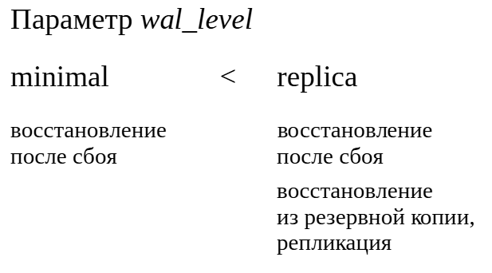
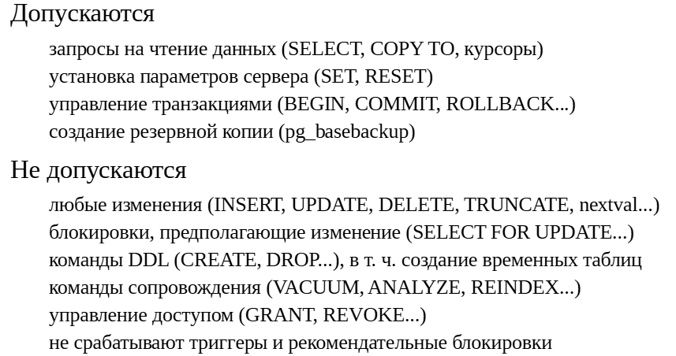
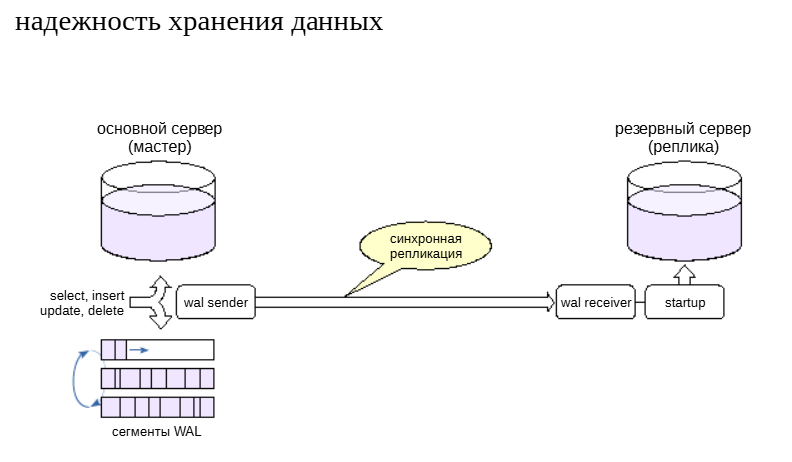
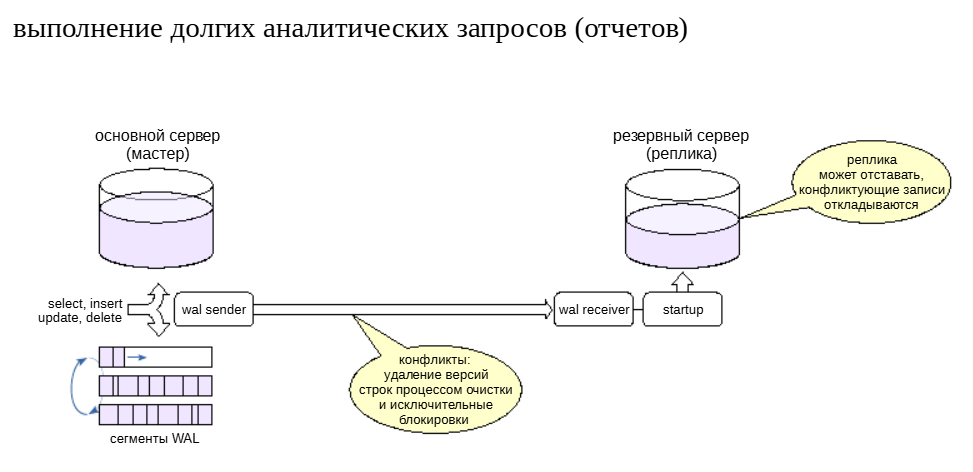
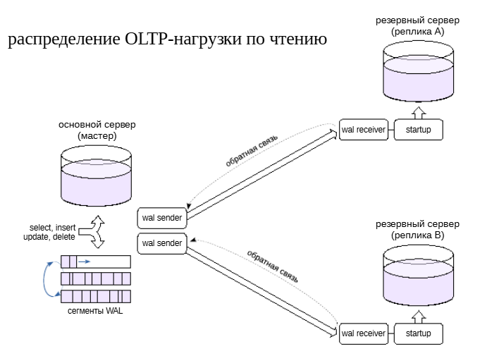
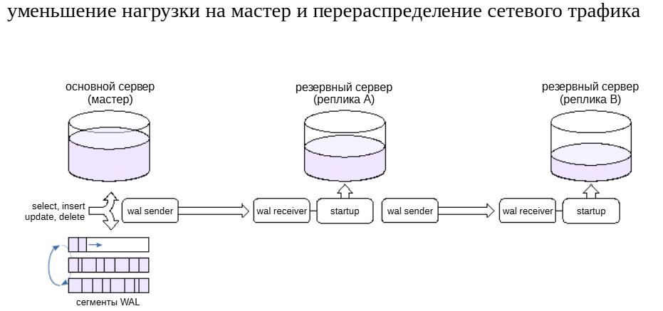
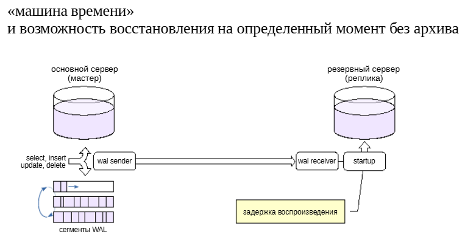

Физическая репликация
#####################

Задачи и виды репликации
************************

	   
Одиночный сервер, управляющий базами данных, может не удовлетворять предъявляемым требованиям.

Один сервер — возможная точка отказа. Два (или больше) серверов позволяют сохранить доступность системы в случае сбоя (отказоустойчивость) или — более широко — в любом случае, например, при проведении плановых работ (высокая доступность).

Один сервер может не справляться с нагрузкой. Наращивать ресурсы сервера может оказаться невыгодно или вообще невозможно.

Но можно распределить нагрузку на несколько серверов (масштабирование).

Информационные системы могут использовать общие данные.

Таким образом, речь идет о том, чтобы иметь несколько серверов, работающих с одними и теми же данными. Под репликацией понимается процесс синхронизации этих данных.

В зависимости от уровня, на котором происходит синхронизация, различают *физическую* и *логическую* репликацию: при *физической* репликации *синхронизируются изменения*, произошедшие *в страницах данных и статусах транзакций*, 
а при *логической* — изменения строк таблиц.

Физическая репликация
*********************

Механизм физической репликации состоит в том, что один сервер передает **журнальные записи на другой сервер**, а тот их **проигрывает** — как при восстановлении после сбоя.

При физической репликации серверы имеют назначенные роли: **мастер** и **реплика**. Мастер передает на реплику свои журнальные записи в виде файлов или потока записей; реплика применяет эти записи к своим файлам данных. 
Применение происходит чисто механически, без «понимания смысла» изменений, поэтому *важна двоичная совместимость* между серверами (одинаковые платформыи основные версии PostgreSQL). Поскольку журнал общий для всего кластера, 
то и реплицировать можно только весь кластер целиком.

Чтобы организовать репликацию между двумя серверами, создается реплика из *физической резервной копии основного сервера*. При обычном восстановлении из такой резервной копии получается новый независимый сервер. 
А если *включить репликацию*, ведомый сервер начинает работать в режиме *постоянного восстановления*: он все время применяет новые журнальные записи, приходящие с основного сервера (этим занимается процесс *startup*). 
Таким образом, реплика постоянно поддерживается в почти актуальном состоянии.

Есть два способа доставки журналов от мастера к реплике. Основной, который используется на практике — **потоковая репликация**.

В этом случае реплика (процесс **walreceiver**) подключается к мастеру (процесс **walsender**) по *протоколу репликации* и получает *поток записей WAL*. 
За счет этого при потоковой репликации отставание реплики сведено к минимуму или даже к нулю при *синхронном режиме*.

Если в системе настроено *непрерывное архивирование*, то возможна *файловая репликация*. В этом случае реплика будет заметно *отставать*, поскольку файловый архив пополняется только при *переключении сегмента WAL*.

На практике файловую репликацию используют как *дополнение* к потоковой. Если реплика не может получить очередную журнальную запись по протоколу репликации, она будет пробовать прочитать соответствующий файл из архива сегментов WAL.

https://postgrespro.ru/docs/postgresql/16/high-availability

Уровни журнала
**************

Поскольку на реплику попадает только та информация, которая содержится в журнале, в журнал должны записываться все необходимые для синхронизации данные.

Состав информации, попадающей в журнал, регулируется параметром **wal_level**.

До версии PostgreSQL 10 уровнем по умолчанию был **minimal**, гарантирующий только восстановление после сбоя. На таком уровне репликация работать не может, поскольку для обеспечения надежности в этом случае часть изменений сразу записывается 
на энерго-независимый носитель и не попадает в журнал.

В версиях 10+ уровень по умолчанию — **replica**. На этом уровнев журнал записываются все изменения данных, что позволяет восстанавливать систему из горячих резервных копий, сделанных утилитой **pg_basebackup**, 
а также использовать физическую репликацию.

Поскольку резервное копирование и репликация — востребованные задачи, уровень по умолчанию и был изменен в пользу **replica**.

ПРАКТИКА
========

**Настройка физической репликации**

Посмотрим, как организовать потоковую репликацию между двумя серверами. 

Минимальный набор параметров, которые нужно проверить:

::

	SELECT name, setting FROM pg_settings
	WHERE name in ('wal_level','max_wal_senders');

		  name       | setting 
	-----------------+---------
	 max_wal_senders | 10
	 wal_level       | replica
	(2 rows)

Начиная с версии PostgreSQL 10, параметры по умолчанию уже имеют подходящие значения.

Разрешение на подключение по протоколу репликации в **pg_hba.conf**:

::

	SELECT type, user_name, address, auth_method FROM pg_hba_file_rules
	WHERE 'replication' = ANY(database);

	 type  | user_name |  address  |  auth_method  
	-------+-----------+-----------+---------------
	 local | {all}     |           | trust
	 host  | {all}     | 127.0.0.1 | scram-sha-256
	 host  | {all}     | ::1       | scram-sha-256
	(3 rows)

Разрешение тоже имеется.

Развернем реплику из физической резервной копии, для этого используем утилиту pg_basebackup.

Целевой каталог копии должен быть пустым или отсутствовать:

::

	student$ rm -rf /home/student/tmp/backup

Ключ **--checkpoint=fast** просит утилиту выполнить контрольную точку как можно быстрее (без пауз), а ключ **-R** — добавить настройки для реплики:

::

	student$ pg_basebackup --pgdata=/home/student/tmp/backup -R --checkpoint=fast

Утилита создала заготовку конфигурационного файла...

::

	student$ cat /home/student/tmp/backup/postgresql.auto.conf

	# Do not edit this file manually!
	# It will be overwritten by the ALTER SYSTEM command.
	primary_conninfo = 'user=student passfile=''/home/student/.pgpass'' 
	channel_binding=prefer host=''/var/run/postgresql'' port=5432 sslmode=prefer 
	sslnegotiation=postgres sslcompression=0 sslcertmode=allow sslsni=1 
	ssl_min_protocol_version=TLSv1.2 gssencmode=prefer krbsrvname=postgres gssdelegation=0 
	target_session_attrs=any load_balance_hosts=disable'

... и сигнальный файл, который даст реплике указание перейти в режим постоянного восстановления:

::

	student$ ls -l /home/student/tmp/backup/*.signal

	-rw------- 1 student student 0 ноя 26 19:22 /home/student/tmp/backup/standby.signal

Кластер, в котором мы собираемся развернуть реплику, уже предварительно инициализирован. Если сервер работает, его необходимо остановить:

::

	student$ sudo pg_ctlcluster 16 replica stop

	Cluster is not running.

Копия была размещена в домашнем каталоге пользователя **student**, а теперь переносим ее в каталог данных кластера и делаем владельцем файлов пользователя postgres:

::

	student$ sudo rm -rf /var/lib/postgresql/16/replica
	student$ sudo mv /home/student/tmp/backup /var/lib/postgresql/16/replica
	student$ sudo chown -R postgres: /var/lib/postgresql/16/replica

Можно запускать сервер:

::

	student$ sudo pg_ctlcluster 16 replica start

Посмотрим на процессы реплики.

::

	student$ sudo head -n 1 '/var/lib/postgresql/16/replica/postmaster.pid'

	47149

::

	student$ ps -o pid,command --ppid 47149

		PID COMMAND
	  47150 postgres: 16/replica: checkpointer 
	  47151 postgres: 16/replica: background writer 
	  47152 postgres: 16/replica: startup waiting for 000000010000000000000007
	  47153 postgres: 16/replica: walreceiver 

Процесс **walreceiver** принимает поток журнальных записей, а процесс **startup** применяет изменения.

Сравним с процессами мастера.

::

	student$ sudo head -n 1 '/var/lib/postgresql/16/main/postmaster.pid'
	
	46709
	
::

student$ ps -o pid,command --ppid 46709

		PID COMMAND
	  46710 postgres: 16/main: checkpointer 
	  46711 postgres: 16/main: background writer 
	  46713 postgres: 16/main: walwriter 
	  46714 postgres: 16/main: autovacuum launcher 
	  46715 postgres: 16/main: logical replication launcher 
	  46763 postgres: 16/main: student student [local] idle
	  47154 postgres: 16/main: walsender student [local] START_REPLICATION

Процесс **walsender** отправляет реплике журнальные записи.

Состояние репликации можно смотреть в специальном представлении на мастере:

::

	SELECT * FROM pg_stat_replication \gx

	-[ RECORD 1 ]----+------------------------------
	pid              | 47154
	usesysid         | 16384
	usename          | student
	application_name | 16/replica
	client_addr      | 
	client_hostname  | 
	client_port      | -s1
	backend_start    | 2025-11-26 19:22:46.185306+03
	backend_xmin     | 
	state            | streaming
	sent_lsn         | 0/7000060
	write_lsn        | 0/7000060
	flush_lsn        | 0/7000060
	replay_lsn       | 0/7000060
	write_lag        | 00:00:00.105816
	flush_lag        | 00:00:00.107883
	replay_lag       | 00:00:00.108049
	sync_priority    | 0
	sync_state       | async
	reply_time       | 2025-11-26 19:22:49.038187+03

значения *_lsn — показывают, какие журнальные записи отправлены на реплику, получены ею, записаны на диск и применены;

**sync_state** — синхронная или асинхронная репликация (об этом подробнее позже).

Использование репликики
***********************

	   
По умолчанию реплика работает в режиме горячего резерва,в этом случае разрешены клиентские подключения, но только для чтения данных. 
Также будет работать установка параметров сервераи команды управления транзакциями — например, можно начать (читающую) транзакцию с нужным уровнем изоляции.

Кроме того, реплику можно использовать и для изготовления резервных копий (конечно, принимая во внимание возможное отставание от мастера).

В режиме горячего резерва на реплике не допускаются никакие изменения данных (включая последовательности), многие виды  блокировок, команды DDL, а также такие команды, как vacuum, analyze, reindex и команды управления доступом — словом, 
все, что так или иначе изменяет данные.

При необходимости реплику можно запустить в режиме теплого резерва, задав параметр **hot_standby = off**, тогда подключения будут вообще невозможны.

https://postgrespro.ru/docs/postgresql/16/hot-standby

ПРАКТИКА
========

Использование реплики
Выполним несколько команд на основном сервере:

::

	CREATE DATABASE replica_overview_physical;
	
	CREATE DATABASE

::

	\c replica_overview_physical
	You are now connected to database "replica_overview_physical" as user "student".

::

	CREATE TABLE test(id integer PRIMARY KEY, descr text);

	CREATE TABLE

Проверим реплику:

::

	student$ psql -p 5433 -d replica_overview_physical

	SELECT * FROM test;
	 id | descr 
	----+-------
	(0 rows)

Вставим строку в таблицу на основном сервере:

::

	INSERT INTO test VALUES (1, 'Раз');

	INSERT 0 1

::

	SELECT * FROM test;

	 id | descr 
	----+-------
	  1 | Раз
	(1 row)

Итак, репликация работает и запросы на реплике выполняются. При этом изменения на реплике не допускаются:

::

	INSERT INTO test VALUES (2, 'Два');

	ERROR:  cannot execute INSERT in a read-only transaction
	

Механизм репликации позволяет построить систему так, чтобы она отвечала предъявляемым к ней требованиям. Рассмотрим несколько типичных задач и средства их решения.

Одна из возможных задач — обеспечить надежность хранения данных.

Напомним, что фиксация транзакций может работать в синхронноми асинхронном режимах. 
В первом случае фиксация не завершается до тех пор, пока данные не будут надежно записаны на энерго-независимый носитель. Во втором — есть риск потерять часть зафиксированных данных, но фиксация не ждет записи на диск,и система работает быстрее.

Аналогичная картина и с репликацией. При синхронном режиме (**synchronous_commit = on**) и наличии реплики фиксация ждет не только записи WAL на диск, но и подтверждения приема журнальных записей от синхронной реплики. 
Это еще больше увеличивает надежность (данные не пропадут, даже если основной сервер выйдет из строя), но и еще больше замедляет систему.

Существуют и промежуточные варианты настройки, которые не дают полной гарантии надежности, но все-таки снижают вероятность потери данных.

Как уже говорилось, долгие запросы удерживают горизонт очистки,из-за чего не удается удалять ненужные версии строк. 
Если какие-то таблицы в это время активно изменяются, они могут сильно вырасти в размере. Поэтому для выполнения долгих аналитических запросов можно использовать реплику.

Тонкий момент состоит в том, что с основного сервера могут приходить журнальные записи, конфликтующие с выполняющимся запросом. Есть два источника таких записей.

1. Очистка удаляет версии строк, уже не нужные основному серверу, но еще нужные для выполнения запроса на реплике.

2. Исключительные блокировки, происходящие на основном сервере, несовместимые с запросом на реплике.

Поэтому «отчетную» реплику настраивают так, чтобы она принимала WAL-записи, но откладывала их применение, если они конфликтуютс запросами. Это приводит к тому, что данные на реплике могут «отставать» от основного сервера, 
но, как правило, для долгих аналитических запросов это не существенно.

Несколько реплик
****************

К основному серверу можно подключить несколько реплик, например, для распределения OLTP-нагрузки по чтению.

OLTP-запросы *не должны* быть долгими. 

Это позволяет использовать **обратную связь** между репликой и основным сервером по протоколу репликации. В этом случае основной сервер знает, какой горизонт транзакций нужен запросам на реплике, 
и очистка не будет удалять соответствующие версии строк. Иными словами, *обратная связь* дает такой же эффект, как если бы все запросы выполнялись непосредственно на основном сервере.

Однако репликация обеспечивает только базовый механизм. Для автоматического распределения нагрузки необходимы внешние средства (балансировщики). 
Следует также иметь в виду, что между основным сервером и репликами не гарантируется согласованность данных, даже в случае синхронной репликации. Если приложение читает данные только с одного из серверов, оно, разумеется, будет получать согласованные данные. 
Но это не выполняется, если приложение читает данные с нескольких серверов. С реплики можно прочитать как устаревшие данные, так и данные, которых еще не видно на основном сервере. 

Каскадная репликация
********************

Несколько реплик, подключенных к одному основному серверу, будут создавать на него определенную нагрузку. Кроме того, надо учитывать нагрузку на сеть при пересылке нескольких копий потока журнальных записей.

Для снижения нагрузки реплики можно соединять каскадом; при этом серверы передают журнальные записи друг другу по цепочке. Чем дальше от мастера, тем большее запаздывание может накопитьсяв изменяемых данных.

Заметим, что *каскадная синхронная репликация не поддерживается*: основной сервер может быть синхронизирован только с *непосредственно подключенной* к нему репликой. 
А вот обратная связь поступает к основному серверу от всех реплик.

Отложенная репликация
*********************

Полезной может оказаться возможность просматривать данные на некоторый момент в прошлом и, при необходимости, восстановить сервер на этот момент. 
Это позволяет, в частности, справитьсяс ошибкой пользователя, совершившего неправильные действия, требующие отмены.

Обычный механизм восстановления из архива на момент времени (point-in-time recovery) в принципе позволяет решить эту задачу, но требует большой подготовительной работы и занимает много времени. 
А способа построить снимок данных по состояниюна произвольный момент в прошлом в PostgreSQL нет.Задача решается созданием реплики, которая применяет записи WAL не сразу, а через установленный интервал времени.

Переключение на реплику
***********************

Имеющуюся реплику можно использовать и для того, чтобы переключить на нее приложение с основного сервера.

Причины перехода на резервный сервер бывают разные. Это может быть необходимость технических работ на основном сервере — тогда переход выполняется в удобное время в штатном режиме. 
Возможен и сбой основного сервера, в таком случае переходить на резервный сервер нужно как можно быстрее, чтобы не прерывать обслуживание пользователей.

Даже в случае сбоя переход осуществляется вручную, если не используется специальное кластерное программное обеспечение, которое следит за состоянием серверов и может инициировать  переход автоматически.

Практика
========

**Переключение на реплику**

Чтобы перевести реплику из режима восстановления в обычный режим, нужно дать ей соответствующую команду

::

	SELECT pg_is_in_recovery();  -- является репликой?

	 pg_is_in_recovery 
	-------------------
	 t
	(1 row)

::

	student$ sudo pg_ctlcluster 16 replica promote

Начиная с версии 12 это же можно сделать, используя SQL-функцию pg_promote.

::

	SELECT pg_is_in_recovery();  -- снова проверим: это реплика?

	 pg_is_in_recovery 
	-------------------
	 f
	(1 row)

Таким образом мы получили два самостоятельных, никак не связанных друг с другом сервера.

::

	INSERT INTO test VALUES (2, 'Два');

	INSERT 0 1

Очень важно иметь гарантии того, что приложение работает только с одним из серверов, иначе возникает ситуация, называемая **split brain**: часть данных оказывается на одном сервере, часть — на другом, и собрать их воедино практически невозможно.

Самостоятельно
**************

1. Разверните реплику так, как показано в демонстрации. Проверьте, как работает приложение, если переключить его на использование реплики.

2. Добавьте к механизму фоновых заданий возможность выполнять задания на реплике с помощью расширения dblink. Убедитесь, что долгое задание не приведет к появлению такой же долгой транзакции на основном сервере.

Пояснение
=========

1. Переключатель сервера находится в верхней части информационной панели приложения. 

Обратите внимание на то, какие операции по-прежнему работают,а какие — вызывают ошибку.

2. Приложение позволяет при отправке задания на выполнение указать удаленный сервер, и записывает имя узла и порт в таблицу **tasks**.

Добавьте в процедуру **process_tasks** проверку: если указаны узели порт, вызывайте функцию run не локально, а с помощью расширения **dblink** на указанном сервере. (
Чтобы долгое задание не приводило к появлению такой же долгой транзакции на основном сервере, используйте **dblink** в асинхронном режиме, и периодически опрашивайте готовность запроса в отдельных, коротких, транзакциях.